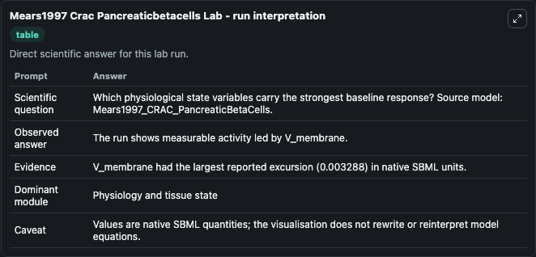
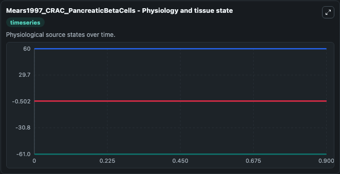
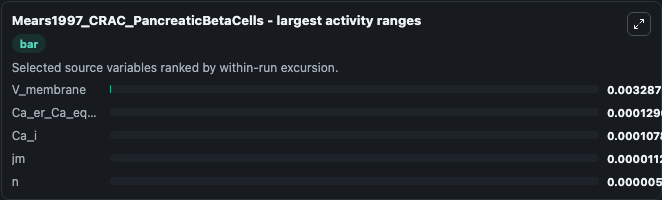
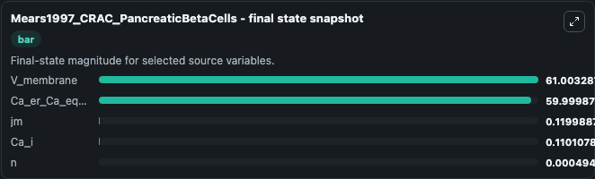
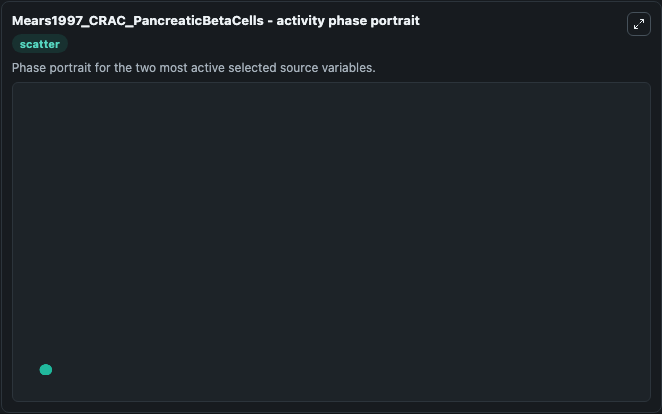

# Mears1997 Crac Pancreaticbetacells

This Biosimulant lab wraps `Mears1997 Crac Pancreaticbetacells` as a runnable systems biology model with a companion visualization module.
This a model from the article: Evidence that calcium release-activated current mediates the biphasic electricalactivity of mouse pancreatic beta-cells. It can be used to explore the configured dynamics and compare scenario outcomes across configurations.

## What You'll See

The lab asks: Which physiological state variables carry the strongest baseline response? Source model: Mears1997_CRAC_PancreaticBetaCells. It runs for 1.0 time units with a communication step of 0.1. The run uses the model defaults declared by the curated SBML wrapper. The generated visualizations focus on V_membrane, Ca_er_Ca_equations, jm, Ca_i, and n, combining trajectory, endpoint-comparison, and summary-table views from one completed dark-mode run.

In this captured run, **V_membrane** moved from -61.000 to -61.003 across 1.0 simulation windows.


### Output Visualizations



*Summary table for Mears1997 Crac Pancreaticbetacells, reporting the scientific question, observed answer, dominant module, and caveat.*



*Trajectories of V_membrane, Ca_er_Ca_equations, Ca_i, jm, and n across the 1.0 simulation. In this run **Ca_i** climbed from 0.1100 to 0.1101 and **V_membrane** fell from -61.000 to -61.003 — the largest movements among the focused observables.*



*Largest-excursion ranking of the focused observables — the absolute movement magnitude during the run. Top 3: **V_membrane** = 0.00329, **Ca_er_Ca_equations** = 0.000129, **Ca_i** = 0.000108, with 2 more observables below.*



*Endpoint snapshot of the focused observables — final values from the captured run. Top 3 by value: **V_membrane** = 61.003, **Ca_er_Ca_equations** = 60.000, **jm** = 0.1200, with 2 more observables below.*



*Visualization card from the Mears1997 Crac Pancreaticbetacells dark-mode run.*


## Model Context

- Core model: `models/core`
- Visualization model: `models/visualisation`
- Standard: `other`
- Upstream source: `biomodels_ebi:BIOMD0000000375`
- License: `CC0`

## Inputs

| Input | Maps To | Default | Notes |
|---|---|---|---|
| Initial V Membrane | `systemsbiology_sbml_mears1997_crac_pancreaticbetacells_biomd0000000375_model.initial_v_membrane` | | Source state initial condition exposed as a model-specific control because no explicit intervention parameter is identifiable. Maps to SBML symbol `V_membrane`. |
| Initial Ca Er Ca Equations | `systemsbiology_sbml_mears1997_crac_pancreaticbetacells_biomd0000000375_model.initial_ca_er_ca_equations` | | Source state initial condition exposed as a model-specific control because no explicit intervention parameter is identifiable. Maps to SBML symbol `Ca_er_Ca_equations`. |
| Initial Model State Jm | `systemsbiology_sbml_mears1997_crac_pancreaticbetacells_biomd0000000375_model.initial_model_state_jm` | | Source state initial condition exposed as a model-specific control because no explicit intervention parameter is identifiable. Maps to SBML symbol `jm`. |
| Initial Ca I | `systemsbiology_sbml_mears1997_crac_pancreaticbetacells_biomd0000000375_model.initial_ca_i` | | Source state initial condition exposed as a model-specific control because no explicit intervention parameter is identifiable. Maps to SBML symbol `Ca_i`. |
| Initial Model State N | `systemsbiology_sbml_mears1997_crac_pancreaticbetacells_biomd0000000375_model.initial_model_state_n` | | Source state initial condition exposed as a model-specific control because no explicit intervention parameter is identifiable. Maps to SBML symbol `n`. |

## Outputs

| Output | Maps To | Role |
|---|---|---|
| `state` | `systemsbiology_sbml_mears1997_crac_pancreaticbetacells_biomd0000000375_model.state` | Available to the visualization model and downstream workflows. |
| `summary` | `systemsbiology_sbml_mears1997_crac_pancreaticbetacells_biomd0000000375_model.summary` | Available to the visualization model and downstream workflows. |
| `species_labels` | `systemsbiology_sbml_mears1997_crac_pancreaticbetacells_biomd0000000375_model.species_labels` | Available to the visualization model and downstream workflows. |
| `v_membrane` | `systemsbiology_sbml_mears1997_crac_pancreaticbetacells_biomd0000000375_model.v_membrane` | Available to the visualization model and downstream workflows. |
| `ca_er_ca_equations` | `systemsbiology_sbml_mears1997_crac_pancreaticbetacells_biomd0000000375_model.ca_er_ca_equations` | Available to the visualization model and downstream workflows. |
| `model_state_jm` | `systemsbiology_sbml_mears1997_crac_pancreaticbetacells_biomd0000000375_model.model_state_jm` | Available to the visualization model and downstream workflows. |
| `ca_i` | `systemsbiology_sbml_mears1997_crac_pancreaticbetacells_biomd0000000375_model.ca_i` | Available to the visualization model and downstream workflows. |
| `model_state_n` | `systemsbiology_sbml_mears1997_crac_pancreaticbetacells_biomd0000000375_model.model_state_n` | Available to the visualization model and downstream workflows. |

## Runtime

- Duration: `1.0`
- Communication step: `0.1`

## Running Locally

```bash
biosimulant labs serve
```
