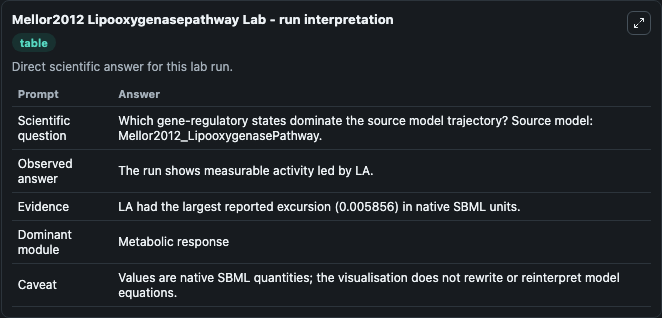
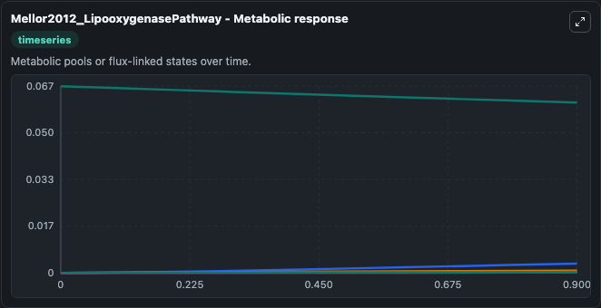
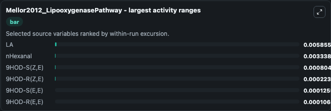
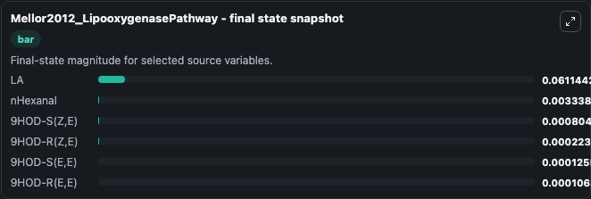
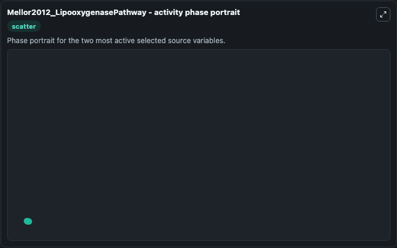

# Mellor2012 Lipooxygenasepathway

This Biosimulant lab wraps `Mellor2012 Lipooxygenasepathway` as a runnable systems biology model with a companion visualization module.
This model is from the article: Reduction of off-flavor generation in soybean homogenates: a mathematical model. It can be used to explore the configured dynamics and compare scenario outcomes across configurations.

## What You'll See

The lab asks: Which gene-regulatory states dominate the source model trajectory? Source model: Mellor2012_LipooxygenasePathway. It runs for 1.0 time units with a communication step of 0.1. The run uses the model defaults declared by the curated SBML wrapper. The generated visualizations focus on LA, nHexanal, 9HOD-S(Z,E), 9HOD-S(E,E), 9HOD-R(Z,E), and 9HOD-R(E,E), combining trajectory, endpoint-comparison, and summary-table views from one completed dark-mode run.

In this captured run, **LA** moved from 0.0670 to 0.0611 across 1.0 simulation windows.


### Output Visualizations



*Summary table for Mellor2012 Lipooxygenasepathway, reporting the scientific question, observed answer, dominant module, and caveat.*



*Trajectories of LA, nHexanal, 9HOD-S(Z,E), 9HOD-R(Z,E), 9HOD-S(E,E), and 9HOD-R(E,E) across the 1.0 simulation. In this run **nHexanal** climbed from 0 to 0.00334 and **LA** fell from 0.0670 to 0.0611 — the largest movements among the focused observables.*



*Largest-excursion ranking of the focused observables — the absolute movement magnitude during the run. Top 3: **LA** = 0.00586, **nHexanal** = 0.00334, **9HOD-S(Z,E)** = 0.000805, with 3 more observables below.*



*Endpoint snapshot of the focused observables — final values from the captured run. Top 3 by value: **LA** = 0.0611, **nHexanal** = 0.00334, **9HOD-S(Z,E)** = 0.000805, with 3 more observables below.*



*Visualization card from the Mellor2012 Lipooxygenasepathway dark-mode run.*


## Model Context

- Core model: `models/core`
- Visualization model: `models/visualisation`
- Standard: `other`
- Upstream source: `biomodels_ebi:BIOMD0000000415`
- License: `CC0`

## Inputs

| Input | Maps To | Default | Notes |
|---|---|---|---|
| Initial Model State La | `systemsbiology_sbml_mellor2012_lipooxygenasepathway_biomd0000000415_model.initial_model_state_la` | | Source state initial condition exposed as a model-specific control because no explicit intervention parameter is identifiable. Maps to SBML symbol `species_1`. |
| Initial N Hexanal | `systemsbiology_sbml_mellor2012_lipooxygenasepathway_biomd0000000415_model.initial_n_hexanal` | | Source state initial condition exposed as a model-specific control because no explicit intervention parameter is identifiable. Maps to SBML symbol `species_15`. |
| Initial Model State 9 Hod S Z E | `systemsbiology_sbml_mellor2012_lipooxygenasepathway_biomd0000000415_model.initial_model_state_9_hod_s_z_e` | | Source state initial condition exposed as a model-specific control because no explicit intervention parameter is identifiable. Maps to SBML symbol `species_11`. |
| Initial Model State 9 Hod S E E | `systemsbiology_sbml_mellor2012_lipooxygenasepathway_biomd0000000415_model.initial_model_state_9_hod_s_e_e` | | Source state initial condition exposed as a model-specific control because no explicit intervention parameter is identifiable. Maps to SBML symbol `species_13`. |
| Initial Model State 9 Hod R Z E | `systemsbiology_sbml_mellor2012_lipooxygenasepathway_biomd0000000415_model.initial_model_state_9_hod_r_z_e` | | Source state initial condition exposed as a model-specific control because no explicit intervention parameter is identifiable. Maps to SBML symbol `species_12`. |
| Initial Model State 9 Hod R E E | `systemsbiology_sbml_mellor2012_lipooxygenasepathway_biomd0000000415_model.initial_model_state_9_hod_r_e_e` | | Source state initial condition exposed as a model-specific control because no explicit intervention parameter is identifiable. Maps to SBML symbol `species_14`. |

## Outputs

| Output | Maps To | Role |
|---|---|---|
| `state` | `systemsbiology_sbml_mellor2012_lipooxygenasepathway_biomd0000000415_model.state` | Available to the visualization model and downstream workflows. |
| `summary` | `systemsbiology_sbml_mellor2012_lipooxygenasepathway_biomd0000000415_model.summary` | Available to the visualization model and downstream workflows. |
| `species_labels` | `systemsbiology_sbml_mellor2012_lipooxygenasepathway_biomd0000000415_model.species_labels` | Available to the visualization model and downstream workflows. |
| `model_state_la` | `systemsbiology_sbml_mellor2012_lipooxygenasepathway_biomd0000000415_model.model_state_la` | Available to the visualization model and downstream workflows. |
| `n_hexanal` | `systemsbiology_sbml_mellor2012_lipooxygenasepathway_biomd0000000415_model.n_hexanal` | Available to the visualization model and downstream workflows. |
| `model_state_9_hod_s_z_e` | `systemsbiology_sbml_mellor2012_lipooxygenasepathway_biomd0000000415_model.model_state_9_hod_s_z_e` | Available to the visualization model and downstream workflows. |
| `model_state_9_hod_s_e_e` | `systemsbiology_sbml_mellor2012_lipooxygenasepathway_biomd0000000415_model.model_state_9_hod_s_e_e` | Available to the visualization model and downstream workflows. |
| `model_state_9_hod_r_z_e` | `systemsbiology_sbml_mellor2012_lipooxygenasepathway_biomd0000000415_model.model_state_9_hod_r_z_e` | Available to the visualization model and downstream workflows. |
| `model_state_9_hod_r_e_e` | `systemsbiology_sbml_mellor2012_lipooxygenasepathway_biomd0000000415_model.model_state_9_hod_r_e_e` | Available to the visualization model and downstream workflows. |

## Runtime

- Duration: `1.0`
- Communication step: `0.1`

## Running Locally

```bash
biosimulant labs serve
```
