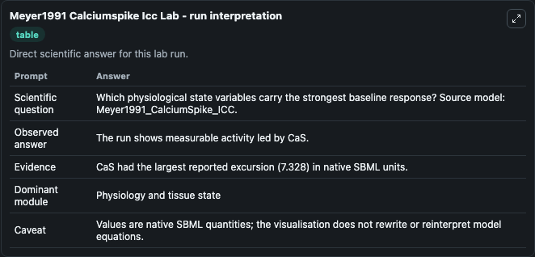
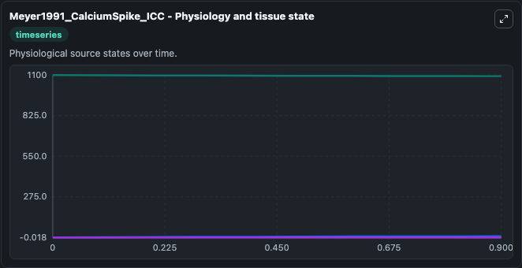
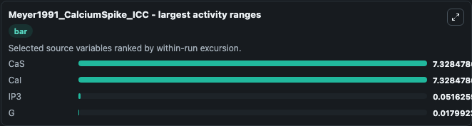
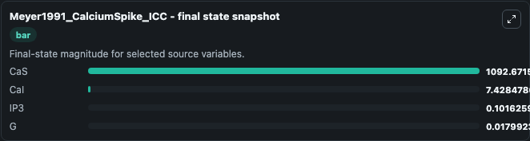
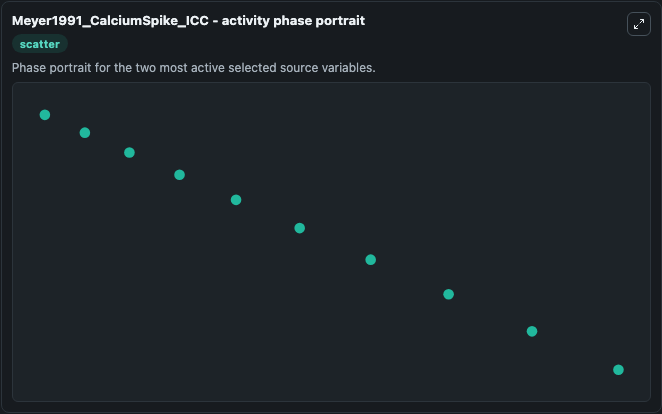

# Meyer1991 Calciumspike Icc

This Biosimulant lab wraps `Meyer1991 Calciumspike Icc` as a runnable systems biology model with a companion visualization module.
This a model from the article: Calcium spiking. It can be used to explore the configured dynamics and compare scenario outcomes across configurations.

## What You'll See

The lab asks: Which physiological state variables carry the strongest baseline response? Source model: Meyer1991_CalciumSpike_ICC. It runs for 1.0 time units with a communication step of 0.1. The run uses the model defaults declared by the curated SBML wrapper. The generated visualizations focus on CaS, CaI, IP3, and G, combining trajectory, endpoint-comparison, and summary-table views from one completed dark-mode run.

In this captured run, **CaS** moved from 1100.0 to 1092.7 across 1.0 simulation windows.


### Output Visualizations



*Summary table for Meyer1991 Calciumspike Icc, reporting the scientific question, observed answer, dominant module, and caveat.*



*Trajectories of CaS, CaI, IP3, and G across the 1.0 simulation. In this run **CaI** climbed from 0.1000 to 7.428 and **CaS** fell from 1100.0 to 1092.7 — the largest movements among the focused observables.*



*Largest-excursion ranking of the focused observables — the absolute movement magnitude during the run. Top 3: **CaS** = 7.328, **CaI** = 7.328, **IP3** = 0.0516, with 1 more observable below.*



*Endpoint snapshot of the focused observables — final values from the captured run. Top 3 by value: **CaS** = 1092.7, **CaI** = 7.428, **IP3** = 0.1016, with 1 more observable below.*



*Visualization card from the Meyer1991 Calciumspike Icc dark-mode run.*


## Model Context

- Core model: `models/core`
- Visualization model: `models/visualisation`
- Standard: `other`
- Upstream source: `biomodels_ebi:BIOMD0000000224`
- License: `CC0`

## Inputs

| Input | Maps To | Default | Notes |
|---|---|---|---|
| Initial Ca S | `systemsbiology_sbml_meyer1991_calciumspike_icc_biomd0000000224_model.initial_ca_s` | | Source state initial condition exposed as a model-specific control because no explicit intervention parameter is identifiable. Maps to SBML symbol `CaS`. |
| Initial Ca I | `systemsbiology_sbml_meyer1991_calciumspike_icc_biomd0000000224_model.initial_ca_i` | | Source state initial condition exposed as a model-specific control because no explicit intervention parameter is identifiable. Maps to SBML symbol `CaI`. |
| Initial Model State IP3 | `systemsbiology_sbml_meyer1991_calciumspike_icc_biomd0000000224_model.initial_model_state_ip3` | | Source state initial condition exposed as a model-specific control because no explicit intervention parameter is identifiable. Maps to SBML symbol `IP3`. |
| Initial Model State G | `systemsbiology_sbml_meyer1991_calciumspike_icc_biomd0000000224_model.initial_model_state_g` | | Source state initial condition exposed as a model-specific control because no explicit intervention parameter is identifiable. Maps to SBML symbol `g`. |

## Outputs

| Output | Maps To | Role |
|---|---|---|
| `state` | `systemsbiology_sbml_meyer1991_calciumspike_icc_biomd0000000224_model.state` | Available to the visualization model and downstream workflows. |
| `summary` | `systemsbiology_sbml_meyer1991_calciumspike_icc_biomd0000000224_model.summary` | Available to the visualization model and downstream workflows. |
| `species_labels` | `systemsbiology_sbml_meyer1991_calciumspike_icc_biomd0000000224_model.species_labels` | Available to the visualization model and downstream workflows. |
| `ca_s` | `systemsbiology_sbml_meyer1991_calciumspike_icc_biomd0000000224_model.ca_s` | Available to the visualization model and downstream workflows. |
| `ca_i` | `systemsbiology_sbml_meyer1991_calciumspike_icc_biomd0000000224_model.ca_i` | Available to the visualization model and downstream workflows. |
| `ip3` | `systemsbiology_sbml_meyer1991_calciumspike_icc_biomd0000000224_model.ip3` | Available to the visualization model and downstream workflows. |
| `model_state_g` | `systemsbiology_sbml_meyer1991_calciumspike_icc_biomd0000000224_model.model_state_g` | Available to the visualization model and downstream workflows. |

## Runtime

- Duration: `1.0`
- Communication step: `0.1`

## Running Locally

```bash
biosimulant labs serve
```
