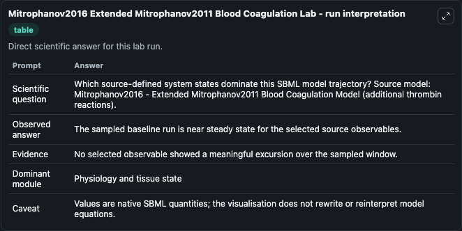
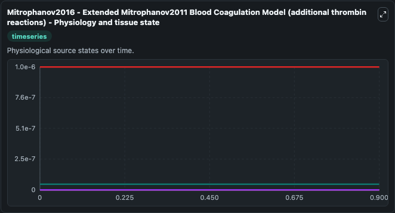
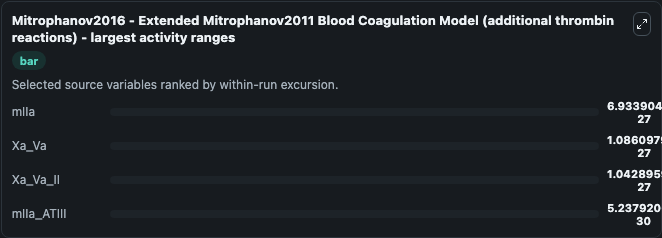
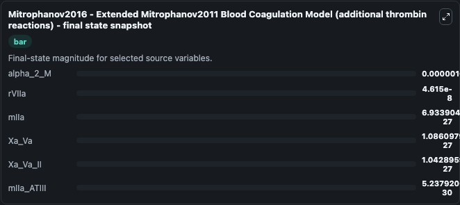
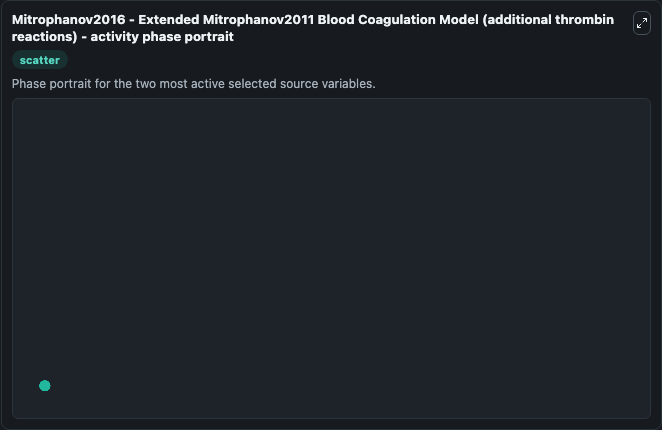

# Mitrophanov2016 Extended Mitrophanov2011 Blood Coagulation

This Biosimulant lab wraps `Mitrophanov2016 Extended Mitrophanov2011 Blood Coagulation` as a runnable systems biology model with a companion visualization module.
Mathematical model of blood coagulation. It can be used to explore the configured dynamics and compare scenario outcomes across configurations.

## What You'll See

The lab asks: Which source-defined system states dominate this SBML model trajectory? Source model: Mitrophanov2016 - Extended Mitrophanov2011 Blood Coagulation Model (additional thrombin reactions). It runs for 1.0 time units with a communication step of 0.1. The run uses the model defaults declared by the curated SBML wrapper. The generated visualizations focus on alpha_2_M, rVIIa, mIIa_ATIII, mIIa, Xa_Va_II, and Xa_Va, combining trajectory, endpoint-comparison, and summary-table views from one completed dark-mode run.

In this captured run, **mIIa** moved from 0 to 6.93e-27 across 1.0 simulation windows.


### Output Visualizations



*Summary table for Mitrophanov2016 Extended Mitrophanov2011 Blood Coagulation, reporting the scientific question, observed answer, dominant module, and caveat.*



*Trajectories of mIIa, Xa_Va, Xa_Va_II, mIIa_ATIII, alpha_2_M, and rVIIa across the 1.0 simulation. In this run **mIIa** climbed from 0 to 6.93e-27 — the largest movements among the focused observables.*



*Largest-excursion ranking of the focused observables — the absolute movement magnitude during the run. Top 3: **mIIa** = 6.93e-27, **Xa_Va** = 1.09e-27, **Xa_Va_II** = 1.04e-27, with 1 more observable below.*



*Endpoint snapshot of the focused observables — final values from the captured run. Top 3 by value: **alpha_2_M** = 1.01e-06, **rVIIa** = 4.61e-08, **mIIa** = 6.93e-27, with 3 more observables below.*



*Visualization card from the Mitrophanov2016 Extended Mitrophanov2011 Blood Coagulation dark-mode run.*


## Model Context

- Core model: `models/core`
- Visualization model: `models/visualisation`
- Standard: `other`
- Upstream source: `biomodels_ebi:MODEL1806280001`
- License: `CC0`

## Inputs

| Input | Maps To | Default | Notes |
|---|---|---|---|
| Initial Alpha 2 M | `systemsbiology_sbml_mitrophanov2016_extended_mitrophanov2011_blood_c_model1806280001_model.initial_alpha_2_m` | | Source state initial condition exposed as a model-specific control because no explicit intervention parameter is identifiable. Maps to SBML symbol `alpha_2_M`. |
| Initial R Vi Ia | `systemsbiology_sbml_mitrophanov2016_extended_mitrophanov2011_blood_c_model1806280001_model.initial_r_vi_ia` | | Source state initial condition exposed as a model-specific control because no explicit intervention parameter is identifiable. Maps to SBML symbol `rVIIa`. |
| Initial M I Ia Atiii | `systemsbiology_sbml_mitrophanov2016_extended_mitrophanov2011_blood_c_model1806280001_model.initial_m_i_ia_atiii` | | Source state initial condition exposed as a model-specific control because no explicit intervention parameter is identifiable. Maps to SBML symbol `mIIa_ATIII`. |
| Initial M I Ia | `systemsbiology_sbml_mitrophanov2016_extended_mitrophanov2011_blood_c_model1806280001_model.initial_m_i_ia` | | Source state initial condition exposed as a model-specific control because no explicit intervention parameter is identifiable. Maps to SBML symbol `mIIa`. |
| Initial Xa Va Ii | `systemsbiology_sbml_mitrophanov2016_extended_mitrophanov2011_blood_c_model1806280001_model.initial_xa_va_ii` | | Source state initial condition exposed as a model-specific control because no explicit intervention parameter is identifiable. Maps to SBML symbol `Xa_Va_II`. |
| Initial Xa Va | `systemsbiology_sbml_mitrophanov2016_extended_mitrophanov2011_blood_c_model1806280001_model.initial_xa_va` | | Source state initial condition exposed as a model-specific control because no explicit intervention parameter is identifiable. Maps to SBML symbol `Xa_Va`. |

## Outputs

| Output | Maps To | Role |
|---|---|---|
| `state` | `systemsbiology_sbml_mitrophanov2016_extended_mitrophanov2011_blood_c_model1806280001_model.state` | Available to the visualization model and downstream workflows. |
| `summary` | `systemsbiology_sbml_mitrophanov2016_extended_mitrophanov2011_blood_c_model1806280001_model.summary` | Available to the visualization model and downstream workflows. |
| `species_labels` | `systemsbiology_sbml_mitrophanov2016_extended_mitrophanov2011_blood_c_model1806280001_model.species_labels` | Available to the visualization model and downstream workflows. |
| `alpha_2_m` | `systemsbiology_sbml_mitrophanov2016_extended_mitrophanov2011_blood_c_model1806280001_model.alpha_2_m` | Available to the visualization model and downstream workflows. |
| `r_vi_ia` | `systemsbiology_sbml_mitrophanov2016_extended_mitrophanov2011_blood_c_model1806280001_model.r_vi_ia` | Available to the visualization model and downstream workflows. |
| `m_i_ia_atiii` | `systemsbiology_sbml_mitrophanov2016_extended_mitrophanov2011_blood_c_model1806280001_model.m_i_ia_atiii` | Available to the visualization model and downstream workflows. |
| `m_i_ia` | `systemsbiology_sbml_mitrophanov2016_extended_mitrophanov2011_blood_c_model1806280001_model.m_i_ia` | Available to the visualization model and downstream workflows. |
| `xa_va_ii` | `systemsbiology_sbml_mitrophanov2016_extended_mitrophanov2011_blood_c_model1806280001_model.xa_va_ii` | Available to the visualization model and downstream workflows. |
| `xa_va` | `systemsbiology_sbml_mitrophanov2016_extended_mitrophanov2011_blood_c_model1806280001_model.xa_va` | Available to the visualization model and downstream workflows. |

## Runtime

- Duration: `1.0`
- Communication step: `0.1`

## Running Locally

```bash
biosimulant labs serve
```
