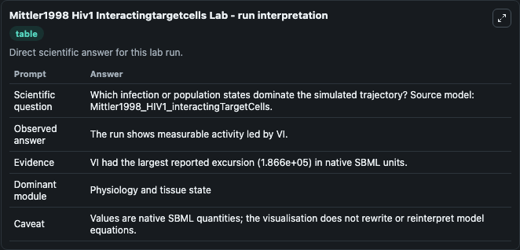
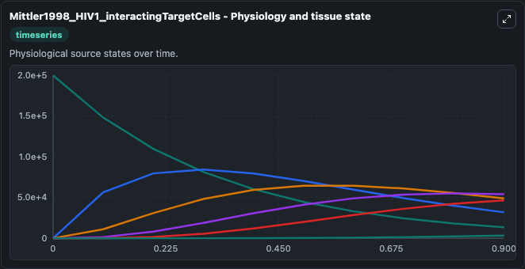
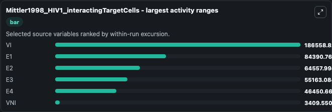
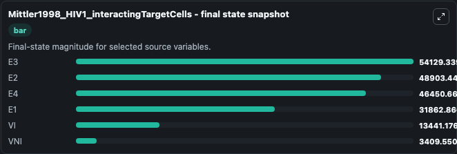
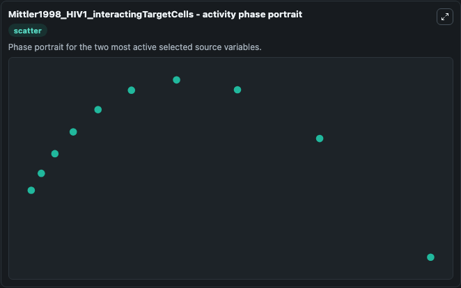

# Mittler1998 Hiv1 Interactingtargetcells

This Biosimulant lab wraps `Mittler1998 Hiv1 Interactingtargetcells` as a runnable systems biology model with a companion visualization module.
This a model from the article: Influence of delayed viral production on viral dynamics in HIV-1 infectedpatients. It can be used to explore the configured dynamics and compare scenario outcomes across configurations.

## What You'll See

The lab asks: Which infection or population states dominate the simulated trajectory? Source model: Mittler1998_HIV1_interactingTargetCells. It runs for 1.0 time units with a communication step of 0.1. The run uses the model defaults declared by the curated SBML wrapper. The generated visualizations focus on VNI, VI, E4, E3, E2, and E1, combining trajectory, endpoint-comparison, and summary-table views from one completed dark-mode run.

In this captured run, **VI** moved from 2e+05 to 1.34e+04 across 1.0 simulation windows.


### Output Visualizations



*Summary table for Mittler1998 Hiv1 Interactingtargetcells, reporting the scientific question, observed answer, dominant module, and caveat.*



*Trajectories of VI, E1, E2, E3, E4, and VNI across the 1.0 simulation. In this run **E3** climbed from 0 to 5.41e+04 and **VI** fell from 2e+05 to 1.34e+04 — the largest movements among the focused observables.*



*Largest-excursion ranking of the focused observables — the absolute movement magnitude during the run. Top 3: **VI** = 1.87e+05, **E1** = 8.44e+04, **E2** = 6.46e+04, with 3 more observables below.*



*Endpoint snapshot of the focused observables — final values from the captured run. Top 3 by value: **E3** = 5.41e+04, **E2** = 4.89e+04, **E4** = 4.65e+04, with 3 more observables below.*



*Visualization card from the Mittler1998 Hiv1 Interactingtargetcells dark-mode run.*


## Model Context

- Core model: `models/core`
- Visualization model: `models/visualisation`
- Standard: `other`
- Upstream source: `biomodels_ebi:MODEL1006230055`
- License: `CC0`

## Inputs

| Input | Maps To | Default | Notes |
|---|---|---|---|
| Initial Model State Vni | `systemsbiology_sbml_mittler1998_hiv1_interactingtargetcells_model1006230055_model.initial_model_state_vni` | | Source state initial condition exposed as a model-specific control because no explicit intervention parameter is identifiable. Maps to SBML symbol `VNI`. |
| Initial Model State Vi | `systemsbiology_sbml_mittler1998_hiv1_interactingtargetcells_model1006230055_model.initial_model_state_vi` | | Source state initial condition exposed as a model-specific control because no explicit intervention parameter is identifiable. Maps to SBML symbol `VI`. |
| Initial Model State E4 | `systemsbiology_sbml_mittler1998_hiv1_interactingtargetcells_model1006230055_model.initial_model_state_e4` | | Source state initial condition exposed as a model-specific control because no explicit intervention parameter is identifiable. Maps to SBML symbol `E4`. |
| Initial Model State E3 | `systemsbiology_sbml_mittler1998_hiv1_interactingtargetcells_model1006230055_model.initial_model_state_e3` | | Source state initial condition exposed as a model-specific control because no explicit intervention parameter is identifiable. Maps to SBML symbol `E3`. |
| Initial Model State E2 | `systemsbiology_sbml_mittler1998_hiv1_interactingtargetcells_model1006230055_model.initial_model_state_e2` | | Source state initial condition exposed as a model-specific control because no explicit intervention parameter is identifiable. Maps to SBML symbol `E2`. |
| Initial Model State E1 | `systemsbiology_sbml_mittler1998_hiv1_interactingtargetcells_model1006230055_model.initial_model_state_e1` | | Source state initial condition exposed as a model-specific control because no explicit intervention parameter is identifiable. Maps to SBML symbol `E1`. |

## Outputs

| Output | Maps To | Role |
|---|---|---|
| `state` | `systemsbiology_sbml_mittler1998_hiv1_interactingtargetcells_model1006230055_model.state` | Available to the visualization model and downstream workflows. |
| `summary` | `systemsbiology_sbml_mittler1998_hiv1_interactingtargetcells_model1006230055_model.summary` | Available to the visualization model and downstream workflows. |
| `species_labels` | `systemsbiology_sbml_mittler1998_hiv1_interactingtargetcells_model1006230055_model.species_labels` | Available to the visualization model and downstream workflows. |
| `vni` | `systemsbiology_sbml_mittler1998_hiv1_interactingtargetcells_model1006230055_model.vni` | Available to the visualization model and downstream workflows. |
| `model_state_vi` | `systemsbiology_sbml_mittler1998_hiv1_interactingtargetcells_model1006230055_model.model_state_vi` | Available to the visualization model and downstream workflows. |
| `model_state_e4` | `systemsbiology_sbml_mittler1998_hiv1_interactingtargetcells_model1006230055_model.model_state_e4` | Available to the visualization model and downstream workflows. |
| `model_state_e3` | `systemsbiology_sbml_mittler1998_hiv1_interactingtargetcells_model1006230055_model.model_state_e3` | Available to the visualization model and downstream workflows. |
| `model_state_e2` | `systemsbiology_sbml_mittler1998_hiv1_interactingtargetcells_model1006230055_model.model_state_e2` | Available to the visualization model and downstream workflows. |
| `model_state_e1` | `systemsbiology_sbml_mittler1998_hiv1_interactingtargetcells_model1006230055_model.model_state_e1` | Available to the visualization model and downstream workflows. |

## Runtime

- Duration: `1.0`
- Communication step: `0.1`

## Running Locally

```bash
biosimulant labs serve
```
