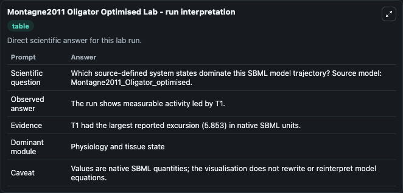
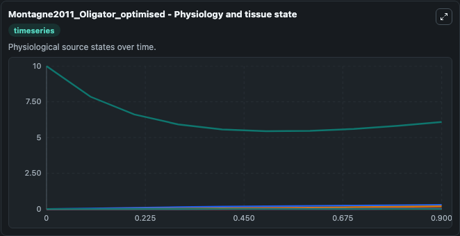
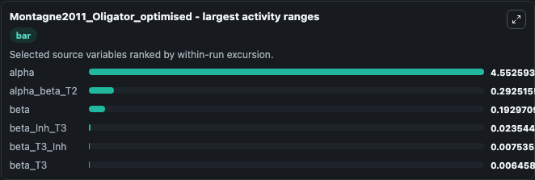
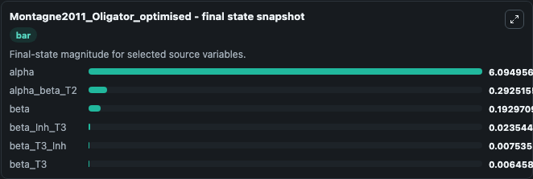
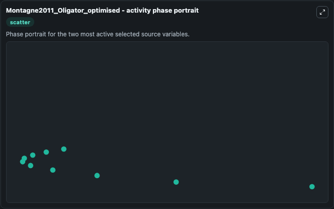

# Montagne2011 Oligator Optimised

This Biosimulant lab wraps `Montagne2011 Oligator Optimised` as a runnable systems biology model with a companion visualization module.
This is the model of the in vitro DNA oscillator called oligator with the optmized set of parameters described in the article: Programming an in vitro DNA oscillator using a molecular networking strat. It can be used to explore the configured dynamics and compare scenario outcomes across configurations.

## What You'll See

The lab asks: Which source-defined system states dominate this SBML model trajectory? Source model: Montagne2011_Oligator_optimised. It runs for 1.0 time units with a communication step of 0.1. The run uses the model defaults declared by the curated SBML wrapper. The generated visualizations focus on alpha, beta_T3_Inh, beta_T3, beta_Inh_T3, beta, and alpha_beta_T2, combining trajectory, endpoint-comparison, and summary-table views from one completed dark-mode run.

In this captured run, **alpha** moved from 10.000 to 6.095 across 1.0 simulation windows.


### Output Visualizations



*Summary table for Montagne2011 Oligator Optimised, reporting the scientific question, observed answer, dominant module, and caveat.*



*Trajectories of alpha, alpha_beta_T2, beta, beta_Inh_T3, beta_T3_Inh, and beta_T3 across the 1.0 simulation. In this run **alpha_beta_T2** climbed from 0 to 0.2925 and **alpha** fell from 10.000 to 6.095 — the largest movements among the focused observables.*



*Largest-excursion ranking of the focused observables — the absolute movement magnitude during the run. Top 3: **alpha** = 4.553, **alpha_beta_T2** = 0.2925, **beta** = 0.1930, with 3 more observables below.*



*Endpoint snapshot of the focused observables — final values from the captured run. Top 3 by value: **alpha** = 6.095, **alpha_beta_T2** = 0.2925, **beta** = 0.1930, with 3 more observables below.*



*Visualization card from the Montagne2011 Oligator Optimised dark-mode run.*


## Model Context

- Core model: `models/core`
- Visualization model: `models/visualisation`
- Standard: `other`
- Upstream source: `biomodels_ebi:BIOMD0000000315`
- License: `CC0`

## Inputs

| Input | Maps To | Default | Notes |
|---|---|---|---|
| Initial Alpha | `systemsbiology_sbml_montagne2011_oligator_optimised_biomd0000000315_model.initial_alpha` | | Source state initial condition exposed as a model-specific control because no explicit intervention parameter is identifiable. Maps to SBML symbol `alpha`. |
| Initial Beta T3 Inh | `systemsbiology_sbml_montagne2011_oligator_optimised_biomd0000000315_model.initial_beta_t3_inh` | | Source state initial condition exposed as a model-specific control because no explicit intervention parameter is identifiable. Maps to SBML symbol `beta_T3_Inh`. |
| Initial Beta T3 | `systemsbiology_sbml_montagne2011_oligator_optimised_biomd0000000315_model.initial_beta_t3` | | Source state initial condition exposed as a model-specific control because no explicit intervention parameter is identifiable. Maps to SBML symbol `beta_T3`. |
| Initial Beta Inh T3 | `systemsbiology_sbml_montagne2011_oligator_optimised_biomd0000000315_model.initial_beta_inh_t3` | | Source state initial condition exposed as a model-specific control because no explicit intervention parameter is identifiable. Maps to SBML symbol `beta_Inh_T3`. |
| Initial Beta | `systemsbiology_sbml_montagne2011_oligator_optimised_biomd0000000315_model.initial_beta` | | Source state initial condition exposed as a model-specific control because no explicit intervention parameter is identifiable. Maps to SBML symbol `beta`. |
| Initial Alpha Beta T2 | `systemsbiology_sbml_montagne2011_oligator_optimised_biomd0000000315_model.initial_alpha_beta_t2` | | Source state initial condition exposed as a model-specific control because no explicit intervention parameter is identifiable. Maps to SBML symbol `alpha_beta_T2`. |

## Outputs

| Output | Maps To | Role |
|---|---|---|
| `state` | `systemsbiology_sbml_montagne2011_oligator_optimised_biomd0000000315_model.state` | Available to the visualization model and downstream workflows. |
| `summary` | `systemsbiology_sbml_montagne2011_oligator_optimised_biomd0000000315_model.summary` | Available to the visualization model and downstream workflows. |
| `species_labels` | `systemsbiology_sbml_montagne2011_oligator_optimised_biomd0000000315_model.species_labels` | Available to the visualization model and downstream workflows. |
| `alpha` | `systemsbiology_sbml_montagne2011_oligator_optimised_biomd0000000315_model.alpha` | Available to the visualization model and downstream workflows. |
| `beta_t3_inh` | `systemsbiology_sbml_montagne2011_oligator_optimised_biomd0000000315_model.beta_t3_inh` | Available to the visualization model and downstream workflows. |
| `beta_t3` | `systemsbiology_sbml_montagne2011_oligator_optimised_biomd0000000315_model.beta_t3` | Available to the visualization model and downstream workflows. |
| `beta_inh_t3` | `systemsbiology_sbml_montagne2011_oligator_optimised_biomd0000000315_model.beta_inh_t3` | Available to the visualization model and downstream workflows. |
| `beta` | `systemsbiology_sbml_montagne2011_oligator_optimised_biomd0000000315_model.beta` | Available to the visualization model and downstream workflows. |
| `alpha_beta_t2` | `systemsbiology_sbml_montagne2011_oligator_optimised_biomd0000000315_model.alpha_beta_t2` | Available to the visualization model and downstream workflows. |

## Runtime

- Duration: `1.0`
- Communication step: `0.1`

## Running Locally

```bash
biosimulant labs serve
```
