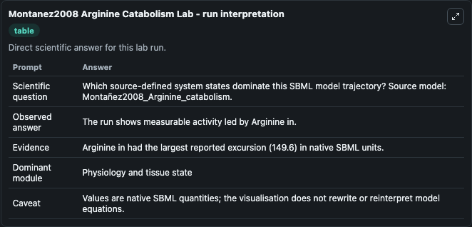
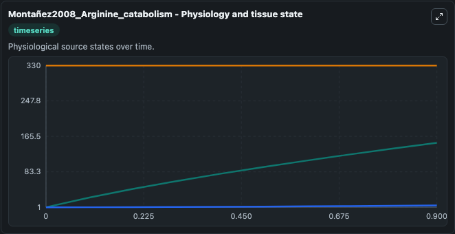
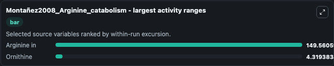
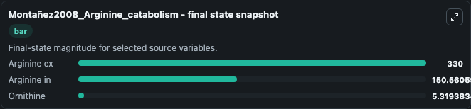
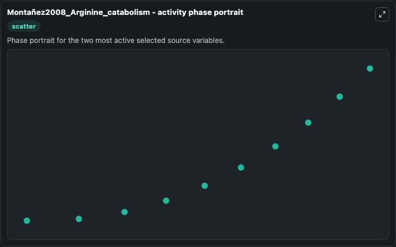

# Montanez2008 Arginine Catabolism

This Biosimulant lab wraps `Montanez2008 Arginine Catabolism` as a runnable systems biology model with a companion visualization module.
SBML creators: Armando Reyes-Palomares * , Raul Montañez *, Carlos Rodriguez-Caso +, Francisca Sanchez-Jimenez * , Miguel A. It can be used to explore the configured dynamics and compare scenario outcomes across configurations.

## What You'll See

The lab asks: Which source-defined system states dominate this SBML model trajectory? Source model: Montañez2008_Arginine_catabolism. It runs for 1.0 time units with a communication step of 0.1. The run uses the model defaults declared by the curated SBML wrapper. The generated visualizations focus on Arginine ex, Ornithine, and Arginine in, combining trajectory, endpoint-comparison, and summary-table views from one completed dark-mode run.

In this captured run, **Arginine in** moved from 1.000 to 150.6 across 1.0 simulation windows.


### Output Visualizations



*Summary table for Montanez2008 Arginine Catabolism, reporting the scientific question, observed answer, dominant module, and caveat.*



*Trajectories of Arginine in, Ornithine, and Arginine ex across the 1.0 simulation. In this run **Arginine in** climbed from 1.000 to 150.6 — the largest movements among the focused observables.*



*Largest-excursion ranking of the focused observables — the absolute movement magnitude during the run. Top 2: **Arginine in** = 149.6, **Ornithine** = 4.319.*



*Endpoint snapshot of the focused observables — final values from the captured run. Top 3 by value: **Arginine ex** = 330.0, **Arginine in** = 150.6, **Ornithine** = 5.319.*



*Visualization card from the Montanez2008 Arginine Catabolism dark-mode run.*


## Model Context

- Core model: `models/core`
- Visualization model: `models/visualisation`
- Standard: `other`
- Upstream source: `biomodels_ebi:BIOMD0000000191`
- License: `CC0`

## Inputs

| Input | Maps To | Default | Notes |
|---|---|---|---|
| Initial Arginine Ex | `systemsbiology_sbml_monta_ez2008_arginine_catabolism_biomd0000000191_model.initial_arginine_ex` | | Source state initial condition exposed as a model-specific control because no explicit intervention parameter is identifiable. Maps to SBML symbol `ARGex`. |
| Initial Ornithine | `systemsbiology_sbml_monta_ez2008_arginine_catabolism_biomd0000000191_model.initial_ornithine` | | Source state initial condition exposed as a model-specific control because no explicit intervention parameter is identifiable. Maps to SBML symbol `ORN`. |
| Initial Arginine In | `systemsbiology_sbml_monta_ez2008_arginine_catabolism_biomd0000000191_model.initial_arginine_in` | | Source state initial condition exposed as a model-specific control because no explicit intervention parameter is identifiable. Maps to SBML symbol `ARGin`. |

## Outputs

| Output | Maps To | Role |
|---|---|---|
| `state` | `systemsbiology_sbml_monta_ez2008_arginine_catabolism_biomd0000000191_model.state` | Available to the visualization model and downstream workflows. |
| `summary` | `systemsbiology_sbml_monta_ez2008_arginine_catabolism_biomd0000000191_model.summary` | Available to the visualization model and downstream workflows. |
| `species_labels` | `systemsbiology_sbml_monta_ez2008_arginine_catabolism_biomd0000000191_model.species_labels` | Available to the visualization model and downstream workflows. |
| `arginine_ex` | `systemsbiology_sbml_monta_ez2008_arginine_catabolism_biomd0000000191_model.arginine_ex` | Available to the visualization model and downstream workflows. |
| `ornithine` | `systemsbiology_sbml_monta_ez2008_arginine_catabolism_biomd0000000191_model.ornithine` | Available to the visualization model and downstream workflows. |
| `arginine_in` | `systemsbiology_sbml_monta_ez2008_arginine_catabolism_biomd0000000191_model.arginine_in` | Available to the visualization model and downstream workflows. |

## Runtime

- Duration: `1.0`
- Communication step: `0.1`

## Running Locally

```bash
biosimulant labs serve
```
