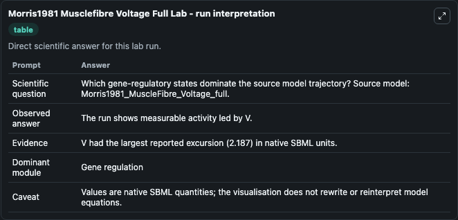
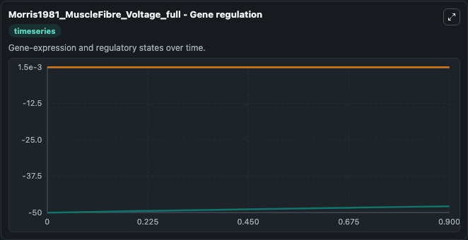
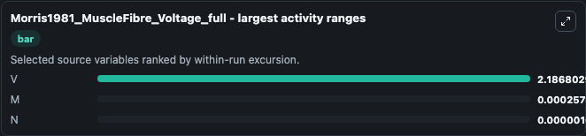
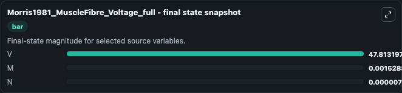
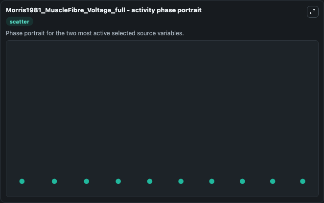

# Morris1981 Musclefibre Voltage Full

This Biosimulant lab wraps `Morris1981 Musclefibre Voltage Full` as a runnable systems biology model with a companion visualization module.
This is the full model (eq. 1 and 2) of the voltage oscillations in barnacle muscle fibers described in the article: Voltage oscillations in the barnacle giant muscle fiber. It can be used to explore the configured dynamics and compare scenario outcomes across configurations.

## What You'll See

The lab asks: Which gene-regulatory states dominate the source model trajectory? Source model: Morris1981_MuscleFibre_Voltage_full. It runs for 1.0 time units with a communication step of 0.1. The run uses the model defaults declared by the curated SBML wrapper. The generated visualizations focus on V, N, and M, combining trajectory, endpoint-comparison, and summary-table views from one completed dark-mode run.

In this captured run, **V** moved from -50.000 to -47.813 across 1.0 simulation windows.


### Output Visualizations



*Summary table for Morris1981 Musclefibre Voltage Full, reporting the scientific question, observed answer, dominant module, and caveat.*



*Trajectories of V, M, and N across the 1.0 simulation. In this run **V** climbed from -50.000 to -47.813 — the largest movements among the focused observables.*



*Largest-excursion ranking of the focused observables — the absolute movement magnitude during the run. Top 3: **V** = 2.187, **M** = 0.000258, **N** = 1.03e-06.*



*Endpoint snapshot of the focused observables — final values from the captured run. Top 3 by value: **V** = 47.813, **M** = 0.00153, **N** = 7.18e-06.*



*Visualization card from the Morris1981 Musclefibre Voltage Full dark-mode run.*


## Model Context

- Core model: `models/core`
- Visualization model: `models/visualisation`
- Standard: `other`
- Upstream source: `biomodels_ebi:BIOMD0000000324`
- License: `CC0`

## Inputs

| Input | Maps To | Default | Notes |
|---|---|---|---|
| Initial Model State V | `systemsbiology_sbml_morris1981_musclefibre_voltage_full_biomd0000000324_model.initial_model_state_v` | | Source state initial condition exposed as a model-specific control because no explicit intervention parameter is identifiable. Maps to SBML symbol `V`. |
| Initial Model State N | `systemsbiology_sbml_morris1981_musclefibre_voltage_full_biomd0000000324_model.initial_model_state_n` | | Source state initial condition exposed as a model-specific control because no explicit intervention parameter is identifiable. Maps to SBML symbol `N`. |
| Initial Model State M | `systemsbiology_sbml_morris1981_musclefibre_voltage_full_biomd0000000324_model.initial_model_state_m` | | Source state initial condition exposed as a model-specific control because no explicit intervention parameter is identifiable. Maps to SBML symbol `M`. |

## Outputs

| Output | Maps To | Role |
|---|---|---|
| `state` | `systemsbiology_sbml_morris1981_musclefibre_voltage_full_biomd0000000324_model.state` | Available to the visualization model and downstream workflows. |
| `summary` | `systemsbiology_sbml_morris1981_musclefibre_voltage_full_biomd0000000324_model.summary` | Available to the visualization model and downstream workflows. |
| `species_labels` | `systemsbiology_sbml_morris1981_musclefibre_voltage_full_biomd0000000324_model.species_labels` | Available to the visualization model and downstream workflows. |
| `model_state_v` | `systemsbiology_sbml_morris1981_musclefibre_voltage_full_biomd0000000324_model.model_state_v` | Available to the visualization model and downstream workflows. |
| `model_state_n` | `systemsbiology_sbml_morris1981_musclefibre_voltage_full_biomd0000000324_model.model_state_n` | Available to the visualization model and downstream workflows. |
| `model_state_m` | `systemsbiology_sbml_morris1981_musclefibre_voltage_full_biomd0000000324_model.model_state_m` | Available to the visualization model and downstream workflows. |

## Runtime

- Duration: `1.0`
- Communication step: `0.1`

## Running Locally

```bash
biosimulant labs serve
```
