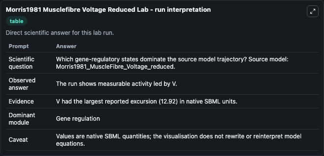
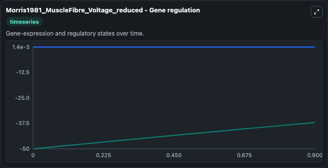
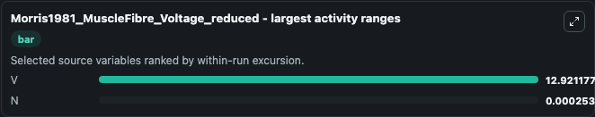
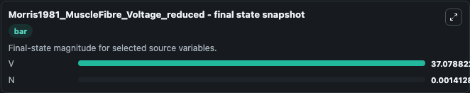
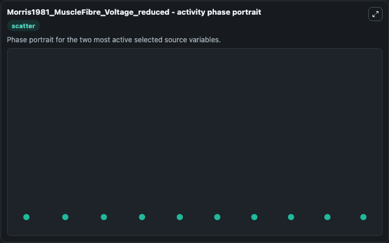

# Morris1981 Musclefibre Voltage Reduced

This Biosimulant lab wraps `Morris1981 Musclefibre Voltage Reduced` as a runnable systems biology model with a companion visualization module.
This is the reduced model of the voltage oscillations in barnacle muscle fibers, generally known as the Morris-Lecar model (eg. wikipedia ), described in the article: Voltage oscillations in the barna. It can be used to explore the configured dynamics and compare scenario outcomes across configurations.

## What You'll See

The lab asks: Which gene-regulatory states dominate the source model trajectory? Source model: Morris1981_MuscleFibre_Voltage_reduced. It runs for 1.0 time units with a communication step of 0.1. The run uses the model defaults declared by the curated SBML wrapper. The generated visualizations focus on V, and N, combining trajectory, endpoint-comparison, and summary-table views from one completed dark-mode run.

In this captured run, **V** moved from -50.000 to -37.079 across 1.0 simulation windows.


### Output Visualizations



*Summary table for Morris1981 Musclefibre Voltage Reduced, reporting the scientific question, observed answer, dominant module, and caveat.*



*Trajectories of V, and N across the 1.0 simulation. In this run **V** climbed from -50.000 to -37.079 — the largest movements among the focused observables.*



*Largest-excursion ranking of the focused observables — the absolute movement magnitude during the run. Top 2: **V** = 12.921, **N** = 0.000253.*



*Endpoint snapshot of the focused observables — final values from the captured run. Top 2 by value: **V** = 37.079, **N** = 0.00141.*



*Visualization card from the Morris1981 Musclefibre Voltage Reduced dark-mode run.*


## Model Context

- Core model: `models/core`
- Visualization model: `models/visualisation`
- Standard: `other`
- Upstream source: `biomodels_ebi:BIOMD0000000280`
- License: `CC0`

## Inputs

| Input | Maps To | Default | Notes |
|---|---|---|---|
| Initial Model State V | `systemsbiology_sbml_morris1981_musclefibre_voltage_reduced_biomd0000000280_model.initial_model_state_v` | | Source state initial condition exposed as a model-specific control because no explicit intervention parameter is identifiable. Maps to SBML symbol `V`. |
| Initial Model State N | `systemsbiology_sbml_morris1981_musclefibre_voltage_reduced_biomd0000000280_model.initial_model_state_n` | | Source state initial condition exposed as a model-specific control because no explicit intervention parameter is identifiable. Maps to SBML symbol `N`. |

## Outputs

| Output | Maps To | Role |
|---|---|---|
| `state` | `systemsbiology_sbml_morris1981_musclefibre_voltage_reduced_biomd0000000280_model.state` | Available to the visualization model and downstream workflows. |
| `summary` | `systemsbiology_sbml_morris1981_musclefibre_voltage_reduced_biomd0000000280_model.summary` | Available to the visualization model and downstream workflows. |
| `species_labels` | `systemsbiology_sbml_morris1981_musclefibre_voltage_reduced_biomd0000000280_model.species_labels` | Available to the visualization model and downstream workflows. |
| `model_state_v` | `systemsbiology_sbml_morris1981_musclefibre_voltage_reduced_biomd0000000280_model.model_state_v` | Available to the visualization model and downstream workflows. |
| `model_state_n` | `systemsbiology_sbml_morris1981_musclefibre_voltage_reduced_biomd0000000280_model.model_state_n` | Available to the visualization model and downstream workflows. |

## Runtime

- Duration: `1.0`
- Communication step: `0.1`

## Running Locally

```bash
biosimulant labs serve
```
