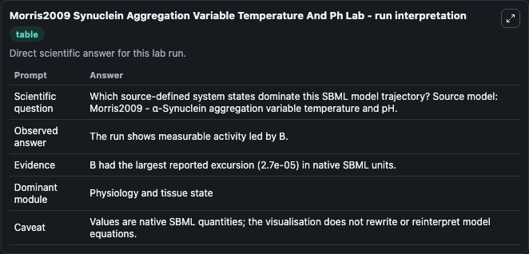
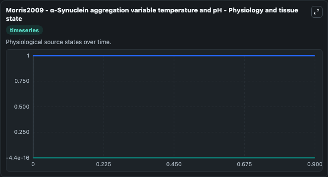
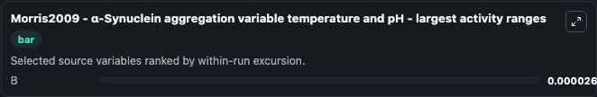
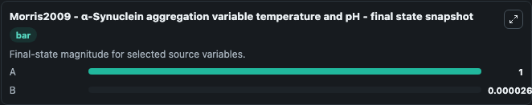

# Morris2009 Synuclein Aggregation Variable Temperature And Ph

This Biosimulant lab wraps `Morris2009 Synuclein Aggregation Variable Temperature And Ph` as a runnable systems biology model with a companion visualization module.
Morris2009 - α-Synuclein aggregationvariable temperature and pH This model is described in the article: Alpha-synuclein aggregation variable temperature and variable pH kinetic data: a re-analysis usi. It can be used to explore the configured dynamics and compare scenario outcomes across configurations.

## What You'll See

The lab asks: Which source-defined system states dominate this SBML model trajectory? Source model: Morris2009 - α-Synuclein aggregation variable temperature and pH. It runs for 1.0 time units with a communication step of 0.1. The run uses the model defaults declared by the curated SBML wrapper. The generated visualizations focus on A, and B, combining trajectory, endpoint-comparison, and summary-table views from one completed dark-mode run.

In this captured run, **B** moved from -4.44e-16 to 2.7e-05 across 1.0 simulation windows.


### Output Visualizations



*Summary table for Morris2009 Synuclein Aggregation Variable Temperature And Ph, reporting the scientific question, observed answer, dominant module, and caveat.*



*Trajectories of B, and A across the 1.0 simulation. In this run **B** climbed from -4.44e-16 to 2.7e-05 — the largest movements among the focused observables.*



*Largest-excursion ranking of the focused observables — the absolute movement magnitude during the run. Top 1: **B** = 2.7e-05.*



*Trajectories of B, and A across the 1.0 simulation. In this run **B** climbed from -4.44e-16 to 2.7e-05 — the largest movements among the focused observables.*


## Model Context

- Core model: `models/core`
- Visualization model: `models/visualisation`
- Standard: `other`
- Upstream source: `biomodels_ebi:BIOMD0000000566`
- License: `CC0`

## Inputs

| Input | Maps To | Default | Notes |
|---|---|---|---|
| Initial Model State A | `systemsbiology_sbml_morris2009_synuclein_aggregation_variable_temper_biomd0000000566_model.initial_model_state_a` | | Source state initial condition exposed as a model-specific control because no explicit intervention parameter is identifiable. Maps to SBML symbol `A`. |
| Initial Model State B | `systemsbiology_sbml_morris2009_synuclein_aggregation_variable_temper_biomd0000000566_model.initial_model_state_b` | | Source state initial condition exposed as a model-specific control because no explicit intervention parameter is identifiable. Maps to SBML symbol `B`. |

## Outputs

| Output | Maps To | Role |
|---|---|---|
| `state` | `systemsbiology_sbml_morris2009_synuclein_aggregation_variable_temper_biomd0000000566_model.state` | Available to the visualization model and downstream workflows. |
| `summary` | `systemsbiology_sbml_morris2009_synuclein_aggregation_variable_temper_biomd0000000566_model.summary` | Available to the visualization model and downstream workflows. |
| `species_labels` | `systemsbiology_sbml_morris2009_synuclein_aggregation_variable_temper_biomd0000000566_model.species_labels` | Available to the visualization model and downstream workflows. |
| `model_state_a` | `systemsbiology_sbml_morris2009_synuclein_aggregation_variable_temper_biomd0000000566_model.model_state_a` | Available to the visualization model and downstream workflows. |
| `model_state_b` | `systemsbiology_sbml_morris2009_synuclein_aggregation_variable_temper_biomd0000000566_model.model_state_b` | Available to the visualization model and downstream workflows. |

## Runtime

- Duration: `1.0`
- Communication step: `0.1`

## Running Locally

```bash
biosimulant labs serve
```
