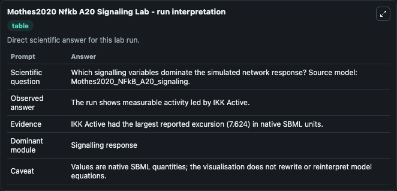
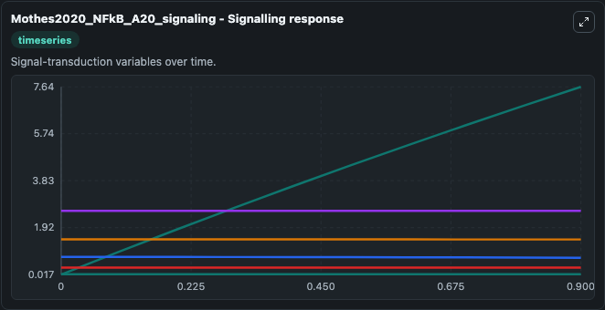
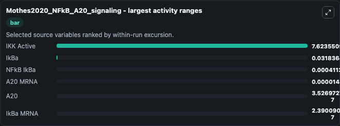
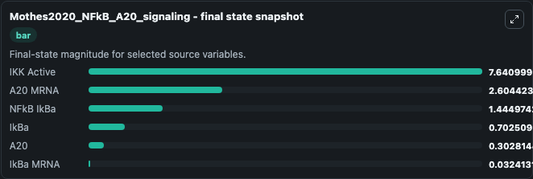
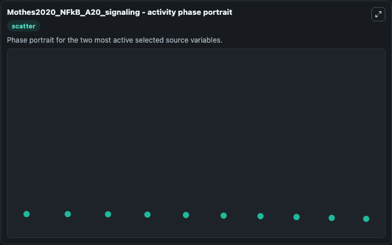

# Mothes2020 Nfkb A20 Signaling

This Biosimulant lab wraps `Mothes2020 Nfkb A20 Signaling` as a runnable systems biology model with a companion visualization module.
The Mothes2020_NFkB_A20_signaling model is based on our previous model published in Murakawa et al., Nat Commun, 2015 (doi: 10.1038/ncomms8367). It can be used to explore the configured dynamics and compare scenario outcomes across configurations.

## What You'll See

The lab asks: Which signalling variables dominate the simulated network response? Source model: Mothes2020_NFkB_A20_signaling. It runs for 1.0 time units with a communication step of 0.1. The run uses the model defaults declared by the curated SBML wrapper. The generated visualizations focus on A20 MRNA, IkBa MRNA, NFkB IkBa, IkBa, A20, and IKK Active, combining trajectory, endpoint-comparison, and summary-table views from one completed dark-mode run.

In this captured run, **IKK Active** moved from 0.0174 to 7.641 across 1.0 simulation windows.


### Output Visualizations



*Summary table for Mothes2020 Nfkb A20 Signaling, reporting the scientific question, observed answer, dominant module, and caveat.*



*Trajectories of IKK Active, IkBa, NFkB IkBa, A20 MRNA, A20, and IkBa MRNA across the 1.0 simulation. In this run **IKK Active** climbed from 0.0174 to 7.641 and **IkBa** fell from 0.7343 to 0.7025 — the largest movements among the focused observables.*



*Largest-excursion ranking of the focused observables — the absolute movement magnitude during the run. Top 3: **IKK Active** = 7.624, **IkBa** = 0.0318, **NFkB IkBa** = 0.000411, with 3 more observables below.*



*Endpoint snapshot of the focused observables — final values from the captured run. Top 3 by value: **IKK Active** = 7.641, **A20 MRNA** = 2.604, **NFkB IkBa** = 1.445, with 3 more observables below.*



*Visualization card from the Mothes2020 Nfkb A20 Signaling dark-mode run.*


## Model Context

- Core model: `models/core`
- Visualization model: `models/visualisation`
- Standard: `other`
- Upstream source: `biomodels_ebi:MODEL2307110001`
- License: `CC0`

## Inputs

| Input | Maps To | Default | Notes |
|---|---|---|---|
| Stimulus | `systemsbiology_sbml_mothes2020_nfkb_a20_signaling_model2307110001_model.stimulus` | | Source parameter exposed because its SBML label indicates a boundary, stimulus, dose, ligand, protocol, substrate, or environmental control. Maps to SBML symbol `stimulus`. |

## Outputs

| Output | Maps To | Role |
|---|---|---|
| `state` | `systemsbiology_sbml_mothes2020_nfkb_a20_signaling_model2307110001_model.state` | Available to the visualization model and downstream workflows. |
| `summary` | `systemsbiology_sbml_mothes2020_nfkb_a20_signaling_model2307110001_model.summary` | Available to the visualization model and downstream workflows. |
| `species_labels` | `systemsbiology_sbml_mothes2020_nfkb_a20_signaling_model2307110001_model.species_labels` | Available to the visualization model and downstream workflows. |
| `a20_mrna` | `systemsbiology_sbml_mothes2020_nfkb_a20_signaling_model2307110001_model.a20_mrna` | Available to the visualization model and downstream workflows. |
| `ik_ba_mrna` | `systemsbiology_sbml_mothes2020_nfkb_a20_signaling_model2307110001_model.ik_ba_mrna` | Available to the visualization model and downstream workflows. |
| `n_fk_b_ik_ba` | `systemsbiology_sbml_mothes2020_nfkb_a20_signaling_model2307110001_model.n_fk_b_ik_ba` | Available to the visualization model and downstream workflows. |
| `ik_ba` | `systemsbiology_sbml_mothes2020_nfkb_a20_signaling_model2307110001_model.ik_ba` | Available to the visualization model and downstream workflows. |
| `a20` | `systemsbiology_sbml_mothes2020_nfkb_a20_signaling_model2307110001_model.a20` | Available to the visualization model and downstream workflows. |
| `ikk_active` | `systemsbiology_sbml_mothes2020_nfkb_a20_signaling_model2307110001_model.ikk_active` | Available to the visualization model and downstream workflows. |

## Runtime

- Duration: `1.0`
- Communication step: `0.1`

## Running Locally

```bash
biosimulant labs serve
```
