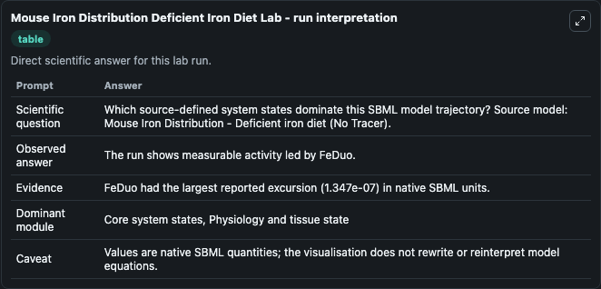
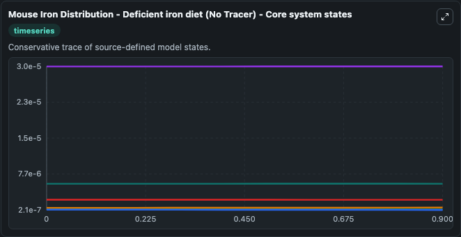
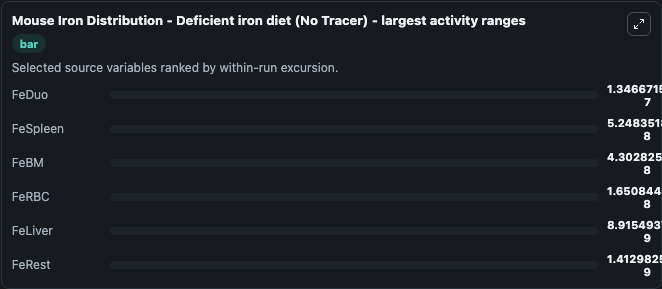
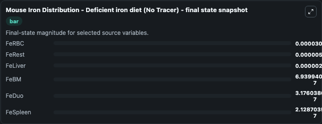
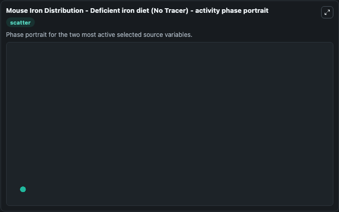

# Mouse Iron Distribution Deficient Iron Diet

This Biosimulant lab wraps `Mouse Iron Distribution Deficient Iron Diet` as a runnable systems biology model with a companion visualization module.
Mouse Iron Distribution Dynamics Dynamic model of iron distribution in mice. It can be used to explore the configured dynamics and compare scenario outcomes across configurations.

## What You'll See

The lab asks: Which source-defined system states dominate this SBML model trajectory? Source model: Mouse Iron Distribution - Deficient iron diet (No Tracer). It runs for 1.0 time units with a communication step of 0.1. The run uses the model defaults declared by the curated SBML wrapper. The generated visualizations focus on FeLiver, FeRBC, FeDuo, FeSpleen, FeBM, and FeRest, combining trajectory, endpoint-comparison, and summary-table views from one completed dark-mode run.

In this captured run, **FeDuo** moved from 4.52e-07 to 3.18e-07 across 1.0 simulation windows.


### Output Visualizations



*Summary table for Mouse Iron Distribution Deficient Iron Diet, reporting the scientific question, observed answer, dominant module, and caveat.*



*Trajectories of FeDuo, FeSpleen, FeBM, FeRBC, FeLiver, and FeRest across the 1.0 simulation. In this run **FeBM** climbed from 6.51e-07 to 6.94e-07 and **FeDuo** fell from 4.52e-07 to 3.18e-07 — the largest movements among the focused observables.*



*Largest-excursion ranking of the focused observables — the absolute movement magnitude during the run. Top 3: **FeDuo** = 1.35e-07, **FeSpleen** = 5.25e-08, **FeBM** = 4.3e-08, with 3 more observables below.*



*Endpoint snapshot of the focused observables — final values from the captured run. Top 3 by value: **FeRBC** = 3e-05, **FeRest** = 5.65e-06, **FeLiver** = 2.32e-06, with 3 more observables below.*



*Visualization card from the Mouse Iron Distribution Deficient Iron Diet dark-mode run.*


## Model Context

- Core model: `models/core`
- Visualization model: `models/visualisation`
- Standard: `other`
- Upstream source: `biomodels_ebi:BIOMD0000000737`
- License: `CC0`

## Inputs

| Input | Maps To | Default | Notes |
|---|---|---|---|
| Initial Fe Liver | `systemsbiology_sbml_mouse_iron_distribution_deficient_iron_diet_no_t_biomd0000000737_model.initial_fe_liver` | | Source state initial condition exposed as a model-specific control because no explicit intervention parameter is identifiable. Maps to SBML symbol `FeLiver`. |
| Initial Fe Rbc | `systemsbiology_sbml_mouse_iron_distribution_deficient_iron_diet_no_t_biomd0000000737_model.initial_fe_rbc` | | Source state initial condition exposed as a model-specific control because no explicit intervention parameter is identifiable. Maps to SBML symbol `FeRBC`. |
| Initial Fe Duo | `systemsbiology_sbml_mouse_iron_distribution_deficient_iron_diet_no_t_biomd0000000737_model.initial_fe_duo` | | Source state initial condition exposed as a model-specific control because no explicit intervention parameter is identifiable. Maps to SBML symbol `FeDuo`. |
| Initial Fe Spleen | `systemsbiology_sbml_mouse_iron_distribution_deficient_iron_diet_no_t_biomd0000000737_model.initial_fe_spleen` | | Source state initial condition exposed as a model-specific control because no explicit intervention parameter is identifiable. Maps to SBML symbol `FeSpleen`. |
| Initial Fe Bm | `systemsbiology_sbml_mouse_iron_distribution_deficient_iron_diet_no_t_biomd0000000737_model.initial_fe_bm` | | Source state initial condition exposed as a model-specific control because no explicit intervention parameter is identifiable. Maps to SBML symbol `FeBM`. |
| Initial Fe Rest | `systemsbiology_sbml_mouse_iron_distribution_deficient_iron_diet_no_t_biomd0000000737_model.initial_fe_rest` | | Source state initial condition exposed as a model-specific control because no explicit intervention parameter is identifiable. Maps to SBML symbol `FeRest`. |

## Outputs

| Output | Maps To | Role |
|---|---|---|
| `state` | `systemsbiology_sbml_mouse_iron_distribution_deficient_iron_diet_no_t_biomd0000000737_model.state` | Available to the visualization model and downstream workflows. |
| `summary` | `systemsbiology_sbml_mouse_iron_distribution_deficient_iron_diet_no_t_biomd0000000737_model.summary` | Available to the visualization model and downstream workflows. |
| `species_labels` | `systemsbiology_sbml_mouse_iron_distribution_deficient_iron_diet_no_t_biomd0000000737_model.species_labels` | Available to the visualization model and downstream workflows. |
| `fe_liver` | `systemsbiology_sbml_mouse_iron_distribution_deficient_iron_diet_no_t_biomd0000000737_model.fe_liver` | Available to the visualization model and downstream workflows. |
| `fe_rbc` | `systemsbiology_sbml_mouse_iron_distribution_deficient_iron_diet_no_t_biomd0000000737_model.fe_rbc` | Available to the visualization model and downstream workflows. |
| `fe_duo` | `systemsbiology_sbml_mouse_iron_distribution_deficient_iron_diet_no_t_biomd0000000737_model.fe_duo` | Available to the visualization model and downstream workflows. |
| `fe_spleen` | `systemsbiology_sbml_mouse_iron_distribution_deficient_iron_diet_no_t_biomd0000000737_model.fe_spleen` | Available to the visualization model and downstream workflows. |
| `fe_bm` | `systemsbiology_sbml_mouse_iron_distribution_deficient_iron_diet_no_t_biomd0000000737_model.fe_bm` | Available to the visualization model and downstream workflows. |
| `fe_rest` | `systemsbiology_sbml_mouse_iron_distribution_deficient_iron_diet_no_t_biomd0000000737_model.fe_rest` | Available to the visualization model and downstream workflows. |

## Runtime

- Duration: `1.0`
- Communication step: `0.1`

## Running Locally

```bash
biosimulant labs serve
```
