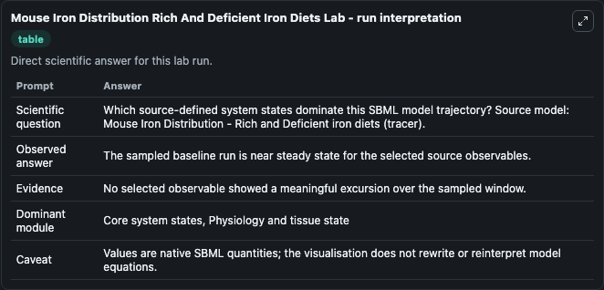
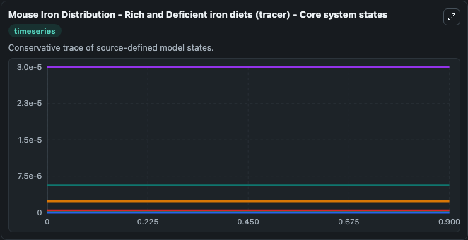
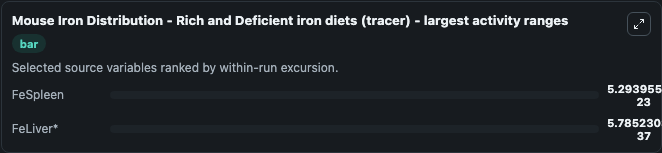
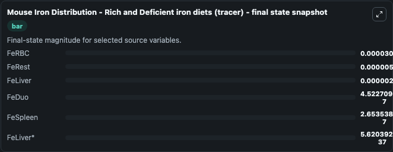
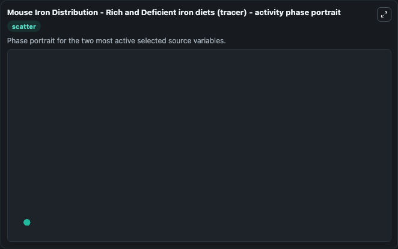

# Mouse Iron Distribution Rich And Deficient Iron Diets

This Biosimulant lab wraps `Mouse Iron Distribution Rich And Deficient Iron Diets` as a runnable systems biology model with a companion visualization module.
Mouse Iron Distribution Dynamics Dynamic model of iron distribution in mice. It can be used to explore the configured dynamics and compare scenario outcomes across configurations.

## What You'll See

The lab asks: Which source-defined system states dominate this SBML model trajectory? Source model: Mouse Iron Distribution - Rich and Deficient iron diets (tracer). It runs for 1.0 time units with a communication step of 0.1. The run uses the model defaults declared by the curated SBML wrapper. The generated visualizations focus on FeLiver, FeLiver*, FeRBC, FeDuo, FeSpleen, and FeRest, combining trajectory, endpoint-comparison, and summary-table views from one completed dark-mode run.

In this captured run, **FeSpleen** moved from 2.65e-07 to 2.65e-07 across 1.0 simulation windows.


### Output Visualizations



*Summary table for Mouse Iron Distribution Rich And Deficient Iron Diets, reporting the scientific question, observed answer, dominant module, and caveat.*



*Trajectories of FeSpleen, FeLiver*, FeLiver, FeRBC, FeDuo, and FeRest across the 1.0 simulation. In this run **FeSpleen** climbed from 2.65e-07 to 2.65e-07 — the largest movements among the focused observables.*



*Largest-excursion ranking of the focused observables — the absolute movement magnitude during the run. Top 2: **FeSpleen** = 5.29e-23, **FeLiver*** = 5.79e-37.*



*Trajectories of FeSpleen, FeLiver*, FeLiver, FeRBC, FeDuo, and FeRest across the 1.0 simulation. In this run **FeSpleen** climbed from 2.65e-07 to 2.65e-07 — the largest movements among the focused observables.*



*Visualization card from the Mouse Iron Distribution Rich And Deficient Iron Diets dark-mode run.*


## Model Context

- Core model: `models/core`
- Visualization model: `models/visualisation`
- Standard: `other`
- Upstream source: `biomodels_ebi:BIOMD0000000734`
- License: `CC0`

## Inputs

| Input | Maps To | Default | Notes |
|---|---|---|---|
| Initial Fe Liver | `systemsbiology_sbml_mouse_iron_distribution_rich_and_deficient_iron_biomd0000000734_model.initial_fe_liver` | | Source state initial condition exposed as a model-specific control because no explicit intervention parameter is identifiable. Maps to SBML symbol `FeLiver_0`. |
| Initial Fe Liver 2 | `systemsbiology_sbml_mouse_iron_distribution_rich_and_deficient_iron_biomd0000000734_model.initial_fe_liver_2` | | Source state initial condition exposed as a model-specific control because no explicit intervention parameter is identifiable. Maps to SBML symbol `FeLiver`. |
| Initial Fe Rbc | `systemsbiology_sbml_mouse_iron_distribution_rich_and_deficient_iron_biomd0000000734_model.initial_fe_rbc` | | Source state initial condition exposed as a model-specific control because no explicit intervention parameter is identifiable. Maps to SBML symbol `FeRBC_0`. |
| Initial Fe Duo | `systemsbiology_sbml_mouse_iron_distribution_rich_and_deficient_iron_biomd0000000734_model.initial_fe_duo` | | Source state initial condition exposed as a model-specific control because no explicit intervention parameter is identifiable. Maps to SBML symbol `FeDuo_0`. |
| Initial Fe Spleen | `systemsbiology_sbml_mouse_iron_distribution_rich_and_deficient_iron_biomd0000000734_model.initial_fe_spleen` | | Source state initial condition exposed as a model-specific control because no explicit intervention parameter is identifiable. Maps to SBML symbol `FeSpleen_0`. |
| Initial Fe Rest | `systemsbiology_sbml_mouse_iron_distribution_rich_and_deficient_iron_biomd0000000734_model.initial_fe_rest` | | Source state initial condition exposed as a model-specific control because no explicit intervention parameter is identifiable. Maps to SBML symbol `FeRest_0`. |

## Outputs

| Output | Maps To | Role |
|---|---|---|
| `state` | `systemsbiology_sbml_mouse_iron_distribution_rich_and_deficient_iron_biomd0000000734_model.state` | Available to the visualization model and downstream workflows. |
| `summary` | `systemsbiology_sbml_mouse_iron_distribution_rich_and_deficient_iron_biomd0000000734_model.summary` | Available to the visualization model and downstream workflows. |
| `species_labels` | `systemsbiology_sbml_mouse_iron_distribution_rich_and_deficient_iron_biomd0000000734_model.species_labels` | Available to the visualization model and downstream workflows. |
| `fe_liver` | `systemsbiology_sbml_mouse_iron_distribution_rich_and_deficient_iron_biomd0000000734_model.fe_liver` | Available to the visualization model and downstream workflows. |
| `fe_liver_2` | `systemsbiology_sbml_mouse_iron_distribution_rich_and_deficient_iron_biomd0000000734_model.fe_liver_2` | Available to the visualization model and downstream workflows. |
| `fe_rbc` | `systemsbiology_sbml_mouse_iron_distribution_rich_and_deficient_iron_biomd0000000734_model.fe_rbc` | Available to the visualization model and downstream workflows. |
| `fe_duo` | `systemsbiology_sbml_mouse_iron_distribution_rich_and_deficient_iron_biomd0000000734_model.fe_duo` | Available to the visualization model and downstream workflows. |
| `fe_spleen` | `systemsbiology_sbml_mouse_iron_distribution_rich_and_deficient_iron_biomd0000000734_model.fe_spleen` | Available to the visualization model and downstream workflows. |
| `fe_rest` | `systemsbiology_sbml_mouse_iron_distribution_rich_and_deficient_iron_biomd0000000734_model.fe_rest` | Available to the visualization model and downstream workflows. |

## Runtime

- Duration: `1.0`
- Communication step: `0.1`

## Running Locally

```bash
biosimulant labs serve
```
