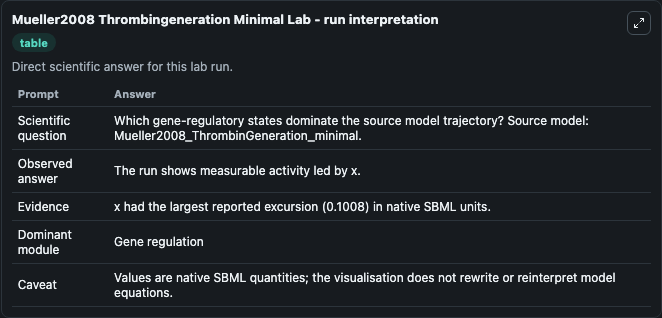
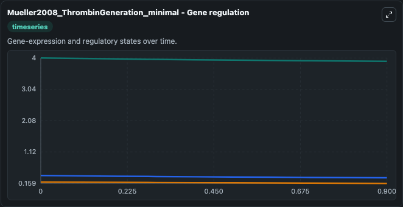
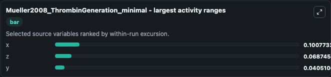
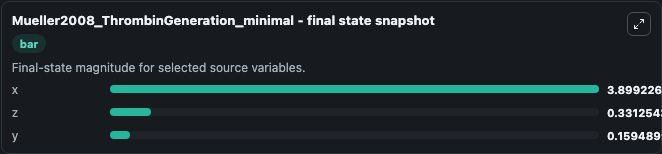
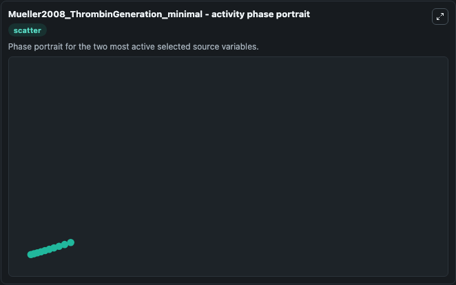

# Mueller2008 Thrombingeneration Minimal

This Biosimulant lab wraps `Mueller2008 Thrombingeneration Minimal` as a runnable systems biology model with a companion visualization module.
This model originates from BioModels Database: A Database of Annotated Published Models (http://www.ebi.ac.uk/biomodels/). It can be used to explore the configured dynamics and compare scenario outcomes across configurations.

## What You'll See

The lab asks: Which gene-regulatory states dominate the source model trajectory? Source model: Mueller2008_ThrombinGeneration_minimal. It runs for 1.0 time units with a communication step of 0.1. The run uses the model defaults declared by the curated SBML wrapper. The generated visualizations focus on x, z, and y, combining trajectory, endpoint-comparison, and summary-table views from one completed dark-mode run.

In this captured run, **x** moved from 4.000 to 3.899 across 1.0 simulation windows.


### Output Visualizations



*Summary table for Mueller2008 Thrombingeneration Minimal, reporting the scientific question, observed answer, dominant module, and caveat.*



*Trajectories of x, z, and y across the 1.0 simulation. In this run **x** fell from 4.000 to 3.899 — the largest movements among the focused observables.*



*Largest-excursion ranking of the focused observables — the absolute movement magnitude during the run. Top 3: **x** = 0.1008, **z** = 0.0687, **y** = 0.0405.*



*Endpoint snapshot of the focused observables — final values from the captured run. Top 3 by value: **x** = 3.899, **z** = 0.3313, **y** = 0.1595.*



*Visualization card from the Mueller2008 Thrombingeneration Minimal dark-mode run.*


## Model Context

- Core model: `models/core`
- Visualization model: `models/visualisation`
- Standard: `other`
- Upstream source: `biomodels_ebi:BIOMD0000000367`
- License: `CC0`

## Inputs

| Input | Maps To | Default | Notes |
|---|---|---|---|
| Initial Model State X | `systemsbiology_sbml_mueller2008_thrombingeneration_minimal_biomd0000000367_model.initial_model_state_x` | | Source state initial condition exposed as a model-specific control because no explicit intervention parameter is identifiable. Maps to SBML symbol `x`. |
| Initial Model State Z | `systemsbiology_sbml_mueller2008_thrombingeneration_minimal_biomd0000000367_model.initial_model_state_z` | | Source state initial condition exposed as a model-specific control because no explicit intervention parameter is identifiable. Maps to SBML symbol `z`. |
| Initial Model State Y | `systemsbiology_sbml_mueller2008_thrombingeneration_minimal_biomd0000000367_model.initial_model_state_y` | | Source state initial condition exposed as a model-specific control because no explicit intervention parameter is identifiable. Maps to SBML symbol `y`. |

## Outputs

| Output | Maps To | Role |
|---|---|---|
| `state` | `systemsbiology_sbml_mueller2008_thrombingeneration_minimal_biomd0000000367_model.state` | Available to the visualization model and downstream workflows. |
| `summary` | `systemsbiology_sbml_mueller2008_thrombingeneration_minimal_biomd0000000367_model.summary` | Available to the visualization model and downstream workflows. |
| `species_labels` | `systemsbiology_sbml_mueller2008_thrombingeneration_minimal_biomd0000000367_model.species_labels` | Available to the visualization model and downstream workflows. |
| `model_state_x` | `systemsbiology_sbml_mueller2008_thrombingeneration_minimal_biomd0000000367_model.model_state_x` | Available to the visualization model and downstream workflows. |
| `model_state_z` | `systemsbiology_sbml_mueller2008_thrombingeneration_minimal_biomd0000000367_model.model_state_z` | Available to the visualization model and downstream workflows. |
| `model_state_y` | `systemsbiology_sbml_mueller2008_thrombingeneration_minimal_biomd0000000367_model.model_state_y` | Available to the visualization model and downstream workflows. |

## Runtime

- Duration: `1.0`
- Communication step: `0.1`

## Running Locally

```bash
biosimulant labs serve
```
