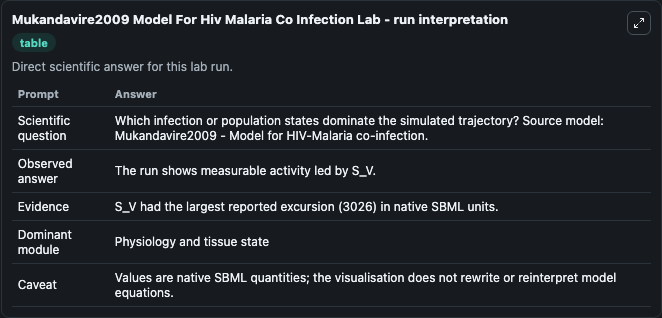
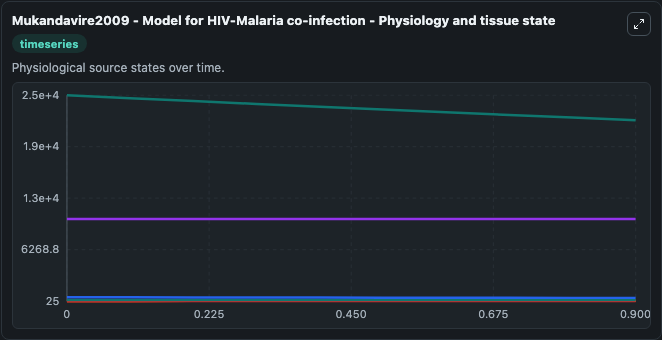
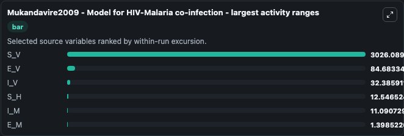
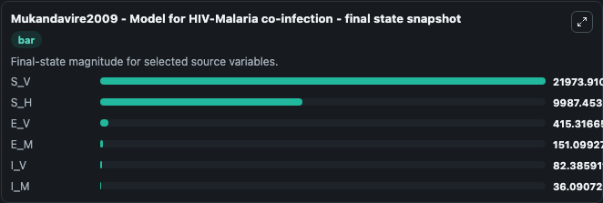
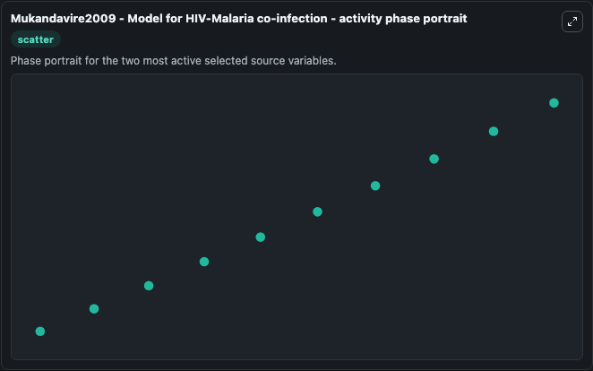

# Mukandavire2009 Model For Hiv Malaria Co Infection

This Biosimulant lab wraps `Mukandavire2009 Model For Hiv Malaria Co Infection` as a runnable systems biology model with a companion visualization module.
Mathematical model for HIV, malaria and HIV-malaria co-infection. It can be used to explore the configured dynamics and compare scenario outcomes across configurations.

## What You'll See

The lab asks: Which infection or population states dominate the simulated trajectory? Source model: Mukandavire2009 - Model for HIV-Malaria co-infection. It runs for 1.0 time units with a communication step of 0.1. The run uses the model defaults declared by the curated SBML wrapper. The generated visualizations focus on S_V, S_H, E_V, E_M, I_V, and I_M, combining trajectory, endpoint-comparison, and summary-table views from one completed dark-mode run.

In this captured run, **S_V** moved from 2.5e+04 to 2.2e+04 across 1.0 simulation windows.


### Output Visualizations



*Summary table for Mukandavire2009 Model For Hiv Malaria Co Infection, reporting the scientific question, observed answer, dominant module, and caveat.*



*Trajectories of S_V, E_V, I_V, S_H, I_M, and E_M across the 1.0 simulation. In this run **I_V** climbed from 50.000 to 82.386 and **S_V** fell from 2.5e+04 to 2.2e+04 — the largest movements among the focused observables.*



*Largest-excursion ranking of the focused observables — the absolute movement magnitude during the run. Top 3: **S_V** = 3026.1, **E_V** = 84.683, **I_V** = 32.386, with 3 more observables below.*



*Endpoint snapshot of the focused observables — final values from the captured run. Top 3 by value: **S_V** = 2.2e+04, **S_H** = 9987.5, **E_V** = 415.3, with 3 more observables below.*



*Visualization card from the Mukandavire2009 Model For Hiv Malaria Co Infection dark-mode run.*


## Model Context

- Core model: `models/core`
- Visualization model: `models/visualisation`
- Standard: `other`
- Upstream source: `biomodels_ebi:MODEL1805230001`
- License: `CC0`

## Inputs

| Input | Maps To | Default | Notes |
|---|---|---|---|
| Initial Model State S V | `systemsbiology_sbml_mukandavire2009_model_for_hiv_malaria_co_infecti_model1805230001_model.initial_model_state_s_v` | | Source state initial condition exposed as a model-specific control because no explicit intervention parameter is identifiable. Maps to SBML symbol `S_V`. |
| Initial Model State S H | `systemsbiology_sbml_mukandavire2009_model_for_hiv_malaria_co_infecti_model1805230001_model.initial_model_state_s_h` | | Source state initial condition exposed as a model-specific control because no explicit intervention parameter is identifiable. Maps to SBML symbol `S_H`. |
| Initial Model State E V | `systemsbiology_sbml_mukandavire2009_model_for_hiv_malaria_co_infecti_model1805230001_model.initial_model_state_e_v` | | Source state initial condition exposed as a model-specific control because no explicit intervention parameter is identifiable. Maps to SBML symbol `E_V`. |
| Initial Model State E M | `systemsbiology_sbml_mukandavire2009_model_for_hiv_malaria_co_infecti_model1805230001_model.initial_model_state_e_m` | | Source state initial condition exposed as a model-specific control because no explicit intervention parameter is identifiable. Maps to SBML symbol `E_M`. |
| Initial Model State I V | `systemsbiology_sbml_mukandavire2009_model_for_hiv_malaria_co_infecti_model1805230001_model.initial_model_state_i_v` | | Source state initial condition exposed as a model-specific control because no explicit intervention parameter is identifiable. Maps to SBML symbol `I_V`. |
| Initial Model State I M | `systemsbiology_sbml_mukandavire2009_model_for_hiv_malaria_co_infecti_model1805230001_model.initial_model_state_i_m` | | Source state initial condition exposed as a model-specific control because no explicit intervention parameter is identifiable. Maps to SBML symbol `I_M`. |

## Outputs

| Output | Maps To | Role |
|---|---|---|
| `state` | `systemsbiology_sbml_mukandavire2009_model_for_hiv_malaria_co_infecti_model1805230001_model.state` | Available to the visualization model and downstream workflows. |
| `summary` | `systemsbiology_sbml_mukandavire2009_model_for_hiv_malaria_co_infecti_model1805230001_model.summary` | Available to the visualization model and downstream workflows. |
| `species_labels` | `systemsbiology_sbml_mukandavire2009_model_for_hiv_malaria_co_infecti_model1805230001_model.species_labels` | Available to the visualization model and downstream workflows. |
| `s_v` | `systemsbiology_sbml_mukandavire2009_model_for_hiv_malaria_co_infecti_model1805230001_model.s_v` | Available to the visualization model and downstream workflows. |
| `s_h` | `systemsbiology_sbml_mukandavire2009_model_for_hiv_malaria_co_infecti_model1805230001_model.s_h` | Available to the visualization model and downstream workflows. |
| `e_v` | `systemsbiology_sbml_mukandavire2009_model_for_hiv_malaria_co_infecti_model1805230001_model.e_v` | Available to the visualization model and downstream workflows. |
| `e_m` | `systemsbiology_sbml_mukandavire2009_model_for_hiv_malaria_co_infecti_model1805230001_model.e_m` | Available to the visualization model and downstream workflows. |
| `i_v` | `systemsbiology_sbml_mukandavire2009_model_for_hiv_malaria_co_infecti_model1805230001_model.i_v` | Available to the visualization model and downstream workflows. |
| `i_m` | `systemsbiology_sbml_mukandavire2009_model_for_hiv_malaria_co_infecti_model1805230001_model.i_m` | Available to the visualization model and downstream workflows. |

## Runtime

- Duration: `1.0`
- Communication step: `0.1`

## Running Locally

```bash
biosimulant labs serve
```
