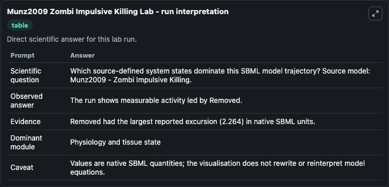
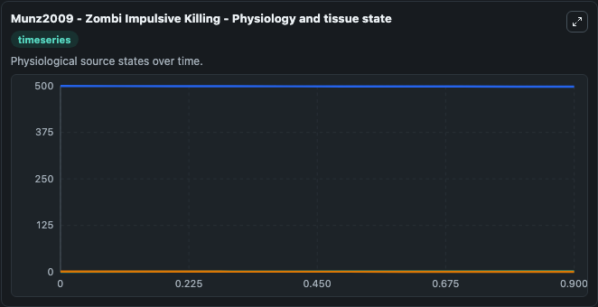
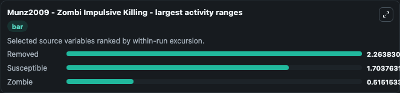
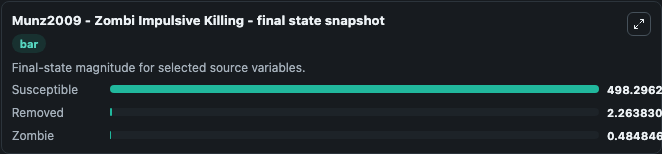
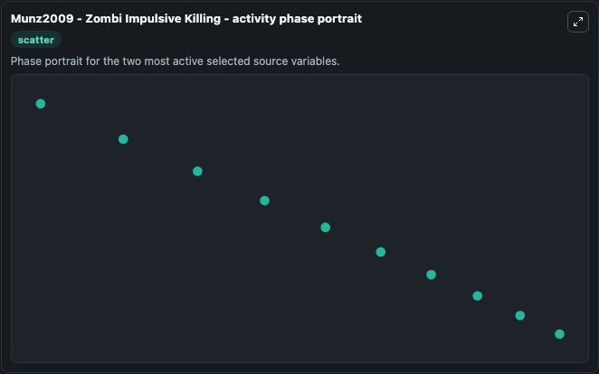

# Munz2009 Zombi Impulsive Killing

This Biosimulant lab wraps `Munz2009 Zombi Impulsive Killing` as a runnable systems biology model with a companion visualization module.
Munz2009 - Zombie Impulsive Killing This is the basic SZR model with impulsive killing described in the article. It can be used to explore the configured dynamics and compare scenario outcomes across configurations.

## What You'll See

The lab asks: Which source-defined system states dominate this SBML model trajectory? Source model: Munz2009 - Zombi Impulsive Killing. It runs for 1.0 time units with a communication step of 0.1. The run uses the model defaults declared by the curated SBML wrapper. The generated visualizations focus on Zombie, Susceptible, and Removed, combining trajectory, endpoint-comparison, and summary-table views from one completed dark-mode run.

In this captured run, **Removed** moved from 0 to 2.264 across 1.0 simulation windows.


### Output Visualizations



*Summary table for Munz2009 Zombi Impulsive Killing, reporting the scientific question, observed answer, dominant module, and caveat.*



*Trajectories of Removed, Susceptible, and Zombie across the 1.0 simulation. In this run **Removed** climbed from 0 to 2.264 and **Susceptible** fell from 500.0 to 498.3 — the largest movements among the focused observables.*



*Largest-excursion ranking of the focused observables — the absolute movement magnitude during the run. Top 3: **Removed** = 2.264, **Susceptible** = 1.704, **Zombie** = 0.5152.*



*Endpoint snapshot of the focused observables — final values from the captured run. Top 3 by value: **Susceptible** = 498.3, **Removed** = 2.264, **Zombie** = 0.4848.*



*Visualization card from the Munz2009 Zombi Impulsive Killing dark-mode run.*


## Model Context

- Core model: `models/core`
- Visualization model: `models/visualisation`
- Standard: `other`
- Upstream source: `biomodels_ebi:MODEL1008060000`
- License: `CC0`

## Inputs

| Input | Maps To | Default | Notes |
|---|---|---|---|
| Initial Zombie | `systemsbiology_sbml_munz2009_zombi_impulsive_killing_model1008060000_model.initial_zombie` | | Source state initial condition exposed as a model-specific control because no explicit intervention parameter is identifiable. Maps to SBML symbol `Z`. |
| Initial Susceptible | `systemsbiology_sbml_munz2009_zombi_impulsive_killing_model1008060000_model.initial_susceptible` | | Source state initial condition exposed as a model-specific control because no explicit intervention parameter is identifiable. Maps to SBML symbol `S`. |
| Initial Removed | `systemsbiology_sbml_munz2009_zombi_impulsive_killing_model1008060000_model.initial_removed` | | Source state initial condition exposed as a model-specific control because no explicit intervention parameter is identifiable. Maps to SBML symbol `R`. |

## Outputs

| Output | Maps To | Role |
|---|---|---|
| `state` | `systemsbiology_sbml_munz2009_zombi_impulsive_killing_model1008060000_model.state` | Available to the visualization model and downstream workflows. |
| `summary` | `systemsbiology_sbml_munz2009_zombi_impulsive_killing_model1008060000_model.summary` | Available to the visualization model and downstream workflows. |
| `species_labels` | `systemsbiology_sbml_munz2009_zombi_impulsive_killing_model1008060000_model.species_labels` | Available to the visualization model and downstream workflows. |
| `zombie` | `systemsbiology_sbml_munz2009_zombi_impulsive_killing_model1008060000_model.zombie` | Available to the visualization model and downstream workflows. |
| `susceptible` | `systemsbiology_sbml_munz2009_zombi_impulsive_killing_model1008060000_model.susceptible` | Available to the visualization model and downstream workflows. |
| `removed` | `systemsbiology_sbml_munz2009_zombi_impulsive_killing_model1008060000_model.removed` | Available to the visualization model and downstream workflows. |

## Runtime

- Duration: `1.0`
- Communication step: `0.1`

## Running Locally

```bash
biosimulant labs serve
```
