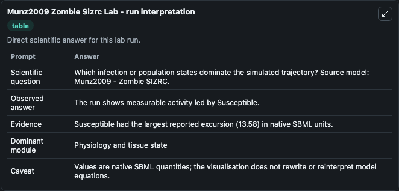
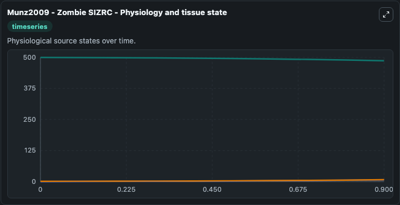
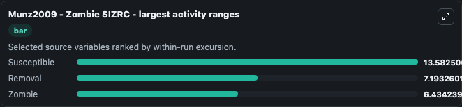
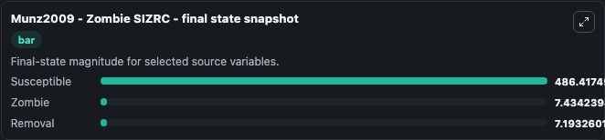
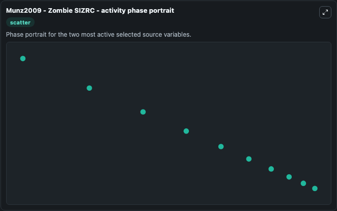

# Munz2009 Zombie Sizrc

This Biosimulant lab wraps `Munz2009 Zombie Sizrc` as a runnable systems biology model with a companion visualization module.
Munz2009 - Zombie SIZRC This is the model with an latent infection and cure for zombies described in the article. It can be used to explore the configured dynamics and compare scenario outcomes across configurations.

## What You'll See

The lab asks: Which infection or population states dominate the simulated trajectory? Source model: Munz2009 - Zombie SIZRC. It runs for 1.0 time units with a communication step of 0.1. The run uses the model defaults declared by the curated SBML wrapper. The generated visualizations focus on Susceptible, Zombie, and Removal, combining trajectory, endpoint-comparison, and summary-table views from one completed dark-mode run.

In this captured run, **Susceptible** moved from 500.0 to 486.4 across 1.0 simulation windows.


### Output Visualizations



*Summary table for Munz2009 Zombie Sizrc, reporting the scientific question, observed answer, dominant module, and caveat.*



*Trajectories of Susceptible, Removal, and Zombie across the 1.0 simulation. In this run **Removal** climbed from 0 to 7.193 and **Susceptible** fell from 500.0 to 486.4 — the largest movements among the focused observables.*



*Largest-excursion ranking of the focused observables — the absolute movement magnitude during the run. Top 3: **Susceptible** = 13.583, **Removal** = 7.193, **Zombie** = 6.434.*



*Endpoint snapshot of the focused observables — final values from the captured run. Top 3 by value: **Susceptible** = 486.4, **Zombie** = 7.434, **Removal** = 7.193.*



*Visualization card from the Munz2009 Zombie Sizrc dark-mode run.*


## Model Context

- Core model: `models/core`
- Visualization model: `models/visualisation`
- Standard: `other`
- Upstream source: `biomodels_ebi:BIOMD0000000882`
- License: `CC0`

## Inputs

| Input | Maps To | Default | Notes |
|---|---|---|---|
| Initial Susceptible | `systemsbiology_sbml_munz2009_zombie_sizrc_biomd0000000882_model.initial_susceptible` | | Source state initial condition exposed as a model-specific control because no explicit intervention parameter is identifiable. Maps to SBML symbol `Susceptible`. |
| Initial Zombie | `systemsbiology_sbml_munz2009_zombie_sizrc_biomd0000000882_model.initial_zombie` | | Source state initial condition exposed as a model-specific control because no explicit intervention parameter is identifiable. Maps to SBML symbol `Zombie`. |
| Initial Removal | `systemsbiology_sbml_munz2009_zombie_sizrc_biomd0000000882_model.initial_removal` | | Source state initial condition exposed as a model-specific control because no explicit intervention parameter is identifiable. Maps to SBML symbol `Removal`. |

## Outputs

| Output | Maps To | Role |
|---|---|---|
| `state` | `systemsbiology_sbml_munz2009_zombie_sizrc_biomd0000000882_model.state` | Available to the visualization model and downstream workflows. |
| `summary` | `systemsbiology_sbml_munz2009_zombie_sizrc_biomd0000000882_model.summary` | Available to the visualization model and downstream workflows. |
| `species_labels` | `systemsbiology_sbml_munz2009_zombie_sizrc_biomd0000000882_model.species_labels` | Available to the visualization model and downstream workflows. |
| `susceptible` | `systemsbiology_sbml_munz2009_zombie_sizrc_biomd0000000882_model.susceptible` | Available to the visualization model and downstream workflows. |
| `zombie` | `systemsbiology_sbml_munz2009_zombie_sizrc_biomd0000000882_model.zombie` | Available to the visualization model and downstream workflows. |
| `removal` | `systemsbiology_sbml_munz2009_zombie_sizrc_biomd0000000882_model.removal` | Available to the visualization model and downstream workflows. |

## Runtime

- Duration: `1.0`
- Communication step: `0.1`

## Running Locally

```bash
biosimulant labs serve
```
