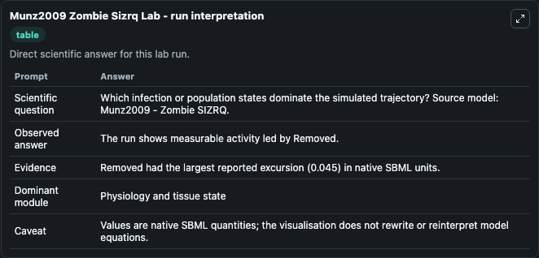
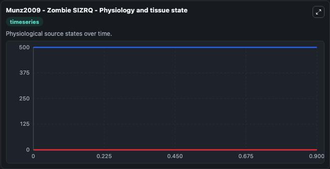
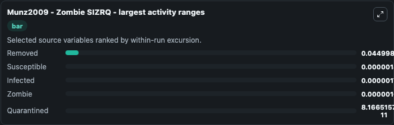
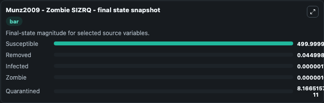
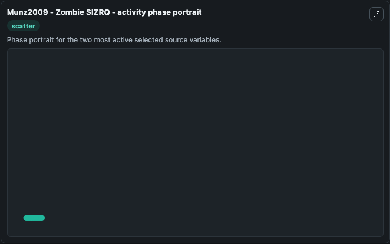

# Munz2009 Zombie Sizrq

This Biosimulant lab wraps `Munz2009 Zombie Sizrq` as a runnable systems biology model with a companion visualization module.
Munz2009 - Zombie SIZRQ This is the model with latent infection and quarantine described in the article. It can be used to explore the configured dynamics and compare scenario outcomes across configurations.

## What You'll See

The lab asks: Which infection or population states dominate the simulated trajectory? Source model: Munz2009 - Zombie SIZRQ. It runs for 1.0 time units with a communication step of 0.1. The run uses the model defaults declared by the curated SBML wrapper. The generated visualizations focus on Zombie, Susceptible, Removed, Quarantined, and Infected, combining trajectory, endpoint-comparison, and summary-table views from one completed dark-mode run.

In this captured run, **Removed** moved from 0 to 0.0450 across 1.0 simulation windows.


### Output Visualizations



*Summary table for Munz2009 Zombie Sizrq, reporting the scientific question, observed answer, dominant module, and caveat.*



*Trajectories of Removed, Susceptible, Infected, Zombie, and Quarantined across the 1.0 simulation. In this run **Removed** climbed from 0 to 0.0450 and **Susceptible** fell from 500.0 to 500.0 — the largest movements among the focused observables.*



*Largest-excursion ranking of the focused observables — the absolute movement magnitude during the run. Top 3: **Removed** = 0.0450, **Susceptible** = 1.8e-06, **Infected** = 1.78e-06, with 2 more observables below.*



*Endpoint snapshot of the focused observables — final values from the captured run. Top 3 by value: **Susceptible** = 500.0, **Removed** = 0.0450, **Infected** = 1.78e-06, with 2 more observables below.*



*Visualization card from the Munz2009 Zombie Sizrq dark-mode run.*


## Model Context

- Core model: `models/core`
- Visualization model: `models/visualisation`
- Standard: `other`
- Upstream source: `biomodels_ebi:MODEL1008060002`
- License: `CC0`

## Inputs

| Input | Maps To | Default | Notes |
|---|---|---|---|
| Initial Zombie | `systemsbiology_sbml_munz2009_zombie_sizrq_model1008060002_model.initial_zombie` | | Source state initial condition exposed as a model-specific control because no explicit intervention parameter is identifiable. Maps to SBML symbol `Z`. |
| Initial Susceptible | `systemsbiology_sbml_munz2009_zombie_sizrq_model1008060002_model.initial_susceptible` | | Source state initial condition exposed as a model-specific control because no explicit intervention parameter is identifiable. Maps to SBML symbol `S`. |
| Initial Removed | `systemsbiology_sbml_munz2009_zombie_sizrq_model1008060002_model.initial_removed` | | Source state initial condition exposed as a model-specific control because no explicit intervention parameter is identifiable. Maps to SBML symbol `R`. |
| Initial Quarantined | `systemsbiology_sbml_munz2009_zombie_sizrq_model1008060002_model.initial_quarantined` | | Source state initial condition exposed as a model-specific control because no explicit intervention parameter is identifiable. Maps to SBML symbol `Q`. |
| Initial Infected | `systemsbiology_sbml_munz2009_zombie_sizrq_model1008060002_model.initial_infected` | | Source state initial condition exposed as a model-specific control because no explicit intervention parameter is identifiable. Maps to SBML symbol `I`. |

## Outputs

| Output | Maps To | Role |
|---|---|---|
| `state` | `systemsbiology_sbml_munz2009_zombie_sizrq_model1008060002_model.state` | Available to the visualization model and downstream workflows. |
| `summary` | `systemsbiology_sbml_munz2009_zombie_sizrq_model1008060002_model.summary` | Available to the visualization model and downstream workflows. |
| `species_labels` | `systemsbiology_sbml_munz2009_zombie_sizrq_model1008060002_model.species_labels` | Available to the visualization model and downstream workflows. |
| `zombie` | `systemsbiology_sbml_munz2009_zombie_sizrq_model1008060002_model.zombie` | Available to the visualization model and downstream workflows. |
| `susceptible` | `systemsbiology_sbml_munz2009_zombie_sizrq_model1008060002_model.susceptible` | Available to the visualization model and downstream workflows. |
| `removed` | `systemsbiology_sbml_munz2009_zombie_sizrq_model1008060002_model.removed` | Available to the visualization model and downstream workflows. |
| `quarantined` | `systemsbiology_sbml_munz2009_zombie_sizrq_model1008060002_model.quarantined` | Available to the visualization model and downstream workflows. |
| `infected` | `systemsbiology_sbml_munz2009_zombie_sizrq_model1008060002_model.infected` | Available to the visualization model and downstream workflows. |

## Runtime

- Duration: `1.0`
- Communication step: `0.1`

## Running Locally

```bash
biosimulant labs serve
```
