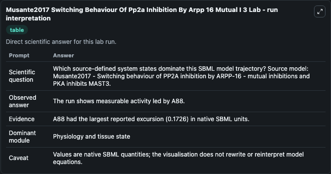
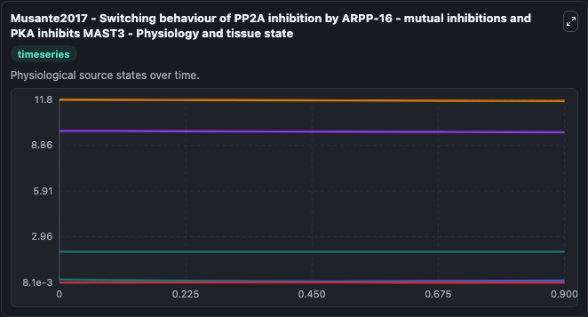
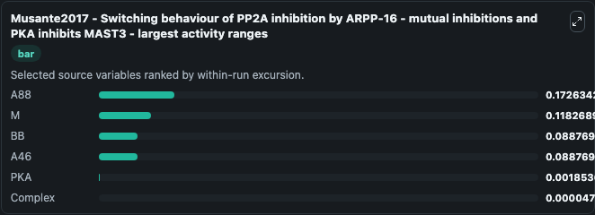
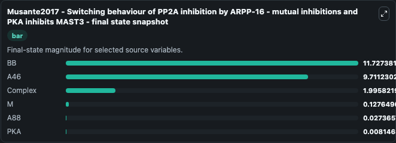
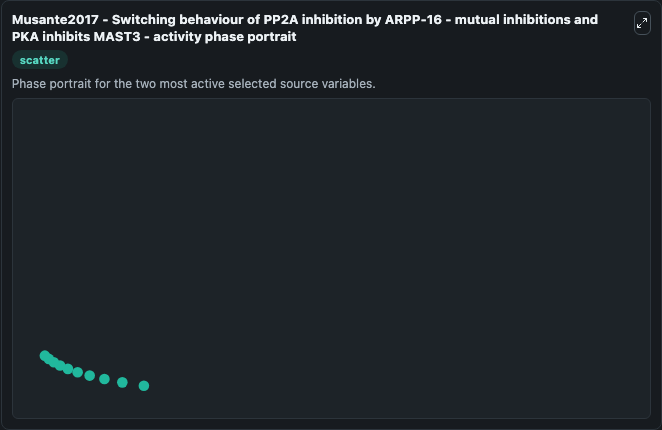

# Musante2017 Switching Behaviour Of Pp2a Inhibition By Arpp 16 Mutual I 3 (BIOMD0000000644)

This Biosimulant lab wraps `BIOMD0000000644 Musante2017 Switching Behaviour Of Pp2a Inhibition By Arpp 16 Mutual I 3` as a runnable systems biology model with a companion visualization module.
Musante2017 - Switching behaviour of PP2Ainhibition by ARPP-16 - mutual inhibitions and PKA inhibitsMAST3 This model is described in the article: Reciprocal regulation of ARPP-16 by PKA and MAST3 kina. It can be used to explore the configured dynamics and compare scenario outcomes across configurations.

## What You'll See

The lab asks: Which source-defined system states dominate this SBML model trajectory? Source model: Musante2017 - Switching behaviour of PP2A inhibition by ARPP-16 - mutual inhibitions and PKA inhibits MAST3. It runs for 1.0 time units with a communication step of 0.1. The run uses the model defaults declared by the curated SBML wrapper. The generated visualizations focus on BB, A46, Complex, A88, PKA, and M, combining trajectory, endpoint-comparison, and summary-table views from one completed dark-mode run.

In this captured run, **A88** moved from 0.2000 to 0.0274 across 1.0 simulation windows.


### Output Visualizations



*Summary table for Musante2017 Switching Behaviour Of Pp2a Inhibition By Arpp 16 Mutual I 3, reporting the scientific question, observed answer, dominant module, and caveat.*



*Trajectories of A88, M, BB, A46, PKA, and Complex across the 1.0 simulation. In this run **M** climbed from 0.00938 to 0.1276 and **A88** fell from 0.2000 to 0.0274 — the largest movements among the focused observables.*



*Largest-excursion ranking of the focused observables — the absolute movement magnitude during the run. Top 3: **A88** = 0.1726, **M** = 0.1183, **BB** = 0.0888, with 3 more observables below.*



*Endpoint snapshot of the focused observables — final values from the captured run. Top 3 by value: **BB** = 11.727, **A46** = 9.711, **Complex** = 1.996, with 3 more observables below.*



*Visualization card from the Musante2017 Switching Behaviour Of Pp2a Inhibition By Arpp 16 Mutual I 3 dark-mode run.*


## Model Context

- Core model: `models/core`
- Visualization model: `models/visualisation`
- Standard: `other`
- Upstream source: `biomodels_ebi:BIOMD0000000644`
- License: `CC0`

## Inputs

| Input | Maps To | Default | Notes |
|---|---|---|---|
| Initial Model State Bb | `systemsbiology_sbml_musante2017_switching_behaviour_of_pp2a_inhibiti_biomd0000000644_model.initial_model_state_bb` | | Source state initial condition exposed as a model-specific control because no explicit intervention parameter is identifiable. Maps to SBML symbol `BB`. |
| Initial Model State A46 | `systemsbiology_sbml_musante2017_switching_behaviour_of_pp2a_inhibiti_biomd0000000644_model.initial_model_state_a46` | | Source state initial condition exposed as a model-specific control because no explicit intervention parameter is identifiable. Maps to SBML symbol `A46`. |
| Initial Complex | `systemsbiology_sbml_musante2017_switching_behaviour_of_pp2a_inhibiti_biomd0000000644_model.initial_complex` | | Source state initial condition exposed as a model-specific control because no explicit intervention parameter is identifiable. Maps to SBML symbol `Complex`. |
| Initial Model State A88 | `systemsbiology_sbml_musante2017_switching_behaviour_of_pp2a_inhibiti_biomd0000000644_model.initial_model_state_a88` | | Source state initial condition exposed as a model-specific control because no explicit intervention parameter is identifiable. Maps to SBML symbol `A88`. |
| Initial Model State Pka | `systemsbiology_sbml_musante2017_switching_behaviour_of_pp2a_inhibiti_biomd0000000644_model.initial_model_state_pka` | | Source state initial condition exposed as a model-specific control because no explicit intervention parameter is identifiable. Maps to SBML symbol `PKA`. |
| Initial Model State M | `systemsbiology_sbml_musante2017_switching_behaviour_of_pp2a_inhibiti_biomd0000000644_model.initial_model_state_m` | | Source state initial condition exposed as a model-specific control because no explicit intervention parameter is identifiable. Maps to SBML symbol `M`. |

## Outputs

| Output | Maps To | Role |
|---|---|---|
| `state` | `systemsbiology_sbml_musante2017_switching_behaviour_of_pp2a_inhibiti_biomd0000000644_model.state` | Available to the visualization model and downstream workflows. |
| `summary` | `systemsbiology_sbml_musante2017_switching_behaviour_of_pp2a_inhibiti_biomd0000000644_model.summary` | Available to the visualization model and downstream workflows. |
| `species_labels` | `systemsbiology_sbml_musante2017_switching_behaviour_of_pp2a_inhibiti_biomd0000000644_model.species_labels` | Available to the visualization model and downstream workflows. |
| `model_state_bb` | `systemsbiology_sbml_musante2017_switching_behaviour_of_pp2a_inhibiti_biomd0000000644_model.model_state_bb` | Available to the visualization model and downstream workflows. |
| `a46` | `systemsbiology_sbml_musante2017_switching_behaviour_of_pp2a_inhibiti_biomd0000000644_model.a46` | Available to the visualization model and downstream workflows. |
| `complex` | `systemsbiology_sbml_musante2017_switching_behaviour_of_pp2a_inhibiti_biomd0000000644_model.complex` | Available to the visualization model and downstream workflows. |
| `a88` | `systemsbiology_sbml_musante2017_switching_behaviour_of_pp2a_inhibiti_biomd0000000644_model.a88` | Available to the visualization model and downstream workflows. |
| `pka` | `systemsbiology_sbml_musante2017_switching_behaviour_of_pp2a_inhibiti_biomd0000000644_model.pka` | Available to the visualization model and downstream workflows. |
| `model_state_m` | `systemsbiology_sbml_musante2017_switching_behaviour_of_pp2a_inhibiti_biomd0000000644_model.model_state_m` | Available to the visualization model and downstream workflows. |

## Runtime

- Duration: `1.0`
- Communication step: `0.1`

## Running Locally

```bash
biosimulant labs serve
```
