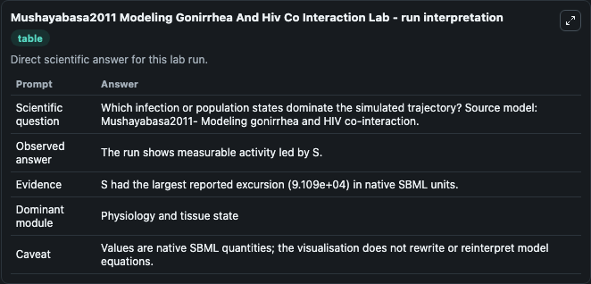
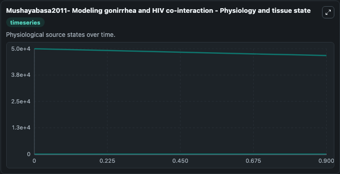
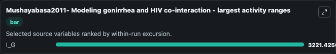

# Mushayabasa2011 Modeling Gonirrhea And Hiv Co Interaction

This Biosimulant lab wraps `Mushayabasa2011 Modeling Gonirrhea And Hiv Co Interaction` as a runnable systems biology model with a companion visualization module.
A mathematical model was designed to explore the co-interaction of gonorrhea and HIV in the presence of antiretroviral therapy and gonorrhea treatment. It can be used to explore the configured dynamics and compare scenario outcomes across configurations.

## What You'll See

The lab asks: Which infection or population states dominate the simulated trajectory? Source model: Mushayabasa2011- Modeling gonirrhea and HIV co-interaction. It runs for 1.0 time units with a communication step of 0.1. The run uses the model defaults declared by the curated SBML wrapper. The generated visualizations focus on I_G, I_H, I_GH, A_HT, A_H, and A_GHT, combining trajectory, endpoint-comparison, and summary-table views from one completed dark-mode run.

In this captured run, **I_G** moved from 5e+04 to 4.68e+04 across 1.0 simulation windows.


### Output Visualizations



*Summary table for Mushayabasa2011 Modeling Gonirrhea And Hiv Co Interaction, reporting the scientific question, observed answer, dominant module, and caveat.*



*Trajectories of I_G, I_H, I_GH, A_HT, A_H, and A_GHT across the 1.0 simulation. In this run **I_G** fell from 5e+04 to 4.68e+04 — the largest movements among the focused observables.*



*Largest-excursion ranking of the focused observables — the absolute movement magnitude during the run. Top 1: **I_G** = 3221.4.*


*Endpoint snapshot of the focused observables — final values from the captured run. Top 1 by value: **I_G** = 4.68e+04.*


## Model Context

- Core model: `models/core`
- Visualization model: `models/visualisation`
- Standard: `other`
- Upstream source: `biomodels_ebi:MODEL1812040004`
- License: `CC0`

## Inputs

| Input | Maps To | Default | Notes |
|---|---|---|---|
| Initial Model State I G | `systemsbiology_sbml_mushayabasa2011_modeling_gonirrhea_and_hiv_co_in_model1812040004_model.initial_model_state_i_g` | | Source state initial condition exposed as a model-specific control because no explicit intervention parameter is identifiable. Maps to SBML symbol `I_G`. |
| Initial Model State I H | `systemsbiology_sbml_mushayabasa2011_modeling_gonirrhea_and_hiv_co_in_model1812040004_model.initial_model_state_i_h` | | Source state initial condition exposed as a model-specific control because no explicit intervention parameter is identifiable. Maps to SBML symbol `I_H`. |
| Initial I Gh | `systemsbiology_sbml_mushayabasa2011_modeling_gonirrhea_and_hiv_co_in_model1812040004_model.initial_i_gh` | | Source state initial condition exposed as a model-specific control because no explicit intervention parameter is identifiable. Maps to SBML symbol `I_GH`. |
| Initial A Ht | `systemsbiology_sbml_mushayabasa2011_modeling_gonirrhea_and_hiv_co_in_model1812040004_model.initial_a_ht` | | Source state initial condition exposed as a model-specific control because no explicit intervention parameter is identifiable. Maps to SBML symbol `A_HT`. |
| Initial Model State A H | `systemsbiology_sbml_mushayabasa2011_modeling_gonirrhea_and_hiv_co_in_model1812040004_model.initial_model_state_a_h` | | Source state initial condition exposed as a model-specific control because no explicit intervention parameter is identifiable. Maps to SBML symbol `A_H`. |
| Initial A Ght | `systemsbiology_sbml_mushayabasa2011_modeling_gonirrhea_and_hiv_co_in_model1812040004_model.initial_a_ght` | | Source state initial condition exposed as a model-specific control because no explicit intervention parameter is identifiable. Maps to SBML symbol `A_GHT`. |

## Outputs

| Output | Maps To | Role |
|---|---|---|
| `state` | `systemsbiology_sbml_mushayabasa2011_modeling_gonirrhea_and_hiv_co_in_model1812040004_model.state` | Available to the visualization model and downstream workflows. |
| `summary` | `systemsbiology_sbml_mushayabasa2011_modeling_gonirrhea_and_hiv_co_in_model1812040004_model.summary` | Available to the visualization model and downstream workflows. |
| `species_labels` | `systemsbiology_sbml_mushayabasa2011_modeling_gonirrhea_and_hiv_co_in_model1812040004_model.species_labels` | Available to the visualization model and downstream workflows. |
| `i_g` | `systemsbiology_sbml_mushayabasa2011_modeling_gonirrhea_and_hiv_co_in_model1812040004_model.i_g` | Available to the visualization model and downstream workflows. |
| `i_h` | `systemsbiology_sbml_mushayabasa2011_modeling_gonirrhea_and_hiv_co_in_model1812040004_model.i_h` | Available to the visualization model and downstream workflows. |
| `i_gh` | `systemsbiology_sbml_mushayabasa2011_modeling_gonirrhea_and_hiv_co_in_model1812040004_model.i_gh` | Available to the visualization model and downstream workflows. |
| `a_ht` | `systemsbiology_sbml_mushayabasa2011_modeling_gonirrhea_and_hiv_co_in_model1812040004_model.a_ht` | Available to the visualization model and downstream workflows. |
| `a_h` | `systemsbiology_sbml_mushayabasa2011_modeling_gonirrhea_and_hiv_co_in_model1812040004_model.a_h` | Available to the visualization model and downstream workflows. |
| `a_ght` | `systemsbiology_sbml_mushayabasa2011_modeling_gonirrhea_and_hiv_co_in_model1812040004_model.a_ght` | Available to the visualization model and downstream workflows. |

## Runtime

- Duration: `1.0`
- Communication step: `0.1`

## Running Locally

```bash
biosimulant labs serve
```
