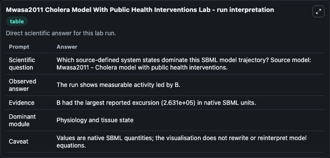
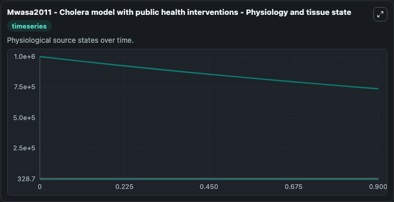
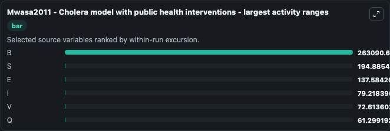
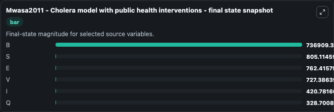
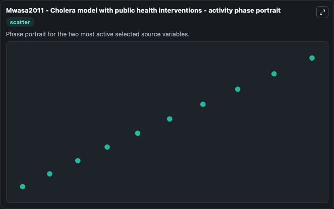

# Mwasa2011 Cholera Model With Public Health Interventions

This Biosimulant lab wraps `Mwasa2011 Cholera Model With Public Health Interventions` as a runnable systems biology model with a companion visualization module.
Mathematical analysis of a cholera model with public health interventions. It can be used to explore the configured dynamics and compare scenario outcomes across configurations.

## What You'll See

The lab asks: Which source-defined system states dominate this SBML model trajectory? Source model: Mwasa2011 - Cholera model with public health interventions. It runs for 1.0 time units with a communication step of 0.1. The run uses the model defaults declared by the curated SBML wrapper. The generated visualizations focus on B, S, E, V, I, and Q, combining trajectory, endpoint-comparison, and summary-table views from one completed dark-mode run.

In this captured run, **B** moved from 1e+06 to 7.37e+05 across 1.0 simulation windows.


### Output Visualizations



*Summary table for Mwasa2011 Cholera Model With Public Health Interventions, reporting the scientific question, observed answer, dominant module, and caveat.*



*Trajectories of B, S, E, I, V, and Q across the 1.0 simulation. In this run **B** fell from 1e+06 to 7.37e+05 — the largest movements among the focused observables.*



*Largest-excursion ranking of the focused observables — the absolute movement magnitude during the run. Top 3: **B** = 2.63e+05, **S** = 194.9, **E** = 137.6, with 3 more observables below.*



*Endpoint snapshot of the focused observables — final values from the captured run. Top 3 by value: **B** = 7.37e+05, **S** = 805.1, **E** = 762.4, with 3 more observables below.*



*Visualization card from the Mwasa2011 Cholera Model With Public Health Interventions dark-mode run.*


## Model Context

- Core model: `models/core`
- Visualization model: `models/visualisation`
- Standard: `other`
- Upstream source: `biomodels_ebi:MODEL1812040007`
- License: `CC0`

## Inputs

| Input | Maps To | Default | Notes |
|---|---|---|---|
| Initial Model State B | `systemsbiology_sbml_mwasa2011_cholera_model_with_public_health_inter_model1812040007_model.initial_model_state_b` | | Source state initial condition exposed as a model-specific control because no explicit intervention parameter is identifiable. Maps to SBML symbol `B`. |
| Initial Model State S | `systemsbiology_sbml_mwasa2011_cholera_model_with_public_health_inter_model1812040007_model.initial_model_state_s` | | Source state initial condition exposed as a model-specific control because no explicit intervention parameter is identifiable. Maps to SBML symbol `S`. |
| Initial Model State E | `systemsbiology_sbml_mwasa2011_cholera_model_with_public_health_inter_model1812040007_model.initial_model_state_e` | | Source state initial condition exposed as a model-specific control because no explicit intervention parameter is identifiable. Maps to SBML symbol `E`. |
| Initial Model State V | `systemsbiology_sbml_mwasa2011_cholera_model_with_public_health_inter_model1812040007_model.initial_model_state_v` | | Source state initial condition exposed as a model-specific control because no explicit intervention parameter is identifiable. Maps to SBML symbol `V`. |
| Initial Model State I | `systemsbiology_sbml_mwasa2011_cholera_model_with_public_health_inter_model1812040007_model.initial_model_state_i` | | Source state initial condition exposed as a model-specific control because no explicit intervention parameter is identifiable. Maps to SBML symbol `I`. |
| Initial Model State Q | `systemsbiology_sbml_mwasa2011_cholera_model_with_public_health_inter_model1812040007_model.initial_model_state_q` | | Source state initial condition exposed as a model-specific control because no explicit intervention parameter is identifiable. Maps to SBML symbol `Q`. |

## Outputs

| Output | Maps To | Role |
|---|---|---|
| `state` | `systemsbiology_sbml_mwasa2011_cholera_model_with_public_health_inter_model1812040007_model.state` | Available to the visualization model and downstream workflows. |
| `summary` | `systemsbiology_sbml_mwasa2011_cholera_model_with_public_health_inter_model1812040007_model.summary` | Available to the visualization model and downstream workflows. |
| `species_labels` | `systemsbiology_sbml_mwasa2011_cholera_model_with_public_health_inter_model1812040007_model.species_labels` | Available to the visualization model and downstream workflows. |
| `model_state_b` | `systemsbiology_sbml_mwasa2011_cholera_model_with_public_health_inter_model1812040007_model.model_state_b` | Available to the visualization model and downstream workflows. |
| `model_state_s` | `systemsbiology_sbml_mwasa2011_cholera_model_with_public_health_inter_model1812040007_model.model_state_s` | Available to the visualization model and downstream workflows. |
| `model_state_e` | `systemsbiology_sbml_mwasa2011_cholera_model_with_public_health_inter_model1812040007_model.model_state_e` | Available to the visualization model and downstream workflows. |
| `model_state_v` | `systemsbiology_sbml_mwasa2011_cholera_model_with_public_health_inter_model1812040007_model.model_state_v` | Available to the visualization model and downstream workflows. |
| `model_state_i` | `systemsbiology_sbml_mwasa2011_cholera_model_with_public_health_inter_model1812040007_model.model_state_i` | Available to the visualization model and downstream workflows. |
| `model_state_q` | `systemsbiology_sbml_mwasa2011_cholera_model_with_public_health_inter_model1812040007_model.model_state_q` | Available to the visualization model and downstream workflows. |

## Runtime

- Duration: `1.0`
- Communication step: `0.1`

## Running Locally

```bash
biosimulant labs serve
```
