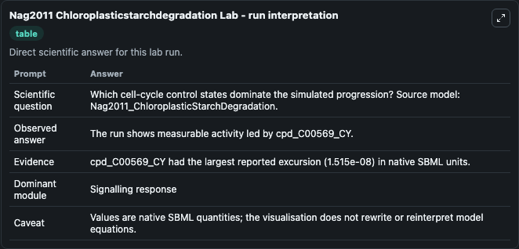
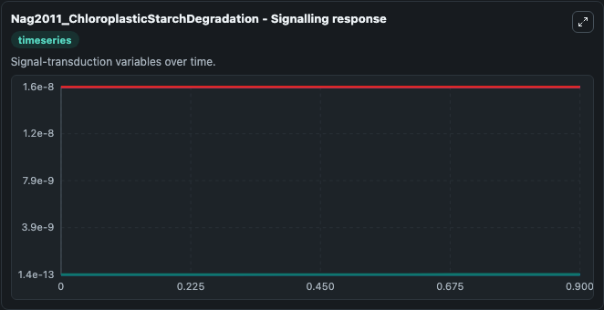
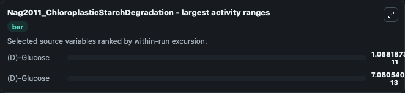
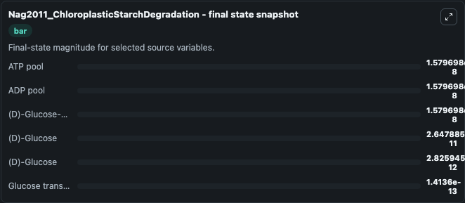
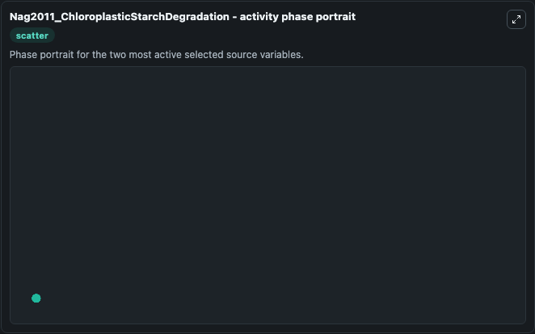

# Nag2011 Chloroplasticstarchdegradation

This Biosimulant lab wraps `Nag2011 Chloroplasticstarchdegradation` as a runnable systems biology model with a companion visualization module.
This model is from the article: Kinetic modeling and exploratory numerical simulation of chloroplastic starch degradation. It can be used to explore the configured dynamics and compare scenario outcomes across configurations.

## What You'll See

The lab asks: Which cell-cycle control states dominate the simulated progression? Source model: Nag2011_ChloroplasticStarchDegradation. It runs for 1.0 time units with a communication step of 0.1. The run uses the model defaults declared by the curated SBML wrapper. The generated visualizations focus on ATP pool, ADP pool, (D)-Glucose-1,6-bisphosphate pool, (D)-Glucose, and Glucose transporter (pGlcT), combining trajectory, endpoint-comparison, and summary-table views from one completed dark-mode run.

In this captured run, **(D)-Glucose** moved from 1.58e-11 to 2.65e-11 across 1.0 simulation windows.


### Output Visualizations



*Summary table for Nag2011 Chloroplasticstarchdegradation, reporting the scientific question, observed answer, dominant module, and caveat.*



*Trajectories of (D)-Glucose, (D)-Glucose, ATP pool, ADP pool, (D)-Glucose-1,6-bisphosphate pool, and Glucose transporter (pGlcT) across the 1.0 simulation. In this run **(D)-Glucose** climbed from 1.58e-11 to 2.65e-11 and **(D)-Glucose** fell from 3.53e-12 to 2.83e-12 — the largest movements among the focused observables.*



*Largest-excursion ranking of the focused observables — the absolute movement magnitude during the run. Top 2: **(D)-Glucose** = 1.07e-11, **(D)-Glucose** = 7.08e-13.*



*Endpoint snapshot of the focused observables — final values from the captured run. Top 3 by value: **ATP pool** = 1.58e-08, **ADP pool** = 1.58e-08, **(D)-Glucose-1,6-bisphosphate pool** = 1.58e-08, with 3 more observables below.*



*Visualization card from the Nag2011 Chloroplasticstarchdegradation dark-mode run.*


## Model Context

- Core model: `models/core`
- Visualization model: `models/visualisation`
- Standard: `other`
- Upstream source: `biomodels_ebi:BIOMD0000000353`
- License: `CC0`

## Inputs

| Input | Maps To | Default | Notes |
|---|---|---|---|
| Initial ATP Pool | `systemsbiology_sbml_nag2011_chloroplasticstarchdegradation_biomd0000000353_model.initial_atp_pool` | | Source state initial condition exposed as a model-specific control because no explicit intervention parameter is identifiable. Maps to SBML symbol `cpd_C00002tot_CY`. |
| Initial ADP Pool | `systemsbiology_sbml_nag2011_chloroplasticstarchdegradation_biomd0000000353_model.initial_adp_pool` | | Source state initial condition exposed as a model-specific control because no explicit intervention parameter is identifiable. Maps to SBML symbol `cpd_C00008tot_CY`. |
| Initial D Glucose 1 6 Bisphosphate Pool | `systemsbiology_sbml_nag2011_chloroplasticstarchdegradation_biomd0000000353_model.initial_d_glucose_1_6_bisphosphate_pool` | | Source state initial condition exposed as a model-specific control because no explicit intervention parameter is identifiable. Maps to SBML symbol `cpd_C00660tot_CY`. |
| Initial D Glucose | `systemsbiology_sbml_nag2011_chloroplasticstarchdegradation_biomd0000000353_model.initial_d_glucose` | | Source state initial condition exposed as a model-specific control because no explicit intervention parameter is identifiable. Maps to SBML symbol `cpd_C00031_CY`. |
| Initial D Glucose 2 | `systemsbiology_sbml_nag2011_chloroplasticstarchdegradation_biomd0000000353_model.initial_d_glucose_2` | | Source state initial condition exposed as a model-specific control because no explicit intervention parameter is identifiable. Maps to SBML symbol `cpd_C00031_CS`. |
| Initial Glucose Transporter P Glc T | `systemsbiology_sbml_nag2011_chloroplasticstarchdegradation_biomd0000000353_model.initial_glucose_transporter_p_glc_t` | | Source state initial condition exposed as a model-specific control because no explicit intervention parameter is identifiable. Maps to SBML symbol `tc_2_A_1_1_17_CIMS`. |

## Outputs

| Output | Maps To | Role |
|---|---|---|
| `state` | `systemsbiology_sbml_nag2011_chloroplasticstarchdegradation_biomd0000000353_model.state` | Available to the visualization model and downstream workflows. |
| `summary` | `systemsbiology_sbml_nag2011_chloroplasticstarchdegradation_biomd0000000353_model.summary` | Available to the visualization model and downstream workflows. |
| `species_labels` | `systemsbiology_sbml_nag2011_chloroplasticstarchdegradation_biomd0000000353_model.species_labels` | Available to the visualization model and downstream workflows. |
| `atp_pool` | `systemsbiology_sbml_nag2011_chloroplasticstarchdegradation_biomd0000000353_model.atp_pool` | Available to the visualization model and downstream workflows. |
| `adp_pool` | `systemsbiology_sbml_nag2011_chloroplasticstarchdegradation_biomd0000000353_model.adp_pool` | Available to the visualization model and downstream workflows. |
| `d_glucose_1_6_bisphosphate_pool` | `systemsbiology_sbml_nag2011_chloroplasticstarchdegradation_biomd0000000353_model.d_glucose_1_6_bisphosphate_pool` | Available to the visualization model and downstream workflows. |
| `d_glucose` | `systemsbiology_sbml_nag2011_chloroplasticstarchdegradation_biomd0000000353_model.d_glucose` | Available to the visualization model and downstream workflows. |
| `d_glucose_2` | `systemsbiology_sbml_nag2011_chloroplasticstarchdegradation_biomd0000000353_model.d_glucose_2` | Available to the visualization model and downstream workflows. |
| `glucose_transporter_p_glc_t` | `systemsbiology_sbml_nag2011_chloroplasticstarchdegradation_biomd0000000353_model.glucose_transporter_p_glc_t` | Available to the visualization model and downstream workflows. |

## Runtime

- Duration: `1.0`
- Communication step: `0.1`

## Running Locally

```bash
biosimulant labs serve
```
