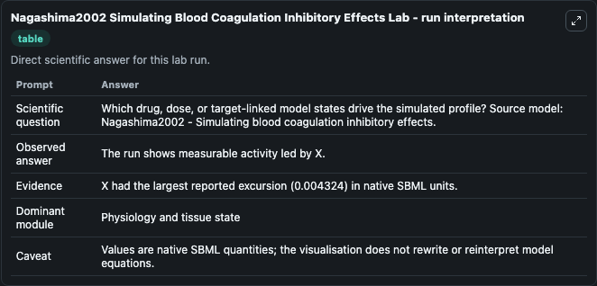
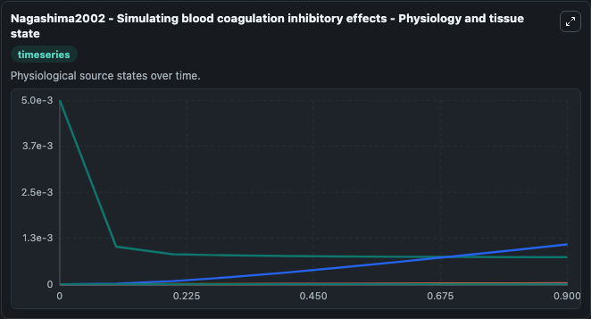
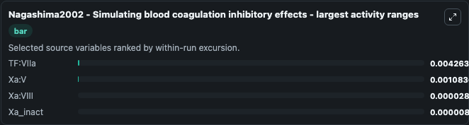
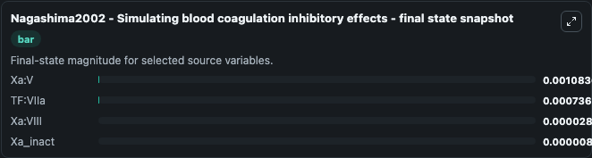
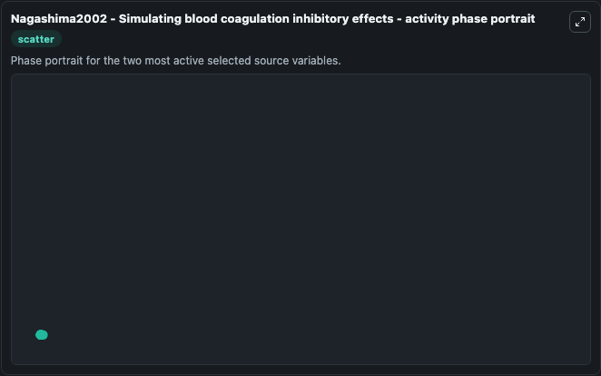

# Nagashima2002 Simulating Blood Coagulation Inhibitory Effects

This Biosimulant lab wraps `Nagashima2002 Simulating Blood Coagulation Inhibitory Effects` as a runnable systems biology model with a companion visualization module.
Mathematical model of blood coagulation and the effects of inhibitors of Xa, Va:Xa and IIa. It can be used to explore the configured dynamics and compare scenario outcomes across configurations.

## What You'll See

The lab asks: Which drug, dose, or target-linked model states drive the simulated profile? Source model: Nagashima2002 - Simulating blood coagulation inhibitory effects. It runs for 1.0 time units with a communication step of 0.1. The run uses the model defaults declared by the curated SBML wrapper. The generated visualizations focus on TF:VIIa, Xa_inact, Xa_Inhibitor, Xa:Xa_Inhibitor, Xa:VIII, and Xa:V, combining trajectory, endpoint-comparison, and summary-table views from one completed dark-mode run.

In this captured run, **TF:VIIa** moved from 0.005 to 0.000736 across 1.0 simulation windows.


### Output Visualizations



*Summary table for Nagashima2002 Simulating Blood Coagulation Inhibitory Effects, reporting the scientific question, observed answer, dominant module, and caveat.*



*Trajectories of TF:VIIa, Xa:V, Xa:VIII, Xa_inact, Xa_Inhibitor, and Xa:Xa_Inhibitor across the 1.0 simulation. In this run **Xa:V** climbed from 0 to 0.00108 and **TF:VIIa** fell from 0.005 to 0.000736 — the largest movements among the focused observables.*



*Largest-excursion ranking of the focused observables — the absolute movement magnitude during the run. Top 3: **TF:VIIa** = 0.00426, **Xa:V** = 0.00108, **Xa:VIII** = 2.86e-05, with 1 more observable below.*



*Trajectories of TF:VIIa, Xa:V, Xa:VIII, Xa_inact, Xa_Inhibitor, and Xa:Xa_Inhibitor across the 1.0 simulation. In this run **Xa:V** climbed from 0 to 0.00108 and **TF:VIIa** fell from 0.005 to 0.000736 — the largest movements among the focused observables.*



*Visualization card from the Nagashima2002 Simulating Blood Coagulation Inhibitory Effects dark-mode run.*


## Model Context

- Core model: `models/core`
- Visualization model: `models/visualisation`
- Standard: `other`
- Upstream source: `biomodels_ebi:BIOMD0000000747`
- License: `CC0`

## Inputs

| Input | Maps To | Default | Notes |
|---|---|---|---|
| Initial Tf Vi Ia | `systemsbiology_sbml_nagashima2002_simulating_blood_coagulation_inhib_biomd0000000747_model.initial_tf_vi_ia` | | Source state initial condition exposed as a model-specific control because no explicit intervention parameter is identifiable. Maps to SBML symbol `TF_VIIa`. |
| Initial Xa Inact | `systemsbiology_sbml_nagashima2002_simulating_blood_coagulation_inhib_biomd0000000747_model.initial_xa_inact` | | Source state initial condition exposed as a model-specific control because no explicit intervention parameter is identifiable. Maps to SBML symbol `Xa_inact`. |
| Initial Xa Inhibitor | `systemsbiology_sbml_nagashima2002_simulating_blood_coagulation_inhib_biomd0000000747_model.initial_xa_inhibitor` | | Source state initial condition exposed as a model-specific control because no explicit intervention parameter is identifiable. Maps to SBML symbol `Xa_Inhibitor`. |
| Initial Xa Xa Inhibitor | `systemsbiology_sbml_nagashima2002_simulating_blood_coagulation_inhib_biomd0000000747_model.initial_xa_xa_inhibitor` | | Source state initial condition exposed as a model-specific control because no explicit intervention parameter is identifiable. Maps to SBML symbol `Xa_Xa_Inhibitor`. |
| Initial Xa Viii | `systemsbiology_sbml_nagashima2002_simulating_blood_coagulation_inhib_biomd0000000747_model.initial_xa_viii` | | Source state initial condition exposed as a model-specific control because no explicit intervention parameter is identifiable. Maps to SBML symbol `Xa_VIII`. |
| Initial Xa V | `systemsbiology_sbml_nagashima2002_simulating_blood_coagulation_inhib_biomd0000000747_model.initial_xa_v` | | Source state initial condition exposed as a model-specific control because no explicit intervention parameter is identifiable. Maps to SBML symbol `Xa_V`. |

## Outputs

| Output | Maps To | Role |
|---|---|---|
| `state` | `systemsbiology_sbml_nagashima2002_simulating_blood_coagulation_inhib_biomd0000000747_model.state` | Available to the visualization model and downstream workflows. |
| `summary` | `systemsbiology_sbml_nagashima2002_simulating_blood_coagulation_inhib_biomd0000000747_model.summary` | Available to the visualization model and downstream workflows. |
| `species_labels` | `systemsbiology_sbml_nagashima2002_simulating_blood_coagulation_inhib_biomd0000000747_model.species_labels` | Available to the visualization model and downstream workflows. |
| `tf_vi_ia` | `systemsbiology_sbml_nagashima2002_simulating_blood_coagulation_inhib_biomd0000000747_model.tf_vi_ia` | Available to the visualization model and downstream workflows. |
| `xa_inact` | `systemsbiology_sbml_nagashima2002_simulating_blood_coagulation_inhib_biomd0000000747_model.xa_inact` | Available to the visualization model and downstream workflows. |
| `xa_inhibitor` | `systemsbiology_sbml_nagashima2002_simulating_blood_coagulation_inhib_biomd0000000747_model.xa_inhibitor` | Available to the visualization model and downstream workflows. |
| `xa_xa_inhibitor` | `systemsbiology_sbml_nagashima2002_simulating_blood_coagulation_inhib_biomd0000000747_model.xa_xa_inhibitor` | Available to the visualization model and downstream workflows. |
| `xa_viii` | `systemsbiology_sbml_nagashima2002_simulating_blood_coagulation_inhib_biomd0000000747_model.xa_viii` | Available to the visualization model and downstream workflows. |
| `xa_v` | `systemsbiology_sbml_nagashima2002_simulating_blood_coagulation_inhib_biomd0000000747_model.xa_v` | Available to the visualization model and downstream workflows. |

## Runtime

- Duration: `1.0`
- Communication step: `0.1`

## Running Locally

```bash
biosimulant labs serve
```
