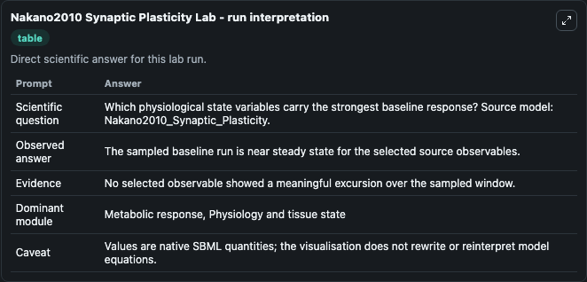
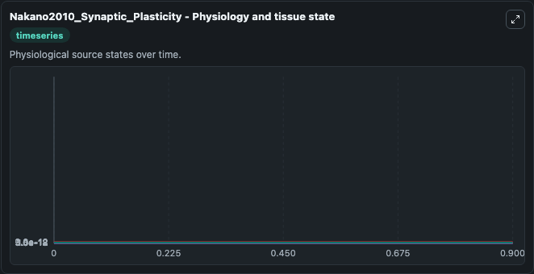
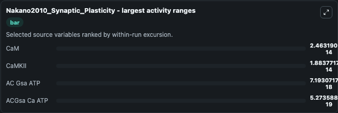
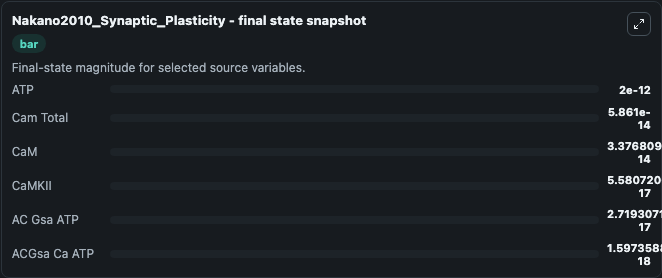
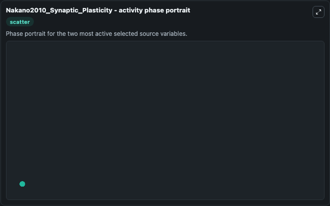

# Nakano2010 Synaptic Plasticity

This Biosimulant lab wraps `Nakano2010 Synaptic Plasticity` as a runnable systems biology model with a companion visualization module.
This is an SBML version of the model described in: A kinetic model of dopamine- and calcium-dependent striatal synaptic plasticity. It can be used to explore the configured dynamics and compare scenario outcomes across configurations.

## What You'll See

The lab asks: Which physiological state variables carry the strongest baseline response? Source model: Nakano2010_Synaptic_Plasticity. It runs for 1.0 time units with a communication step of 0.1. The run uses the model defaults declared by the curated SBML wrapper. The generated visualizations focus on ATP, AC Gsa ATP, ACGsa Ca ATP, Cam Total, CaM, and CaMKII, combining trajectory, endpoint-comparison, and summary-table views from one completed dark-mode run.

In this captured run, **CaM** moved from 5.84e-14 to 3.38e-14 across 1.0 simulation windows.


### Output Visualizations



*Summary table for Nakano2010 Synaptic Plasticity, reporting the scientific question, observed answer, dominant module, and caveat.*



*Trajectories of CaM, CaMKII, AC Gsa ATP, ACGsa Ca ATP, ATP, and Cam Total across the 1.0 simulation. In this run **AC Gsa ATP** climbed from 2e-17 to 2.72e-17 and **CaM** fell from 5.84e-14 to 3.38e-14 — the largest movements among the focused observables.*



*Largest-excursion ranking of the focused observables — the absolute movement magnitude during the run. Top 3: **CaM** = 2.46e-14, **CaMKII** = 1.88e-14, **AC Gsa ATP** = 7.19e-18, with 1 more observable below.*



*Endpoint snapshot of the focused observables — final values from the captured run. Top 3 by value: **ATP** = 2e-12, **Cam Total** = 5.86e-14, **CaM** = 3.38e-14, with 3 more observables below.*



*Visualization card from the Nakano2010 Synaptic Plasticity dark-mode run.*


## Model Context

- Core model: `models/core`
- Visualization model: `models/visualisation`
- Standard: `other`
- Upstream source: `biomodels_ebi:MODEL1101170000`
- License: `CC0`

## Inputs

| Input | Maps To | Default | Notes |
|---|---|---|---|
| Initial Model State ATP | `systemsbiology_sbml_nakano2010_synaptic_plasticity_model1101170000_model.initial_model_state_atp` | | Source state initial condition exposed as a model-specific control because no explicit intervention parameter is identifiable. Maps to SBML symbol `ATP`. |
| Initial Ac Gsa ATP | `systemsbiology_sbml_nakano2010_synaptic_plasticity_model1101170000_model.initial_ac_gsa_atp` | | Source state initial condition exposed as a model-specific control because no explicit intervention parameter is identifiable. Maps to SBML symbol `AC_Gsa_ATP`. |
| Initial Ac Gsa Ca ATP | `systemsbiology_sbml_nakano2010_synaptic_plasticity_model1101170000_model.initial_ac_gsa_ca_atp` | | Source state initial condition exposed as a model-specific control because no explicit intervention parameter is identifiable. Maps to SBML symbol `ACGsa_Ca_ATP`. |
| Initial Cam Total | `systemsbiology_sbml_nakano2010_synaptic_plasticity_model1101170000_model.initial_cam_total` | | Source state initial condition exposed as a model-specific control because no explicit intervention parameter is identifiable. Maps to SBML symbol `Cam_total`. |
| Initial Ca M | `systemsbiology_sbml_nakano2010_synaptic_plasticity_model1101170000_model.initial_ca_m` | | Source state initial condition exposed as a model-specific control because no explicit intervention parameter is identifiable. Maps to SBML symbol `CaM`. |
| Initial Ca Mkii | `systemsbiology_sbml_nakano2010_synaptic_plasticity_model1101170000_model.initial_ca_mkii` | | Source state initial condition exposed as a model-specific control because no explicit intervention parameter is identifiable. Maps to SBML symbol `CaMKII`. |

## Outputs

| Output | Maps To | Role |
|---|---|---|
| `state` | `systemsbiology_sbml_nakano2010_synaptic_plasticity_model1101170000_model.state` | Available to the visualization model and downstream workflows. |
| `summary` | `systemsbiology_sbml_nakano2010_synaptic_plasticity_model1101170000_model.summary` | Available to the visualization model and downstream workflows. |
| `species_labels` | `systemsbiology_sbml_nakano2010_synaptic_plasticity_model1101170000_model.species_labels` | Available to the visualization model and downstream workflows. |
| `atp` | `systemsbiology_sbml_nakano2010_synaptic_plasticity_model1101170000_model.atp` | Available to the visualization model and downstream workflows. |
| `ac_gsa_atp` | `systemsbiology_sbml_nakano2010_synaptic_plasticity_model1101170000_model.ac_gsa_atp` | Available to the visualization model and downstream workflows. |
| `ac_gsa_ca_atp` | `systemsbiology_sbml_nakano2010_synaptic_plasticity_model1101170000_model.ac_gsa_ca_atp` | Available to the visualization model and downstream workflows. |
| `cam_total` | `systemsbiology_sbml_nakano2010_synaptic_plasticity_model1101170000_model.cam_total` | Available to the visualization model and downstream workflows. |
| `ca_m` | `systemsbiology_sbml_nakano2010_synaptic_plasticity_model1101170000_model.ca_m` | Available to the visualization model and downstream workflows. |
| `ca_mkii` | `systemsbiology_sbml_nakano2010_synaptic_plasticity_model1101170000_model.ca_mkii` | Available to the visualization model and downstream workflows. |

## Runtime

- Duration: `1.0`
- Communication step: `0.1`

## Running Locally

```bash
biosimulant labs serve
```
