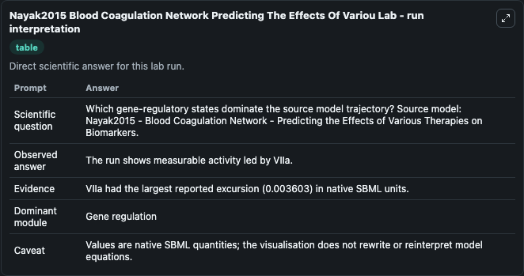
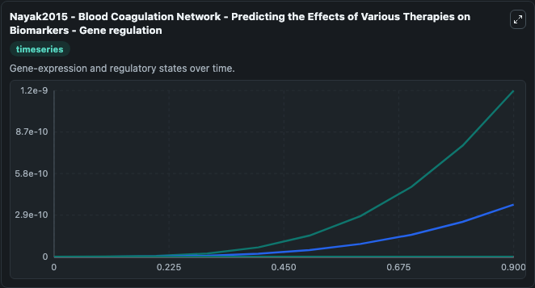
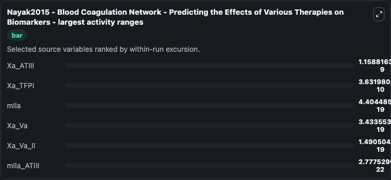
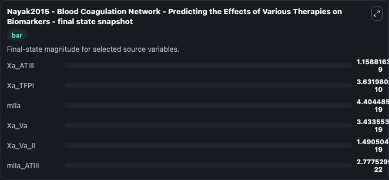
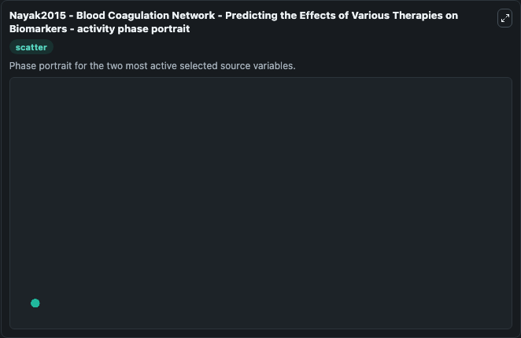

# Nayak2015 Blood Coagulation Network Predicting The Effects Of Variou

This Biosimulant lab wraps `Nayak2015 Blood Coagulation Network Predicting The Effects Of Variou` as a runnable systems biology model with a companion visualization module.
Nayak2015 - Blood Coagulation Network - Predicting the Effects of Various Therapies on Biomarkers Note: The SBML model is generated from SimBiology. It can be used to explore the configured dynamics and compare scenario outcomes across configurations.

## What You'll See

The lab asks: Which gene-regulatory states dominate the source model trajectory? Source model: Nayak2015 - Blood Coagulation Network - Predicting the Effects of Various Therapies on Biomarkers. It runs for 1.0 time units with a communication step of 0.1. The run uses the model defaults declared by the curated SBML wrapper. The generated visualizations focus on mIIa_ATIII, mIIa, Xa_Va_II, Xa_Va, Xa_TFPI, and Xa_ATIII, combining trajectory, endpoint-comparison, and summary-table views from one completed dark-mode run.

In this captured run, **Xa_ATIII** moved from 0 to 1.16e-09 across 1.0 simulation windows.


### Output Visualizations



*Summary table for Nayak2015 Blood Coagulation Network Predicting The Effects Of Variou, reporting the scientific question, observed answer, dominant module, and caveat.*



*Trajectories of Xa_ATIII, Xa_TFPI, mIIa, Xa_Va, Xa_Va_II, and mIIa_ATIII across the 1.0 simulation. In this run **Xa_ATIII** climbed from 0 to 1.16e-09 — the largest movements among the focused observables.*



*Largest-excursion ranking of the focused observables — the absolute movement magnitude during the run. Top 3: **Xa_ATIII** = 1.16e-09, **Xa_TFPI** = 3.63e-10, **mIIa** = 4.4e-19, with 3 more observables below.*



*Endpoint snapshot of the focused observables — final values from the captured run. Top 3 by value: **Xa_ATIII** = 1.16e-09, **Xa_TFPI** = 3.63e-10, **mIIa** = 4.4e-19, with 3 more observables below.*



*Visualization card from the Nayak2015 Blood Coagulation Network Predicting The Effects Of Variou dark-mode run.*


## Model Context

- Core model: `models/core`
- Visualization model: `models/visualisation`
- Standard: `other`
- Upstream source: `biomodels_ebi:BIOMD0000000611`
- License: `CC0`

## Inputs

| Input | Maps To | Default | Notes |
|---|---|---|---|
| Initial M I Ia Atiii | `systemsbiology_sbml_nayak2015_blood_coagulation_network_predicting_t_biomd0000000611_model.initial_m_i_ia_atiii` | | Source state initial condition exposed as a model-specific control because no explicit intervention parameter is identifiable. Maps to SBML symbol `mIIa_ATIII`. |
| Initial M I Ia | `systemsbiology_sbml_nayak2015_blood_coagulation_network_predicting_t_biomd0000000611_model.initial_m_i_ia` | | Source state initial condition exposed as a model-specific control because no explicit intervention parameter is identifiable. Maps to SBML symbol `mIIa`. |
| Initial Xa Va Ii | `systemsbiology_sbml_nayak2015_blood_coagulation_network_predicting_t_biomd0000000611_model.initial_xa_va_ii` | | Source state initial condition exposed as a model-specific control because no explicit intervention parameter is identifiable. Maps to SBML symbol `Xa_Va_II`. |
| Initial Xa Va | `systemsbiology_sbml_nayak2015_blood_coagulation_network_predicting_t_biomd0000000611_model.initial_xa_va` | | Source state initial condition exposed as a model-specific control because no explicit intervention parameter is identifiable. Maps to SBML symbol `Xa_Va`. |
| Initial Xa Tfpi | `systemsbiology_sbml_nayak2015_blood_coagulation_network_predicting_t_biomd0000000611_model.initial_xa_tfpi` | | Source state initial condition exposed as a model-specific control because no explicit intervention parameter is identifiable. Maps to SBML symbol `Xa_TFPI`. |
| Initial Xa Atiii | `systemsbiology_sbml_nayak2015_blood_coagulation_network_predicting_t_biomd0000000611_model.initial_xa_atiii` | | Source state initial condition exposed as a model-specific control because no explicit intervention parameter is identifiable. Maps to SBML symbol `Xa_ATIII`. |

## Outputs

| Output | Maps To | Role |
|---|---|---|
| `state` | `systemsbiology_sbml_nayak2015_blood_coagulation_network_predicting_t_biomd0000000611_model.state` | Available to the visualization model and downstream workflows. |
| `summary` | `systemsbiology_sbml_nayak2015_blood_coagulation_network_predicting_t_biomd0000000611_model.summary` | Available to the visualization model and downstream workflows. |
| `species_labels` | `systemsbiology_sbml_nayak2015_blood_coagulation_network_predicting_t_biomd0000000611_model.species_labels` | Available to the visualization model and downstream workflows. |
| `m_i_ia_atiii` | `systemsbiology_sbml_nayak2015_blood_coagulation_network_predicting_t_biomd0000000611_model.m_i_ia_atiii` | Available to the visualization model and downstream workflows. |
| `m_i_ia` | `systemsbiology_sbml_nayak2015_blood_coagulation_network_predicting_t_biomd0000000611_model.m_i_ia` | Available to the visualization model and downstream workflows. |
| `xa_va_ii` | `systemsbiology_sbml_nayak2015_blood_coagulation_network_predicting_t_biomd0000000611_model.xa_va_ii` | Available to the visualization model and downstream workflows. |
| `xa_va` | `systemsbiology_sbml_nayak2015_blood_coagulation_network_predicting_t_biomd0000000611_model.xa_va` | Available to the visualization model and downstream workflows. |
| `xa_tfpi` | `systemsbiology_sbml_nayak2015_blood_coagulation_network_predicting_t_biomd0000000611_model.xa_tfpi` | Available to the visualization model and downstream workflows. |
| `xa_atiii` | `systemsbiology_sbml_nayak2015_blood_coagulation_network_predicting_t_biomd0000000611_model.xa_atiii` | Available to the visualization model and downstream workflows. |

## Runtime

- Duration: `1.0`
- Communication step: `0.1`

## Running Locally

```bash
biosimulant labs serve
```
