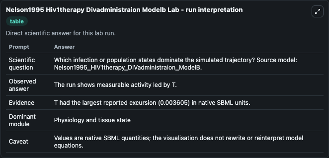
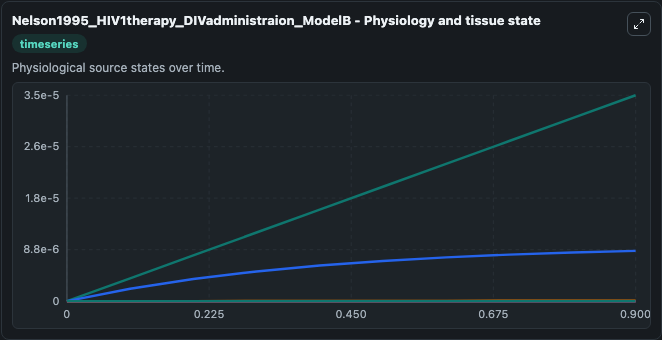
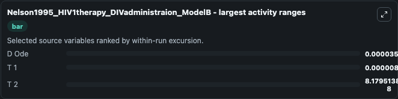
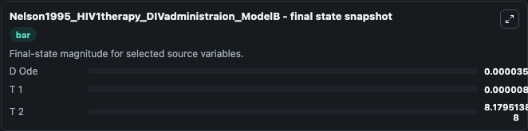
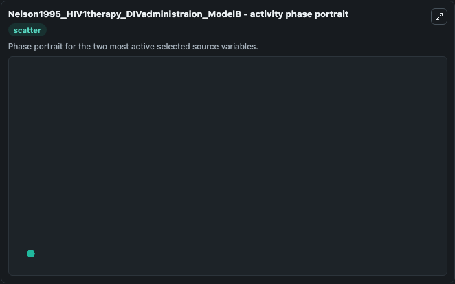

# Nelson1995 Hiv1therapy Divadministraion Modelb

This Biosimulant lab wraps `Nelson1995 Hiv1therapy Divadministraion Modelb` as a runnable systems biology model with a companion visualization module.
This a model from the article: Modeling defective interfering virus therapy for AIDS: conditions for DIVsurvival. It can be used to explore the configured dynamics and compare scenario outcomes across configurations.

## What You'll See

The lab asks: Which infection or population states dominate the simulated trajectory? Source model: Nelson1995_HIV1therapy_DIVadministraion_ModelB. It runs for 1.0 time units with a communication step of 0.1. The run uses the model defaults declared by the curated SBML wrapper. The generated visualizations focus on V, T D2, T D1, T 2, T 1, and D Ode, combining trajectory, endpoint-comparison, and summary-table views from one completed dark-mode run.

In this captured run, **D Ode** moved from 0 to 3.52e-05 across 1.0 simulation windows.


### Output Visualizations



*Summary table for Nelson1995 Hiv1therapy Divadministraion Modelb, reporting the scientific question, observed answer, dominant module, and caveat.*



*Trajectories of D Ode, T 1, T 2, V, T D2, and T D1 across the 1.0 simulation. In this run **D Ode** climbed from 0 to 3.52e-05 — the largest movements among the focused observables.*



*Largest-excursion ranking of the focused observables — the absolute movement magnitude during the run. Top 3: **D Ode** = 3.52e-05, **T 1** = 8.6e-06, **T 2** = 8.18e-08.*



*Endpoint snapshot of the focused observables — final values from the captured run. Top 3 by value: **D Ode** = 3.52e-05, **T 1** = 8.6e-06, **T 2** = 8.18e-08.*



*Visualization card from the Nelson1995 Hiv1therapy Divadministraion Modelb dark-mode run.*


## Model Context

- Core model: `models/core`
- Visualization model: `models/visualisation`
- Standard: `other`
- Upstream source: `biomodels_ebi:MODEL1006230033`
- License: `CC0`

## Inputs

| Input | Maps To | Default | Notes |
|---|---|---|---|
| Initial Model State V | `systemsbiology_sbml_nelson1995_hiv1therapy_divadministraion_modelb_model1006230033_model.initial_model_state_v` | | Source state initial condition exposed as a model-specific control because no explicit intervention parameter is identifiable. Maps to SBML symbol `V_`. |
| Initial T D2 | `systemsbiology_sbml_nelson1995_hiv1therapy_divadministraion_modelb_model1006230033_model.initial_t_d2` | | Source state initial condition exposed as a model-specific control because no explicit intervention parameter is identifiable. Maps to SBML symbol `T_D2`. |
| Initial T D1 | `systemsbiology_sbml_nelson1995_hiv1therapy_divadministraion_modelb_model1006230033_model.initial_t_d1` | | Source state initial condition exposed as a model-specific control because no explicit intervention parameter is identifiable. Maps to SBML symbol `T_D1`. |
| Initial Model State T 2 | `systemsbiology_sbml_nelson1995_hiv1therapy_divadministraion_modelb_model1006230033_model.initial_model_state_t_2` | | Source state initial condition exposed as a model-specific control because no explicit intervention parameter is identifiable. Maps to SBML symbol `T_2`. |
| Initial Model State T 1 | `systemsbiology_sbml_nelson1995_hiv1therapy_divadministraion_modelb_model1006230033_model.initial_model_state_t_1` | | Source state initial condition exposed as a model-specific control because no explicit intervention parameter is identifiable. Maps to SBML symbol `T_1`. |
| Initial D Ode | `systemsbiology_sbml_nelson1995_hiv1therapy_divadministraion_modelb_model1006230033_model.initial_d_ode` | | Source state initial condition exposed as a model-specific control because no explicit intervention parameter is identifiable. Maps to SBML symbol `D_ode`. |

## Outputs

| Output | Maps To | Role |
|---|---|---|
| `state` | `systemsbiology_sbml_nelson1995_hiv1therapy_divadministraion_modelb_model1006230033_model.state` | Available to the visualization model and downstream workflows. |
| `summary` | `systemsbiology_sbml_nelson1995_hiv1therapy_divadministraion_modelb_model1006230033_model.summary` | Available to the visualization model and downstream workflows. |
| `species_labels` | `systemsbiology_sbml_nelson1995_hiv1therapy_divadministraion_modelb_model1006230033_model.species_labels` | Available to the visualization model and downstream workflows. |
| `model_state_v` | `systemsbiology_sbml_nelson1995_hiv1therapy_divadministraion_modelb_model1006230033_model.model_state_v` | Available to the visualization model and downstream workflows. |
| `t_d2` | `systemsbiology_sbml_nelson1995_hiv1therapy_divadministraion_modelb_model1006230033_model.t_d2` | Available to the visualization model and downstream workflows. |
| `t_d1` | `systemsbiology_sbml_nelson1995_hiv1therapy_divadministraion_modelb_model1006230033_model.t_d1` | Available to the visualization model and downstream workflows. |
| `t_2` | `systemsbiology_sbml_nelson1995_hiv1therapy_divadministraion_modelb_model1006230033_model.t_2` | Available to the visualization model and downstream workflows. |
| `t_1` | `systemsbiology_sbml_nelson1995_hiv1therapy_divadministraion_modelb_model1006230033_model.t_1` | Available to the visualization model and downstream workflows. |
| `d_ode` | `systemsbiology_sbml_nelson1995_hiv1therapy_divadministraion_modelb_model1006230033_model.d_ode` | Available to the visualization model and downstream workflows. |

## Runtime

- Duration: `1.0`
- Communication step: `0.1`

## Running Locally

```bash
biosimulant labs serve
```
