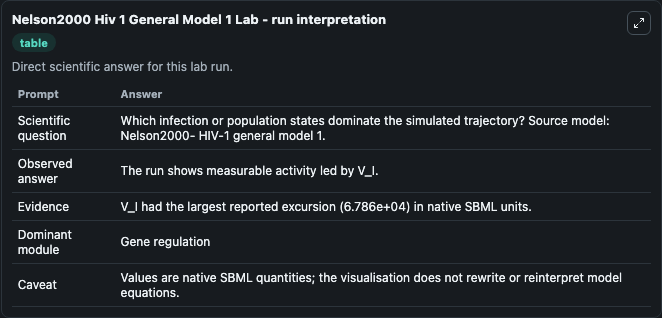
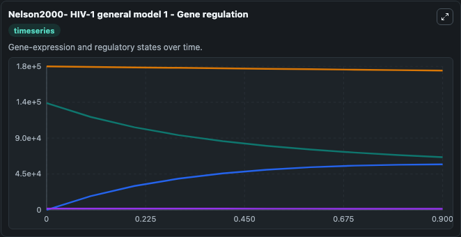
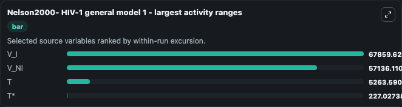
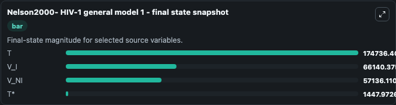
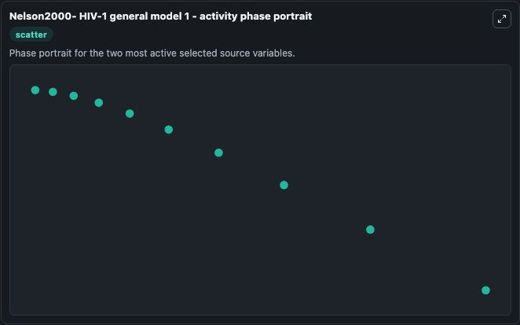

# Nelson2000 Hiv 1 General Model 1

This Biosimulant lab wraps `Nelson2000 Hiv 1 General Model 1` as a runnable systems biology model with a companion visualization module.
This is the general model without delay described by the equation system (1) in: A model of HIV-1 pathogenesis that includes an intracellular delay. It can be used to explore the configured dynamics and compare scenario outcomes across configurations.

## What You'll See

The lab asks: Which infection or population states dominate the simulated trajectory? Source model: Nelson2000- HIV-1 general model 1. It runs for 1.0 time units with a communication step of 0.1. The run uses the model defaults declared by the curated SBML wrapper. The generated visualizations focus on V_I, T*, V_NI, and T, combining trajectory, endpoint-comparison, and summary-table views from one completed dark-mode run.

In this captured run, **V_I** moved from 1.34e+05 to 6.61e+04 across 1.0 simulation windows.


### Output Visualizations



*Summary table for Nelson2000 Hiv 1 General Model 1, reporting the scientific question, observed answer, dominant module, and caveat.*



*Trajectories of V_I, V_NI, T, and T* across the 1.0 simulation. In this run **V_NI** climbed from 0 to 5.71e+04 and **V_I** fell from 1.34e+05 to 6.61e+04 — the largest movements among the focused observables.*



*Largest-excursion ranking of the focused observables — the absolute movement magnitude during the run. Top 3: **V_I** = 6.79e+04, **V_NI** = 5.71e+04, **T** = 5263.6, with 1 more observable below.*



*Endpoint snapshot of the focused observables — final values from the captured run. Top 3 by value: **T** = 1.75e+05, **V_I** = 6.61e+04, **V_NI** = 5.71e+04, with 1 more observable below.*



*Visualization card from the Nelson2000 Hiv 1 General Model 1 dark-mode run.*


## Model Context

- Core model: `models/core`
- Visualization model: `models/visualisation`
- Standard: `other`
- Upstream source: `biomodels_ebi:BIOMD0000000875`
- License: `CC0`

## Inputs

| Input | Maps To | Default | Notes |
|---|---|---|---|
| Initial Model State V I | `systemsbiology_sbml_nelson2000_hiv_1_general_model_1_biomd0000000875_model.initial_model_state_v_i` | | Source state initial condition exposed as a model-specific control because no explicit intervention parameter is identifiable. Maps to SBML symbol `V_I`. |
| Initial Model State T | `systemsbiology_sbml_nelson2000_hiv_1_general_model_1_biomd0000000875_model.initial_model_state_t` | | Source state initial condition exposed as a model-specific control because no explicit intervention parameter is identifiable. Maps to SBML symbol `T_i`. |
| Initial V Ni | `systemsbiology_sbml_nelson2000_hiv_1_general_model_1_biomd0000000875_model.initial_v_ni` | | Source state initial condition exposed as a model-specific control because no explicit intervention parameter is identifiable. Maps to SBML symbol `V_NI`. |
| Initial Model State T 2 | `systemsbiology_sbml_nelson2000_hiv_1_general_model_1_biomd0000000875_model.initial_model_state_t_2` | | Source state initial condition exposed as a model-specific control because no explicit intervention parameter is identifiable. Maps to SBML symbol `T`. |

## Outputs

| Output | Maps To | Role |
|---|---|---|
| `state` | `systemsbiology_sbml_nelson2000_hiv_1_general_model_1_biomd0000000875_model.state` | Available to the visualization model and downstream workflows. |
| `summary` | `systemsbiology_sbml_nelson2000_hiv_1_general_model_1_biomd0000000875_model.summary` | Available to the visualization model and downstream workflows. |
| `species_labels` | `systemsbiology_sbml_nelson2000_hiv_1_general_model_1_biomd0000000875_model.species_labels` | Available to the visualization model and downstream workflows. |
| `v_i` | `systemsbiology_sbml_nelson2000_hiv_1_general_model_1_biomd0000000875_model.v_i` | Available to the visualization model and downstream workflows. |
| `model_state_t` | `systemsbiology_sbml_nelson2000_hiv_1_general_model_1_biomd0000000875_model.model_state_t` | Available to the visualization model and downstream workflows. |
| `v_ni` | `systemsbiology_sbml_nelson2000_hiv_1_general_model_1_biomd0000000875_model.v_ni` | Available to the visualization model and downstream workflows. |
| `model_state_t_2` | `systemsbiology_sbml_nelson2000_hiv_1_general_model_1_biomd0000000875_model.model_state_t_2` | Available to the visualization model and downstream workflows. |

## Runtime

- Duration: `1.0`
- Communication step: `0.1`

## Running Locally

```bash
biosimulant labs serve
```
