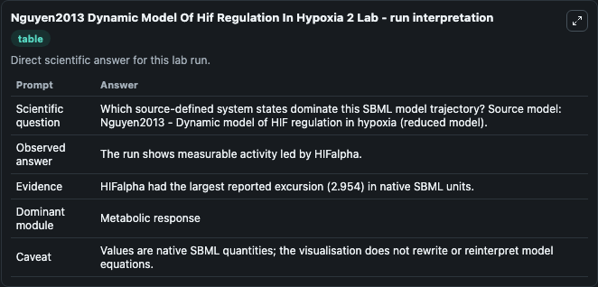
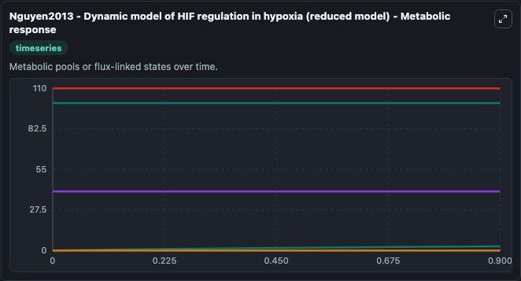
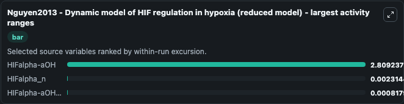
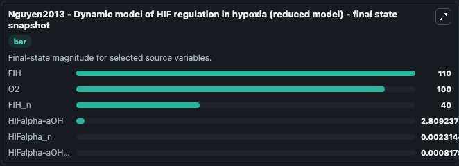
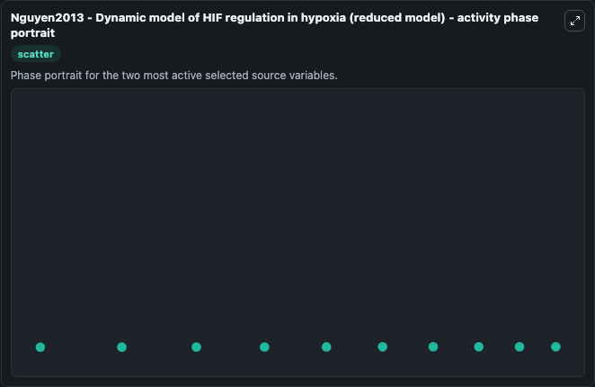

# Nguyen2013 Dynamic Model Of Hif Regulation In Hypoxia 2

This Biosimulant lab wraps `Nguyen2013 Dynamic Model Of Hif Regulation In Hypoxia 2` as a runnable systems biology model with a companion visualization module.
Its a mathematcial model explaining regulation of HIF via FIH and oxygen. It can be used to explore the configured dynamics and compare scenario outcomes across configurations.

## What You'll See

The lab asks: Which source-defined system states dominate this SBML model trajectory? Source model: Nguyen2013 - Dynamic model of HIF regulation in hypoxia (reduced model). It runs for 1.0 time units with a communication step of 0.1. The run uses the model defaults declared by the curated SBML wrapper. The generated visualizations focus on FIH_n, HIFalpha_n, HIFalpha-aOH_n, HIFalpha-aOH, FIH, and O2, combining trajectory, endpoint-comparison, and summary-table views from one completed dark-mode run.

In this captured run, **HIFalpha-aOH** moved from 0 to 2.809 across 1.0 simulation windows.


### Output Visualizations



*Summary table for Nguyen2013 Dynamic Model Of Hif Regulation In Hypoxia 2, reporting the scientific question, observed answer, dominant module, and caveat.*



*Trajectories of HIFalpha-aOH, HIFalpha_n, HIFalpha-aOH_n, FIH_n, FIH, and O2 across the 1.0 simulation. In this run **HIFalpha-aOH** climbed from 0 to 2.809 — the largest movements among the focused observables.*



*Largest-excursion ranking of the focused observables — the absolute movement magnitude during the run. Top 3: **HIFalpha-aOH** = 2.809, **HIFalpha_n** = 0.00231, **HIFalpha-aOH_n** = 0.000818.*



*Trajectories of HIFalpha-aOH, HIFalpha_n, HIFalpha-aOH_n, FIH_n, FIH, and O2 across the 1.0 simulation. In this run **HIFalpha-aOH** climbed from 0 to 2.809 — the largest movements among the focused observables.*



*Visualization card from the Nguyen2013 Dynamic Model Of Hif Regulation In Hypoxia 2 dark-mode run.*


## Model Context

- Core model: `models/core`
- Visualization model: `models/visualisation`
- Standard: `other`
- Upstream source: `biomodels_ebi:MODEL1912100005`
- License: `CC0`

## Inputs

| Input | Maps To | Default | Notes |
|---|---|---|---|
| Initial Fih N | `systemsbiology_sbml_nguyen2013_dynamic_model_of_hif_regulation_in_hy_model1912100005_model.initial_fih_n` | | Source state initial condition exposed as a model-specific control because no explicit intervention parameter is identifiable. Maps to SBML symbol `FIH_n`. |
| Initial Hi Falpha N | `systemsbiology_sbml_nguyen2013_dynamic_model_of_hif_regulation_in_hy_model1912100005_model.initial_hi_falpha_n` | | Source state initial condition exposed as a model-specific control because no explicit intervention parameter is identifiable. Maps to SBML symbol `HIFalpha_n`. |
| Initial Hi Falpha A Oh N | `systemsbiology_sbml_nguyen2013_dynamic_model_of_hif_regulation_in_hy_model1912100005_model.initial_hi_falpha_a_oh_n` | | Source state initial condition exposed as a model-specific control because no explicit intervention parameter is identifiable. Maps to SBML symbol `HIFalpha_aOH_n`. |
| Initial Hi Falpha A Oh | `systemsbiology_sbml_nguyen2013_dynamic_model_of_hif_regulation_in_hy_model1912100005_model.initial_hi_falpha_a_oh` | | Source state initial condition exposed as a model-specific control because no explicit intervention parameter is identifiable. Maps to SBML symbol `HIFalpha_aOH`. |
| Initial Model State Fih | `systemsbiology_sbml_nguyen2013_dynamic_model_of_hif_regulation_in_hy_model1912100005_model.initial_model_state_fih` | | Source state initial condition exposed as a model-specific control because no explicit intervention parameter is identifiable. Maps to SBML symbol `FIH`. |
| Initial Model State O2 | `systemsbiology_sbml_nguyen2013_dynamic_model_of_hif_regulation_in_hy_model1912100005_model.initial_model_state_o2` | | Source state initial condition exposed as a model-specific control because no explicit intervention parameter is identifiable. Maps to SBML symbol `O2`. |

## Outputs

| Output | Maps To | Role |
|---|---|---|
| `state` | `systemsbiology_sbml_nguyen2013_dynamic_model_of_hif_regulation_in_hy_model1912100005_model.state` | Available to the visualization model and downstream workflows. |
| `summary` | `systemsbiology_sbml_nguyen2013_dynamic_model_of_hif_regulation_in_hy_model1912100005_model.summary` | Available to the visualization model and downstream workflows. |
| `species_labels` | `systemsbiology_sbml_nguyen2013_dynamic_model_of_hif_regulation_in_hy_model1912100005_model.species_labels` | Available to the visualization model and downstream workflows. |
| `fih_n` | `systemsbiology_sbml_nguyen2013_dynamic_model_of_hif_regulation_in_hy_model1912100005_model.fih_n` | Available to the visualization model and downstream workflows. |
| `hi_falpha_n` | `systemsbiology_sbml_nguyen2013_dynamic_model_of_hif_regulation_in_hy_model1912100005_model.hi_falpha_n` | Available to the visualization model and downstream workflows. |
| `hi_falpha_a_oh_n` | `systemsbiology_sbml_nguyen2013_dynamic_model_of_hif_regulation_in_hy_model1912100005_model.hi_falpha_a_oh_n` | Available to the visualization model and downstream workflows. |
| `hi_falpha_a_oh` | `systemsbiology_sbml_nguyen2013_dynamic_model_of_hif_regulation_in_hy_model1912100005_model.hi_falpha_a_oh` | Available to the visualization model and downstream workflows. |
| `fih` | `systemsbiology_sbml_nguyen2013_dynamic_model_of_hif_regulation_in_hy_model1912100005_model.fih` | Available to the visualization model and downstream workflows. |
| `model_state_o2` | `systemsbiology_sbml_nguyen2013_dynamic_model_of_hif_regulation_in_hy_model1912100005_model.model_state_o2` | Available to the visualization model and downstream workflows. |

## Runtime

- Duration: `1.0`
- Communication step: `0.1`

## Running Locally

```bash
biosimulant labs serve
```
