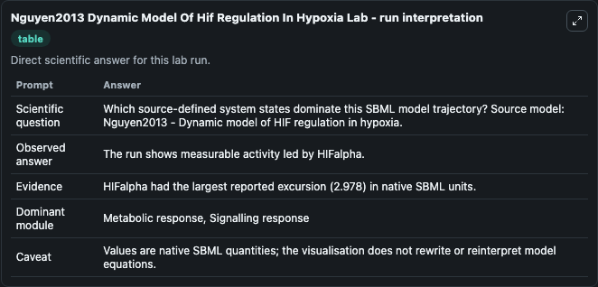
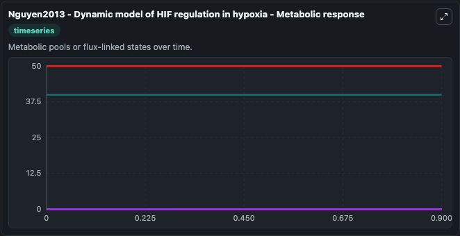
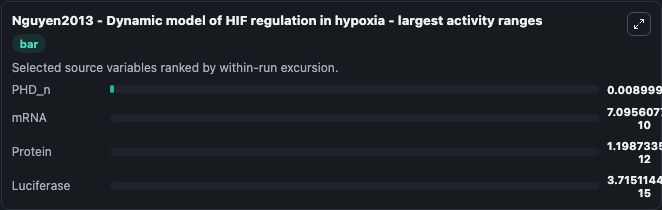
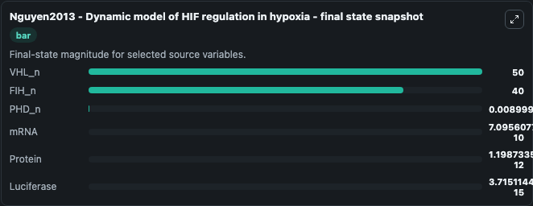
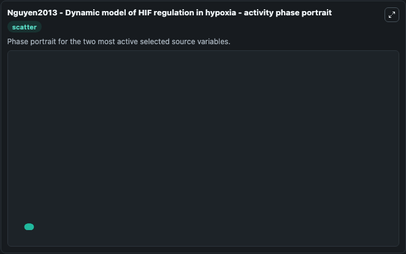

# Nguyen2013 Dynamic Model Of Hif Regulation In Hypoxia

This Biosimulant lab wraps `Nguyen2013 Dynamic Model Of Hif Regulation In Hypoxia` as a runnable systems biology model with a companion visualization module.
Its a mathematcial model explaining regulation of HIF via FIH and oxygen. It can be used to explore the configured dynamics and compare scenario outcomes across configurations.

## What You'll See

The lab asks: Which source-defined system states dominate this SBML model trajectory? Source model: Nguyen2013 - Dynamic model of HIF regulation in hypoxia. It runs for 1.0 time units with a communication step of 0.1. The run uses the model defaults declared by the curated SBML wrapper. The generated visualizations focus on mRNA, Protein, Luciferase, VHL_n, FIH_n, and PHD_n, combining trajectory, endpoint-comparison, and summary-table views from one completed dark-mode run.

In this captured run, **PHD_n** moved from 0 to 0.009 across 1.0 simulation windows.


### Output Visualizations



*Summary table for Nguyen2013 Dynamic Model Of Hif Regulation In Hypoxia, reporting the scientific question, observed answer, dominant module, and caveat.*



*Trajectories of PHD_n, mRNA, Protein, Luciferase, VHL_n, and FIH_n across the 1.0 simulation. In this run **PHD_n** climbed from 0 to 0.009 — the largest movements among the focused observables.*



*Largest-excursion ranking of the focused observables — the absolute movement magnitude during the run. Top 3: **PHD_n** = 0.009, **mRNA** = 7.1e-10, **Protein** = 1.2e-12, with 1 more observable below.*



*Endpoint snapshot of the focused observables — final values from the captured run. Top 3 by value: **VHL_n** = 50.000, **FIH_n** = 40.000, **PHD_n** = 0.009, with 3 more observables below.*



*Visualization card from the Nguyen2013 Dynamic Model Of Hif Regulation In Hypoxia dark-mode run.*


## Model Context

- Core model: `models/core`
- Visualization model: `models/visualisation`
- Standard: `other`
- Upstream source: `biomodels_ebi:MODEL1912100004`
- License: `CC0`

## Inputs

| Input | Maps To | Default | Notes |
|---|---|---|---|
| Initial MRNA | `systemsbiology_sbml_nguyen2013_dynamic_model_of_hif_regulation_in_hy_model1912100004_model.initial_mrna` | | Source state initial condition exposed as a model-specific control because no explicit intervention parameter is identifiable. Maps to SBML symbol `mRNA`. |
| Initial Protein | `systemsbiology_sbml_nguyen2013_dynamic_model_of_hif_regulation_in_hy_model1912100004_model.initial_protein` | | Source state initial condition exposed as a model-specific control because no explicit intervention parameter is identifiable. Maps to SBML symbol `Protein`. |
| Initial Luciferase | `systemsbiology_sbml_nguyen2013_dynamic_model_of_hif_regulation_in_hy_model1912100004_model.initial_luciferase` | | Source state initial condition exposed as a model-specific control because no explicit intervention parameter is identifiable. Maps to SBML symbol `Luciferase`. |
| Initial Vhl N | `systemsbiology_sbml_nguyen2013_dynamic_model_of_hif_regulation_in_hy_model1912100004_model.initial_vhl_n` | | Source state initial condition exposed as a model-specific control because no explicit intervention parameter is identifiable. Maps to SBML symbol `VHL_n`. |
| Initial Fih N | `systemsbiology_sbml_nguyen2013_dynamic_model_of_hif_regulation_in_hy_model1912100004_model.initial_fih_n` | | Source state initial condition exposed as a model-specific control because no explicit intervention parameter is identifiable. Maps to SBML symbol `FIH_n`. |
| Initial Phd N | `systemsbiology_sbml_nguyen2013_dynamic_model_of_hif_regulation_in_hy_model1912100004_model.initial_phd_n` | | Source state initial condition exposed as a model-specific control because no explicit intervention parameter is identifiable. Maps to SBML symbol `PHD_n`. |

## Outputs

| Output | Maps To | Role |
|---|---|---|
| `state` | `systemsbiology_sbml_nguyen2013_dynamic_model_of_hif_regulation_in_hy_model1912100004_model.state` | Available to the visualization model and downstream workflows. |
| `summary` | `systemsbiology_sbml_nguyen2013_dynamic_model_of_hif_regulation_in_hy_model1912100004_model.summary` | Available to the visualization model and downstream workflows. |
| `species_labels` | `systemsbiology_sbml_nguyen2013_dynamic_model_of_hif_regulation_in_hy_model1912100004_model.species_labels` | Available to the visualization model and downstream workflows. |
| `mrna` | `systemsbiology_sbml_nguyen2013_dynamic_model_of_hif_regulation_in_hy_model1912100004_model.mrna` | Available to the visualization model and downstream workflows. |
| `protein` | `systemsbiology_sbml_nguyen2013_dynamic_model_of_hif_regulation_in_hy_model1912100004_model.protein` | Available to the visualization model and downstream workflows. |
| `luciferase` | `systemsbiology_sbml_nguyen2013_dynamic_model_of_hif_regulation_in_hy_model1912100004_model.luciferase` | Available to the visualization model and downstream workflows. |
| `vhl_n` | `systemsbiology_sbml_nguyen2013_dynamic_model_of_hif_regulation_in_hy_model1912100004_model.vhl_n` | Available to the visualization model and downstream workflows. |
| `fih_n` | `systemsbiology_sbml_nguyen2013_dynamic_model_of_hif_regulation_in_hy_model1912100004_model.fih_n` | Available to the visualization model and downstream workflows. |
| `phd_n` | `systemsbiology_sbml_nguyen2013_dynamic_model_of_hif_regulation_in_hy_model1912100004_model.phd_n` | Available to the visualization model and downstream workflows. |

## Runtime

- Duration: `1.0`
- Communication step: `0.1`

## Running Locally

```bash
biosimulant labs serve
```
