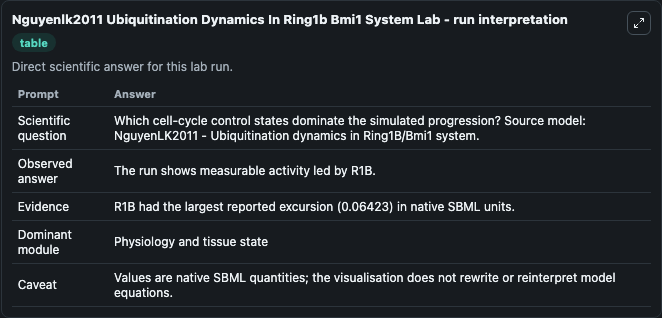
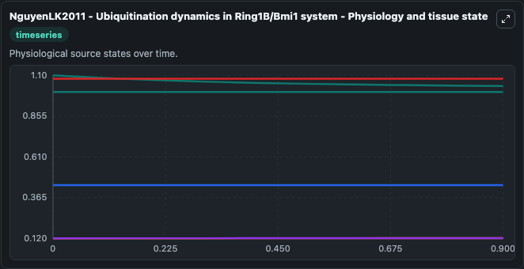
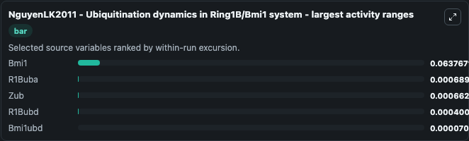
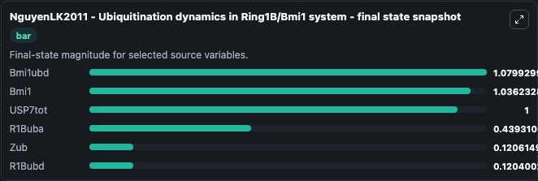
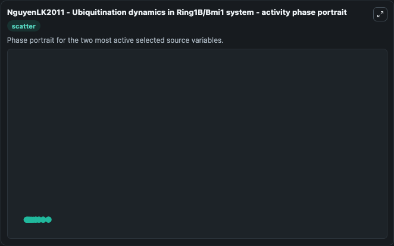

# Nguyenlk2011 Ubiquitination Dynamics In Ring1b Bmi1 System

This Biosimulant lab wraps `Nguyenlk2011 Ubiquitination Dynamics In Ring1b Bmi1 System` as a runnable systems biology model with a companion visualization module.
NguyenLK2011 - Ubiquitination dynamics inRing1B-Bmi1 system This theoretical model investigates thedynamics of Ring1B/Bmi1 ubiquitination to identify bistableswitch-like and oscillatory behaviour in t. It can be used to explore the configured dynamics and compare scenario outcomes across configurations.

## What You'll See

The lab asks: Which cell-cycle control states dominate the simulated progression? Source model: NguyenLK2011 - Ubiquitination dynamics in Ring1B/Bmi1 system. It runs for 1.0 time units with a communication step of 0.1. The run uses the model defaults declared by the curated SBML wrapper. The generated visualizations focus on Bmi1, Bmi1ubd, USP7tot, R1Buba, Zub, and R1Bubd, combining trajectory, endpoint-comparison, and summary-table views from one completed dark-mode run.

In this captured run, **Bmi1** moved from 1.100 to 1.036 across 1.0 simulation windows.


### Output Visualizations



*Summary table for Nguyenlk2011 Ubiquitination Dynamics In Ring1b Bmi1 System, reporting the scientific question, observed answer, dominant module, and caveat.*



*Trajectories of Bmi1, R1Buba, Zub, R1Bubd, Bmi1ubd, and USP7tot across the 1.0 simulation. In this run **Zub** climbed from 0.1200 to 0.1206 and **Bmi1** fell from 1.100 to 1.036 — the largest movements among the focused observables.*



*Largest-excursion ranking of the focused observables — the absolute movement magnitude during the run. Top 3: **Bmi1** = 0.0638, **R1Buba** = 0.000689, **Zub** = 0.000663, with 2 more observables below.*



*Endpoint snapshot of the focused observables — final values from the captured run. Top 3 by value: **Bmi1ubd** = 1.080, **Bmi1** = 1.036, **USP7tot** = 1.000, with 3 more observables below.*



*Visualization card from the Nguyenlk2011 Ubiquitination Dynamics In Ring1b Bmi1 System dark-mode run.*


## Model Context

- Core model: `models/core`
- Visualization model: `models/visualisation`
- Standard: `other`
- Upstream source: `biomodels_ebi:BIOMD0000000622`
- License: `CC0`

## Inputs

| Input | Maps To | Default | Notes |
|---|---|---|---|
| Initial Bmi1 | `systemsbiology_sbml_nguyenlk2011_ubiquitination_dynamics_in_ring1b_b_biomd0000000622_model.initial_bmi1` | | Source state initial condition exposed as a model-specific control because no explicit intervention parameter is identifiable. Maps to SBML symbol `Bmi1`. |
| Initial Bmi1ubd | `systemsbiology_sbml_nguyenlk2011_ubiquitination_dynamics_in_ring1b_b_biomd0000000622_model.initial_bmi1ubd` | | Source state initial condition exposed as a model-specific control because no explicit intervention parameter is identifiable. Maps to SBML symbol `Bmi1ubd`. |
| Initial Usp7tot | `systemsbiology_sbml_nguyenlk2011_ubiquitination_dynamics_in_ring1b_b_biomd0000000622_model.initial_usp7tot` | | Source state initial condition exposed as a model-specific control because no explicit intervention parameter is identifiable. Maps to SBML symbol `USP7tot`. |
| Initial R1 Buba | `systemsbiology_sbml_nguyenlk2011_ubiquitination_dynamics_in_ring1b_b_biomd0000000622_model.initial_r1_buba` | | Source state initial condition exposed as a model-specific control because no explicit intervention parameter is identifiable. Maps to SBML symbol `R1Buba`. |
| Initial Model State Zub | `systemsbiology_sbml_nguyenlk2011_ubiquitination_dynamics_in_ring1b_b_biomd0000000622_model.initial_model_state_zub` | | Source state initial condition exposed as a model-specific control because no explicit intervention parameter is identifiable. Maps to SBML symbol `Zub`. |
| Initial R1 Bubd | `systemsbiology_sbml_nguyenlk2011_ubiquitination_dynamics_in_ring1b_b_biomd0000000622_model.initial_r1_bubd` | | Source state initial condition exposed as a model-specific control because no explicit intervention parameter is identifiable. Maps to SBML symbol `R1Bubd`. |

## Outputs

| Output | Maps To | Role |
|---|---|---|
| `state` | `systemsbiology_sbml_nguyenlk2011_ubiquitination_dynamics_in_ring1b_b_biomd0000000622_model.state` | Available to the visualization model and downstream workflows. |
| `summary` | `systemsbiology_sbml_nguyenlk2011_ubiquitination_dynamics_in_ring1b_b_biomd0000000622_model.summary` | Available to the visualization model and downstream workflows. |
| `species_labels` | `systemsbiology_sbml_nguyenlk2011_ubiquitination_dynamics_in_ring1b_b_biomd0000000622_model.species_labels` | Available to the visualization model and downstream workflows. |
| `bmi1` | `systemsbiology_sbml_nguyenlk2011_ubiquitination_dynamics_in_ring1b_b_biomd0000000622_model.bmi1` | Available to the visualization model and downstream workflows. |
| `bmi1ubd` | `systemsbiology_sbml_nguyenlk2011_ubiquitination_dynamics_in_ring1b_b_biomd0000000622_model.bmi1ubd` | Available to the visualization model and downstream workflows. |
| `usp7tot` | `systemsbiology_sbml_nguyenlk2011_ubiquitination_dynamics_in_ring1b_b_biomd0000000622_model.usp7tot` | Available to the visualization model and downstream workflows. |
| `r1_buba` | `systemsbiology_sbml_nguyenlk2011_ubiquitination_dynamics_in_ring1b_b_biomd0000000622_model.r1_buba` | Available to the visualization model and downstream workflows. |
| `zub` | `systemsbiology_sbml_nguyenlk2011_ubiquitination_dynamics_in_ring1b_b_biomd0000000622_model.zub` | Available to the visualization model and downstream workflows. |
| `r1_bubd` | `systemsbiology_sbml_nguyenlk2011_ubiquitination_dynamics_in_ring1b_b_biomd0000000622_model.r1_bubd` | Available to the visualization model and downstream workflows. |

## Runtime

- Duration: `1.0`
- Communication step: `0.1`

## Running Locally

```bash
biosimulant labs serve
```
