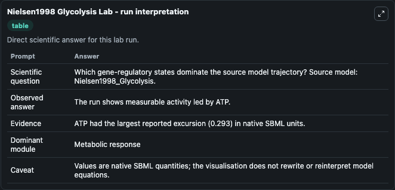
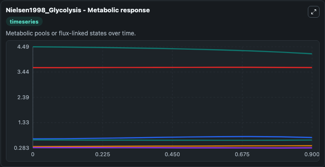
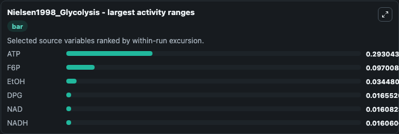
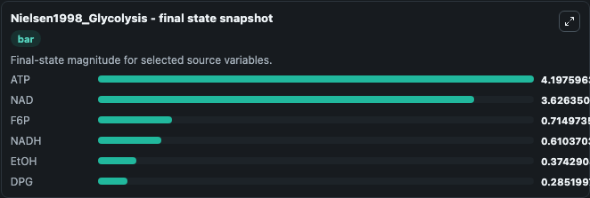
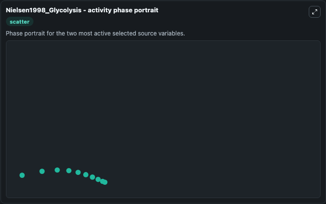

# Nielsen1998 Glycolysis

This Biosimulant lab wraps `Nielsen1998 Glycolysis` as a runnable systems biology model with a companion visualization module.
This model was automatically converted from model BIOMD0000000042 by using libSBML. It can be used to explore the configured dynamics and compare scenario outcomes across configurations.

## What You'll See

The lab asks: Which gene-regulatory states dominate the source model trajectory? Source model: Nielsen1998_Glycolysis. It runs for 1.0 time units with a communication step of 0.1. The run uses the model defaults declared by the curated SBML wrapper. The generated visualizations focus on ATP, NAD, F6P, NADH, EtOH, and DPG, combining trajectory, endpoint-comparison, and summary-table views from one completed dark-mode run.

In this captured run, **ATP** moved from 4.491 to 4.198 across 1.0 simulation windows.


### Output Visualizations



*Summary table for Nielsen1998 Glycolysis, reporting the scientific question, observed answer, dominant module, and caveat.*



*Trajectories of ATP, F6P, EtOH, DPG, NAD, and NADH across the 1.0 simulation. In this run **F6P** climbed from 0.6594 to 0.7150 and **ATP** fell from 4.491 to 4.198 — the largest movements among the focused observables.*



*Largest-excursion ranking of the focused observables — the absolute movement magnitude during the run. Top 3: **ATP** = 0.2930, **F6P** = 0.0970, **EtOH** = 0.0345, with 3 more observables below.*



*Endpoint snapshot of the focused observables — final values from the captured run. Top 3 by value: **ATP** = 4.198, **NAD** = 3.626, **F6P** = 0.7150, with 3 more observables below.*



*Visualization card from the Nielsen1998 Glycolysis dark-mode run.*


## Model Context

- Core model: `models/core`
- Visualization model: `models/visualisation`
- Standard: `other`
- Upstream source: `biomodels_ebi:BIOMD0000000042`
- License: `CC0`

## Inputs

| Input | Maps To | Default | Notes |
|---|---|---|---|
| Flow | `systemsbiology_sbml_nielsen1998_glycolysis_biomd0000000042_model.flow` | | Source parameter exposed because its SBML label indicates a boundary, stimulus, dose, ligand, protocol, substrate, or environmental control. Maps to SBML symbol `flow`. |

## Outputs

| Output | Maps To | Role |
|---|---|---|
| `state` | `systemsbiology_sbml_nielsen1998_glycolysis_biomd0000000042_model.state` | Available to the visualization model and downstream workflows. |
| `summary` | `systemsbiology_sbml_nielsen1998_glycolysis_biomd0000000042_model.summary` | Available to the visualization model and downstream workflows. |
| `species_labels` | `systemsbiology_sbml_nielsen1998_glycolysis_biomd0000000042_model.species_labels` | Available to the visualization model and downstream workflows. |
| `atp` | `systemsbiology_sbml_nielsen1998_glycolysis_biomd0000000042_model.atp` | Available to the visualization model and downstream workflows. |
| `nad` | `systemsbiology_sbml_nielsen1998_glycolysis_biomd0000000042_model.nad` | Available to the visualization model and downstream workflows. |
| `f6_p` | `systemsbiology_sbml_nielsen1998_glycolysis_biomd0000000042_model.f6_p` | Available to the visualization model and downstream workflows. |
| `nadh` | `systemsbiology_sbml_nielsen1998_glycolysis_biomd0000000042_model.nadh` | Available to the visualization model and downstream workflows. |
| `et_oh` | `systemsbiology_sbml_nielsen1998_glycolysis_biomd0000000042_model.et_oh` | Available to the visualization model and downstream workflows. |
| `dpg` | `systemsbiology_sbml_nielsen1998_glycolysis_biomd0000000042_model.dpg` | Available to the visualization model and downstream workflows. |

## Runtime

- Duration: `1.0`
- Communication step: `0.1`

## Running Locally

```bash
biosimulant labs serve
```
