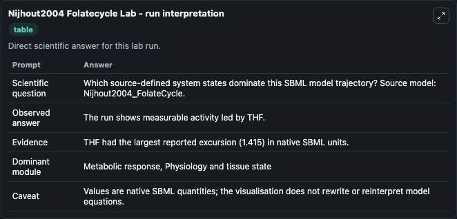
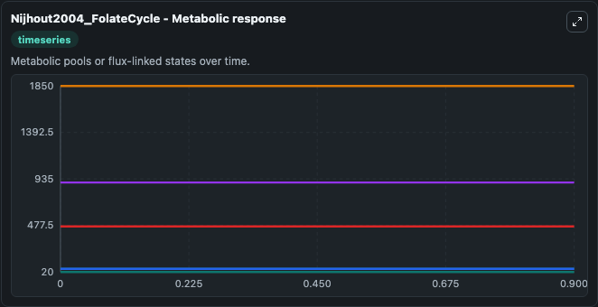
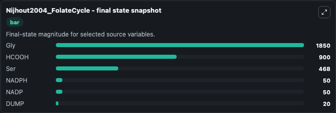

# Nijhout2004 Folatecycle

This Biosimulant lab wraps `Nijhout2004 Folatecycle` as a runnable systems biology model with a companion visualization module.
This is an SBML version of the folate cycle model model from: A mathematical model of the folate cycle: new insights into folate homeostasis. It can be used to explore the configured dynamics and compare scenario outcomes across configurations.

## What You'll See

The lab asks: Which source-defined system states dominate this SBML model trajectory? Source model: Nijhout2004_FolateCycle. It runs for 1.0 time units with a communication step of 0.1. The run uses the model defaults declared by the curated SBML wrapper. The generated visualizations focus on NADPH, NADP, Gly, HCOOH, Ser, and DUMP, combining trajectory, endpoint-comparison, and summary-table views from one completed dark-mode run.

In this captured run, **NADPH** moved from 50.000 to 50.000 across 1.0 simulation windows.


### Output Visualizations



*Summary table for Nijhout2004 Folatecycle, reporting the scientific question, observed answer, dominant module, and caveat.*



*Trajectories of NADPH, NADP, Gly, HCOOH, Ser, and DUMP across the 1.0 simulation. In this run NADPH, NADP, Gly, HCOOH stayed near their initial values — no observable moved appreciably.*



*Endpoint snapshot of the focused observables — final values from the captured run. Top 3 by value: **Gly** = 1850.0, **HCOOH** = 900.0, **Ser** = 468.0, with 3 more observables below.*


## Model Context

- Core model: `models/core`
- Visualization model: `models/visualisation`
- Standard: `other`
- Upstream source: `biomodels_ebi:MODEL6655501972`
- License: `CC0`

## Inputs

| Input | Maps To | Default | Notes |
|---|---|---|---|
| Initial Nadph | `systemsbiology_sbml_nijhout2004_folatecycle_model6655501972_model.initial_nadph` | | Source state initial condition exposed as a model-specific control because no explicit intervention parameter is identifiable. Maps to SBML symbol `NADPH`. |
| Initial Nadp | `systemsbiology_sbml_nijhout2004_folatecycle_model6655501972_model.initial_nadp` | | Source state initial condition exposed as a model-specific control because no explicit intervention parameter is identifiable. Maps to SBML symbol `NADP`. |
| Initial Model State Gly | `systemsbiology_sbml_nijhout2004_folatecycle_model6655501972_model.initial_model_state_gly` | | Source state initial condition exposed as a model-specific control because no explicit intervention parameter is identifiable. Maps to SBML symbol `Gly`. |
| Initial Hcooh | `systemsbiology_sbml_nijhout2004_folatecycle_model6655501972_model.initial_hcooh` | | Source state initial condition exposed as a model-specific control because no explicit intervention parameter is identifiable. Maps to SBML symbol `HCOOH`. |
| Initial Model State Ser | `systemsbiology_sbml_nijhout2004_folatecycle_model6655501972_model.initial_model_state_ser` | | Source state initial condition exposed as a model-specific control because no explicit intervention parameter is identifiable. Maps to SBML symbol `Ser`. |
| Initial Dump | `systemsbiology_sbml_nijhout2004_folatecycle_model6655501972_model.initial_dump` | | Source state initial condition exposed as a model-specific control because no explicit intervention parameter is identifiable. Maps to SBML symbol `dUMP`. |

## Outputs

| Output | Maps To | Role |
|---|---|---|
| `state` | `systemsbiology_sbml_nijhout2004_folatecycle_model6655501972_model.state` | Available to the visualization model and downstream workflows. |
| `summary` | `systemsbiology_sbml_nijhout2004_folatecycle_model6655501972_model.summary` | Available to the visualization model and downstream workflows. |
| `species_labels` | `systemsbiology_sbml_nijhout2004_folatecycle_model6655501972_model.species_labels` | Available to the visualization model and downstream workflows. |
| `nadph` | `systemsbiology_sbml_nijhout2004_folatecycle_model6655501972_model.nadph` | Available to the visualization model and downstream workflows. |
| `nadp` | `systemsbiology_sbml_nijhout2004_folatecycle_model6655501972_model.nadp` | Available to the visualization model and downstream workflows. |
| `gly` | `systemsbiology_sbml_nijhout2004_folatecycle_model6655501972_model.gly` | Available to the visualization model and downstream workflows. |
| `hcooh` | `systemsbiology_sbml_nijhout2004_folatecycle_model6655501972_model.hcooh` | Available to the visualization model and downstream workflows. |
| `ser` | `systemsbiology_sbml_nijhout2004_folatecycle_model6655501972_model.ser` | Available to the visualization model and downstream workflows. |
| `dump` | `systemsbiology_sbml_nijhout2004_folatecycle_model6655501972_model.dump` | Available to the visualization model and downstream workflows. |

## Runtime

- Duration: `1.0`
- Communication step: `0.1`

## Running Locally

```bash
biosimulant labs serve
```
