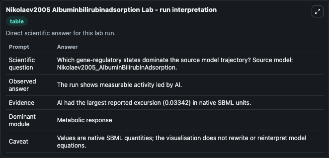
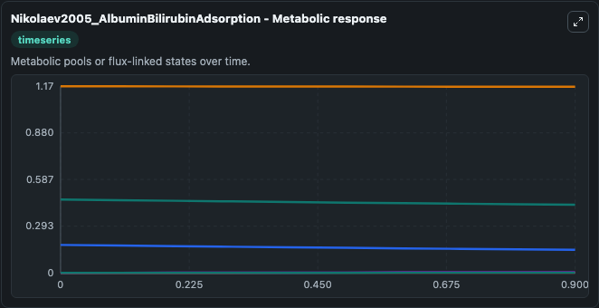
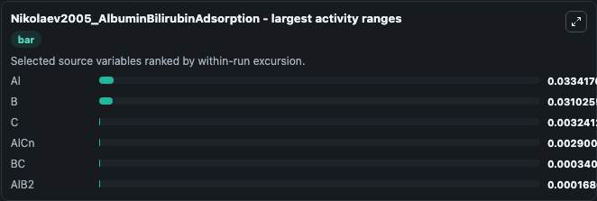
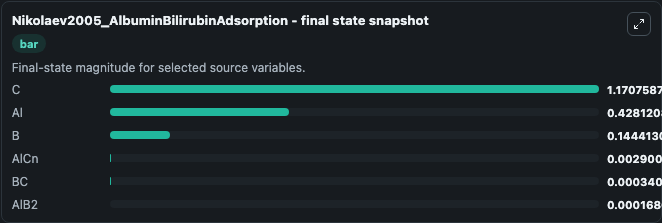
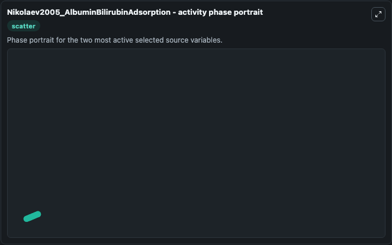

# Nikolaev2005 Albuminbilirubinadsorption

This Biosimulant lab wraps `Nikolaev2005 Albuminbilirubinadsorption` as a runnable systems biology model with a companion visualization module.
This a model from the article: Mathematical model of binding of albumin-bilirubin complex to the surface of carbon pyropolymer. It can be used to explore the configured dynamics and compare scenario outcomes across configurations.

## What You'll See

The lab asks: Which gene-regulatory states dominate the source model trajectory? Source model: Nikolaev2005_AlbuminBilirubinAdsorption. It runs for 1.0 time units with a communication step of 0.1. The run uses the model defaults declared by the curated SBML wrapper. The generated visualizations focus on C, Al, B, BC, AlCn, and AlB2, combining trajectory, endpoint-comparison, and summary-table views from one completed dark-mode run.

In this captured run, **Al** moved from 0.4615 to 0.4281 across 1.0 simulation windows.


### Output Visualizations



*Summary table for Nikolaev2005 Albuminbilirubinadsorption, reporting the scientific question, observed answer, dominant module, and caveat.*



*Trajectories of Al, B, C, AlCn, BC, and AlB2 across the 1.0 simulation. In this run **AlCn** climbed from 0 to 0.0029 and **Al** fell from 0.4615 to 0.4281 — the largest movements among the focused observables.*



*Largest-excursion ranking of the focused observables — the absolute movement magnitude during the run. Top 3: **Al** = 0.0334, **B** = 0.0310, **C** = 0.00324, with 3 more observables below.*



*Endpoint snapshot of the focused observables — final values from the captured run. Top 3 by value: **C** = 1.171, **Al** = 0.4281, **B** = 0.1444, with 3 more observables below.*



*Visualization card from the Nikolaev2005 Albuminbilirubinadsorption dark-mode run.*


## Model Context

- Core model: `models/core`
- Visualization model: `models/visualisation`
- Standard: `other`
- Upstream source: `biomodels_ebi:BIOMD0000000291`
- License: `CC0`

## Inputs

| Input | Maps To | Default | Notes |
|---|---|---|---|
| Initial Model State C | `systemsbiology_sbml_nikolaev2005_albuminbilirubinadsorption_biomd0000000291_model.initial_model_state_c` | | Source state initial condition exposed as a model-specific control because no explicit intervention parameter is identifiable. Maps to SBML symbol `x7`. |
| Initial Model State Al | `systemsbiology_sbml_nikolaev2005_albuminbilirubinadsorption_biomd0000000291_model.initial_model_state_al` | | Source state initial condition exposed as a model-specific control because no explicit intervention parameter is identifiable. Maps to SBML symbol `x5`. |
| Initial Model State B | `systemsbiology_sbml_nikolaev2005_albuminbilirubinadsorption_biomd0000000291_model.initial_model_state_b` | | Source state initial condition exposed as a model-specific control because no explicit intervention parameter is identifiable. Maps to SBML symbol `x6`. |
| Initial Model State Bc | `systemsbiology_sbml_nikolaev2005_albuminbilirubinadsorption_biomd0000000291_model.initial_model_state_bc` | | Source state initial condition exposed as a model-specific control because no explicit intervention parameter is identifiable. Maps to SBML symbol `x2`. |
| Initial Al Cn | `systemsbiology_sbml_nikolaev2005_albuminbilirubinadsorption_biomd0000000291_model.initial_al_cn` | | Source state initial condition exposed as a model-specific control because no explicit intervention parameter is identifiable. Maps to SBML symbol `x3`. |
| Initial Al B2 | `systemsbiology_sbml_nikolaev2005_albuminbilirubinadsorption_biomd0000000291_model.initial_al_b2` | | Source state initial condition exposed as a model-specific control because no explicit intervention parameter is identifiable. Maps to SBML symbol `x4`. |

## Outputs

| Output | Maps To | Role |
|---|---|---|
| `state` | `systemsbiology_sbml_nikolaev2005_albuminbilirubinadsorption_biomd0000000291_model.state` | Available to the visualization model and downstream workflows. |
| `summary` | `systemsbiology_sbml_nikolaev2005_albuminbilirubinadsorption_biomd0000000291_model.summary` | Available to the visualization model and downstream workflows. |
| `species_labels` | `systemsbiology_sbml_nikolaev2005_albuminbilirubinadsorption_biomd0000000291_model.species_labels` | Available to the visualization model and downstream workflows. |
| `model_state_c` | `systemsbiology_sbml_nikolaev2005_albuminbilirubinadsorption_biomd0000000291_model.model_state_c` | Available to the visualization model and downstream workflows. |
| `model_state_al` | `systemsbiology_sbml_nikolaev2005_albuminbilirubinadsorption_biomd0000000291_model.model_state_al` | Available to the visualization model and downstream workflows. |
| `model_state_b` | `systemsbiology_sbml_nikolaev2005_albuminbilirubinadsorption_biomd0000000291_model.model_state_b` | Available to the visualization model and downstream workflows. |
| `model_state_bc` | `systemsbiology_sbml_nikolaev2005_albuminbilirubinadsorption_biomd0000000291_model.model_state_bc` | Available to the visualization model and downstream workflows. |
| `al_cn` | `systemsbiology_sbml_nikolaev2005_albuminbilirubinadsorption_biomd0000000291_model.al_cn` | Available to the visualization model and downstream workflows. |
| `al_b2` | `systemsbiology_sbml_nikolaev2005_albuminbilirubinadsorption_biomd0000000291_model.al_b2` | Available to the visualization model and downstream workflows. |

## Runtime

- Duration: `1.0`
- Communication step: `0.1`

## Running Locally

```bash
biosimulant labs serve
```
