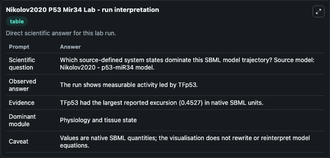
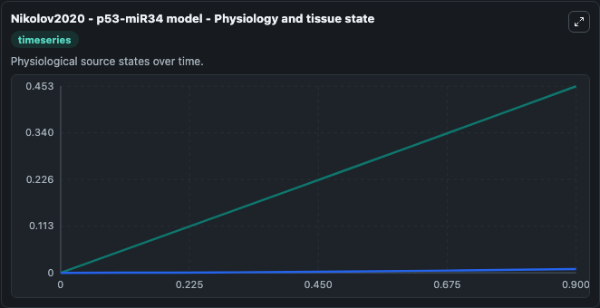
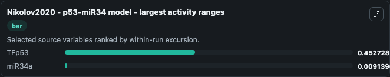
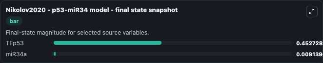
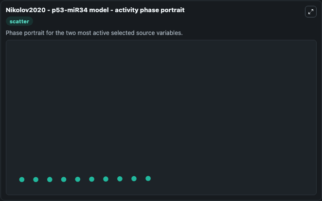

# Nikolov2020 P53 Mir34

This Biosimulant lab wraps `Nikolov2020 P53 Mir34` as a runnable systems biology model with a companion visualization module.
Svetoslav Nikolov, Olaf Wolkenhauer, Julio Vera & Momchil Nenov. It can be used to explore the configured dynamics and compare scenario outcomes across configurations.

## What You'll See

The lab asks: Which source-defined system states dominate this SBML model trajectory? Source model: Nikolov2020 - p53-miR34 model. It runs for 1.0 time units with a communication step of 0.1. The run uses the model defaults declared by the curated SBML wrapper. The generated visualizations focus on miR34a, and TFp53, combining trajectory, endpoint-comparison, and summary-table views from one completed dark-mode run.

In this captured run, **TFp53** moved from 0 to 0.4527 across 1.0 simulation windows.


### Output Visualizations



*Summary table for Nikolov2020 P53 Mir34, reporting the scientific question, observed answer, dominant module, and caveat.*



*Trajectories of TFp53, and miR34a across the 1.0 simulation. In this run **TFp53** climbed from 0 to 0.4527 — the largest movements among the focused observables.*



*Largest-excursion ranking of the focused observables — the absolute movement magnitude during the run. Top 2: **TFp53** = 0.4527, **miR34a** = 0.00914.*



*Endpoint snapshot of the focused observables — final values from the captured run. Top 2 by value: **TFp53** = 0.4527, **miR34a** = 0.00914.*



*Visualization card from the Nikolov2020 P53 Mir34 dark-mode run.*


## Model Context

- Core model: `models/core`
- Visualization model: `models/visualisation`
- Standard: `other`
- Upstream source: `biomodels_ebi:BIOMD0000001057`
- License: `CC0`

## Inputs

| Input | Maps To | Default | Notes |
|---|---|---|---|
| Initial Mi R34a | `systemsbiology_sbml_nikolov2020_p53_mir34_model_biomd0000001057_model.initial_mi_r34a` | | Source state initial condition exposed as a model-specific control because no explicit intervention parameter is identifiable. Maps to SBML symbol `miR34a`. |
| Initial T Fp53 | `systemsbiology_sbml_nikolov2020_p53_mir34_model_biomd0000001057_model.initial_t_fp53` | | Source state initial condition exposed as a model-specific control because no explicit intervention parameter is identifiable. Maps to SBML symbol `TFp53`. |

## Outputs

| Output | Maps To | Role |
|---|---|---|
| `state` | `systemsbiology_sbml_nikolov2020_p53_mir34_model_biomd0000001057_model.state` | Available to the visualization model and downstream workflows. |
| `summary` | `systemsbiology_sbml_nikolov2020_p53_mir34_model_biomd0000001057_model.summary` | Available to the visualization model and downstream workflows. |
| `species_labels` | `systemsbiology_sbml_nikolov2020_p53_mir34_model_biomd0000001057_model.species_labels` | Available to the visualization model and downstream workflows. |
| `mi_r34a` | `systemsbiology_sbml_nikolov2020_p53_mir34_model_biomd0000001057_model.mi_r34a` | Available to the visualization model and downstream workflows. |
| `t_fp53` | `systemsbiology_sbml_nikolov2020_p53_mir34_model_biomd0000001057_model.t_fp53` | Available to the visualization model and downstream workflows. |

## Runtime

- Duration: `1.0`
- Communication step: `0.1`

## Running Locally

```bash
biosimulant labs serve
```
