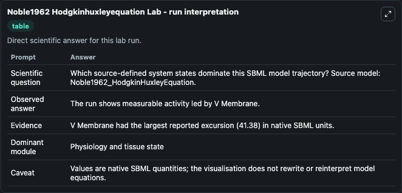
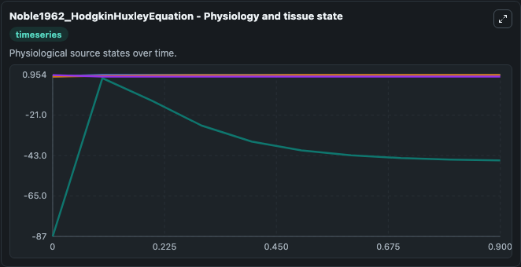
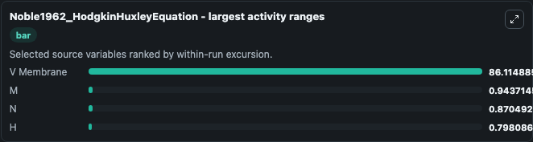
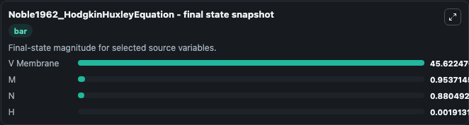
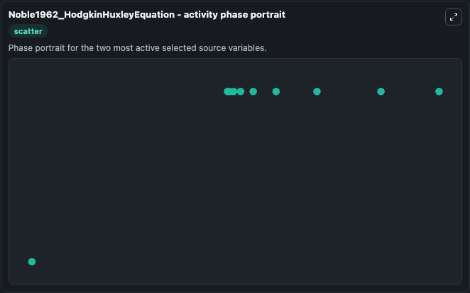

# Noble1962 Hodgkinhuxleyequation

This Biosimulant lab wraps `Noble1962 Hodgkinhuxleyequation` as a runnable systems biology model with a companion visualization module.
This a model from the article: A modification of the Hodgkin--Huxley equations applicable to Purkinje fibre action and pace-maker potentials. It can be used to explore the configured dynamics and compare scenario outcomes across configurations.

## What You'll See

The lab asks: Which source-defined system states dominate this SBML model trajectory? Source model: Noble1962_HodgkinHuxleyEquation. It runs for 1.0 time units with a communication step of 0.1. The run uses the model defaults declared by the curated SBML wrapper. The generated visualizations focus on V Membrane, N, M, and H, combining trajectory, endpoint-comparison, and summary-table views from one completed dark-mode run.

In this captured run, **V Membrane** moved from -87.000 to -45.622 across 1.0 simulation windows.


### Output Visualizations



*Summary table for Noble1962 Hodgkinhuxleyequation, reporting the scientific question, observed answer, dominant module, and caveat.*



*Trajectories of V Membrane, M, N, and H across the 1.0 simulation. In this run **V Membrane** climbed from -87.000 to -45.622 and **H** fell from 0.8000 to 0.00191 — the largest movements among the focused observables.*



*Largest-excursion ranking of the focused observables — the absolute movement magnitude during the run. Top 3: **V Membrane** = 86.115, **M** = 0.9437, **N** = 0.8705, with 1 more observable below.*



*Endpoint snapshot of the focused observables — final values from the captured run. Top 3 by value: **V Membrane** = 45.622, **M** = 0.9537, **N** = 0.8805, with 1 more observable below.*



*Visualization card from the Noble1962 Hodgkinhuxleyequation dark-mode run.*


## Model Context

- Core model: `models/core`
- Visualization model: `models/visualisation`
- Standard: `other`
- Upstream source: `biomodels_ebi:MODEL8686121468`
- License: `CC0`

## Inputs

| Input | Maps To | Default | Notes |
|---|---|---|---|
| Initial V Membrane | `systemsbiology_sbml_noble1962_hodgkinhuxleyequation_model8686121468_model.initial_v_membrane` | | Source state initial condition exposed as a model-specific control because no explicit intervention parameter is identifiable. Maps to SBML symbol `V_membrane`. |
| Initial Model State N | `systemsbiology_sbml_noble1962_hodgkinhuxleyequation_model8686121468_model.initial_model_state_n` | | Source state initial condition exposed as a model-specific control because no explicit intervention parameter is identifiable. Maps to SBML symbol `n`. |
| Initial Model State M | `systemsbiology_sbml_noble1962_hodgkinhuxleyequation_model8686121468_model.initial_model_state_m` | | Source state initial condition exposed as a model-specific control because no explicit intervention parameter is identifiable. Maps to SBML symbol `m`. |
| Initial Model State H | `systemsbiology_sbml_noble1962_hodgkinhuxleyequation_model8686121468_model.initial_model_state_h` | | Source state initial condition exposed as a model-specific control because no explicit intervention parameter is identifiable. Maps to SBML symbol `h`. |

## Outputs

| Output | Maps To | Role |
|---|---|---|
| `state` | `systemsbiology_sbml_noble1962_hodgkinhuxleyequation_model8686121468_model.state` | Available to the visualization model and downstream workflows. |
| `summary` | `systemsbiology_sbml_noble1962_hodgkinhuxleyequation_model8686121468_model.summary` | Available to the visualization model and downstream workflows. |
| `species_labels` | `systemsbiology_sbml_noble1962_hodgkinhuxleyequation_model8686121468_model.species_labels` | Available to the visualization model and downstream workflows. |
| `v_membrane` | `systemsbiology_sbml_noble1962_hodgkinhuxleyequation_model8686121468_model.v_membrane` | Available to the visualization model and downstream workflows. |
| `model_state_n` | `systemsbiology_sbml_noble1962_hodgkinhuxleyequation_model8686121468_model.model_state_n` | Available to the visualization model and downstream workflows. |
| `model_state_m` | `systemsbiology_sbml_noble1962_hodgkinhuxleyequation_model8686121468_model.model_state_m` | Available to the visualization model and downstream workflows. |
| `model_state_h` | `systemsbiology_sbml_noble1962_hodgkinhuxleyequation_model8686121468_model.model_state_h` | Available to the visualization model and downstream workflows. |

## Runtime

- Duration: `1.0`
- Communication step: `0.1`

## Running Locally

```bash
biosimulant labs serve
```
