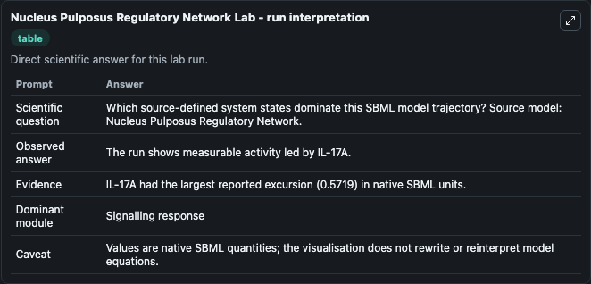
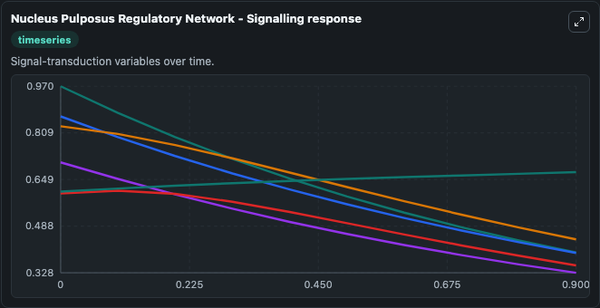
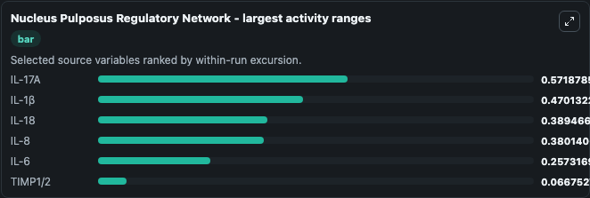
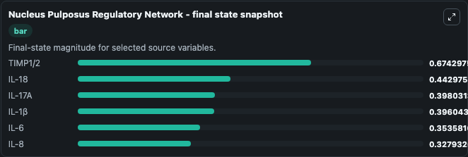
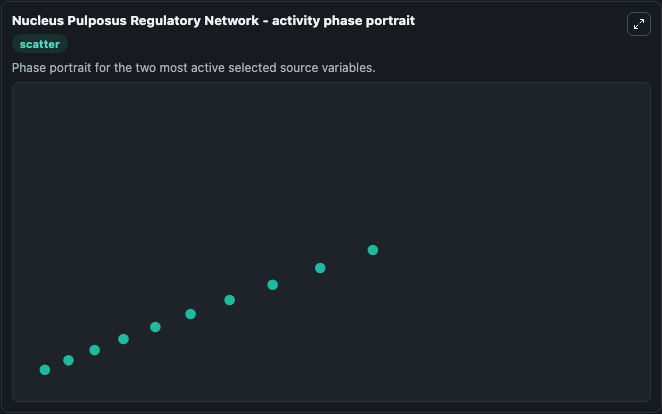

# Nucleus Pulposus Regulatory Network

This Biosimulant lab wraps `Nucleus Pulposus Regulatory Network` as a runnable systems biology model with a companion visualization module.
Systems Biology Nucleus Pulposus Regulatory Network Model2411040001Model models core biological dynamics as a OTHER simulation curated from biomodels_ebi (biomodels_ebi:MODEL2411040001), focused on systemsbiolo. It can be used to explore the configured dynamics and compare scenario outcomes across configurations.

## What You'll See

The lab asks: Which source-defined system states dominate this SBML model trajectory? Source model: Nucleus Pulposus Regulatory Network. It runs for 1.0 time units with a communication step of 0.1. The run uses the model defaults declared by the curated SBML wrapper. The generated visualizations focus on IL-17A, IL-1β, IL-18, IL-8, TIMP1/2, and IL-6, combining trajectory, endpoint-comparison, and summary-table views from one completed dark-mode run.

In this captured run, **IL-17A** moved from 0.9699 to 0.3980 across 1.0 simulation windows.


### Output Visualizations



*Summary table for Nucleus Pulposus Regulatory Network, reporting the scientific question, observed answer, dominant module, and caveat.*



*Trajectories of IL-17A, IL-1β, IL-18, IL-8, IL-6, and TIMP1/2 across the 1.0 simulation. In this run **TIMP1/2** climbed from 0.6075 to 0.6743 and **IL-17A** fell from 0.9699 to 0.3980 — the largest movements among the focused observables.*



*Largest-excursion ranking of the focused observables — the absolute movement magnitude during the run. Top 3: **IL-17A** = 0.5719, **IL-1β** = 0.4701, **IL-18** = 0.3895, with 3 more observables below.*



*Endpoint snapshot of the focused observables — final values from the captured run. Top 3 by value: **TIMP1/2** = 0.6743, **IL-18** = 0.4430, **IL-17A** = 0.3980, with 3 more observables below.*



*Visualization card from the Nucleus Pulposus Regulatory Network dark-mode run.*


## Model Context

- Core model: `models/core`
- Visualization model: `models/visualisation`
- Standard: `other`
- Upstream source: `biomodels_ebi:MODEL2411040001`
- License: `CC0`

## Inputs

| Input | Maps To | Default | Notes |
|---|---|---|---|
| Initial Il 17 A | `systemsbiology_sbml_nucleus_pulposus_regulatory_network_model2411040001_model.initial_il_17_a` | | Source state initial condition exposed as a model-specific control because no explicit intervention parameter is identifiable. Maps to SBML symbol `IL_17A`. |
| Initial Il 1 | `systemsbiology_sbml_nucleus_pulposus_regulatory_network_model2411040001_model.initial_il_1` | | Source state initial condition exposed as a model-specific control because no explicit intervention parameter is identifiable. Maps to SBML symbol `IL_1beta`. |
| Initial Il 18 | `systemsbiology_sbml_nucleus_pulposus_regulatory_network_model2411040001_model.initial_il_18` | | Source state initial condition exposed as a model-specific control because no explicit intervention parameter is identifiable. Maps to SBML symbol `IL_18`. |
| Initial Il 8 | `systemsbiology_sbml_nucleus_pulposus_regulatory_network_model2411040001_model.initial_il_8` | | Source state initial condition exposed as a model-specific control because no explicit intervention parameter is identifiable. Maps to SBML symbol `IL_8`. |
| Initial Timp1 2 | `systemsbiology_sbml_nucleus_pulposus_regulatory_network_model2411040001_model.initial_timp1_2` | | Source state initial condition exposed as a model-specific control because no explicit intervention parameter is identifiable. Maps to SBML symbol `TIMP1_2`. |
| Initial Il 6 | `systemsbiology_sbml_nucleus_pulposus_regulatory_network_model2411040001_model.initial_il_6` | | Source state initial condition exposed as a model-specific control because no explicit intervention parameter is identifiable. Maps to SBML symbol `IL_6`. |

## Outputs

| Output | Maps To | Role |
|---|---|---|
| `state` | `systemsbiology_sbml_nucleus_pulposus_regulatory_network_model2411040001_model.state` | Available to the visualization model and downstream workflows. |
| `summary` | `systemsbiology_sbml_nucleus_pulposus_regulatory_network_model2411040001_model.summary` | Available to the visualization model and downstream workflows. |
| `species_labels` | `systemsbiology_sbml_nucleus_pulposus_regulatory_network_model2411040001_model.species_labels` | Available to the visualization model and downstream workflows. |
| `il_17_a` | `systemsbiology_sbml_nucleus_pulposus_regulatory_network_model2411040001_model.il_17_a` | Available to the visualization model and downstream workflows. |
| `il_1` | `systemsbiology_sbml_nucleus_pulposus_regulatory_network_model2411040001_model.il_1` | Available to the visualization model and downstream workflows. |
| `il_18` | `systemsbiology_sbml_nucleus_pulposus_regulatory_network_model2411040001_model.il_18` | Available to the visualization model and downstream workflows. |
| `il_8` | `systemsbiology_sbml_nucleus_pulposus_regulatory_network_model2411040001_model.il_8` | Available to the visualization model and downstream workflows. |
| `timp1_2` | `systemsbiology_sbml_nucleus_pulposus_regulatory_network_model2411040001_model.timp1_2` | Available to the visualization model and downstream workflows. |
| `il_6` | `systemsbiology_sbml_nucleus_pulposus_regulatory_network_model2411040001_model.il_6` | Available to the visualization model and downstream workflows. |

## Runtime

- Duration: `1.0`
- Communication step: `0.1`

## Running Locally

```bash
biosimulant labs serve
```
