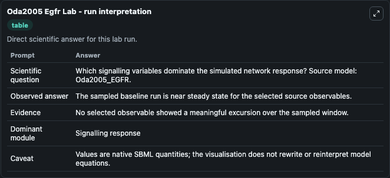
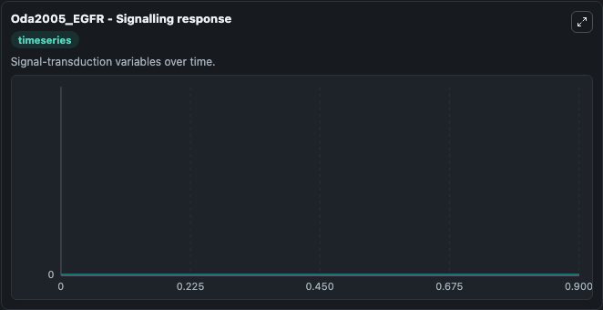

# Oda2005 Egfr

This Biosimulant lab wraps `Oda2005 Egfr` as a runnable systems biology model with a companion visualization module.
This model originates from BioModels Database: A Database of Annotated Published Models (http://www.ebi.ac.uk/biomodels/). It can be used to explore the configured dynamics and compare scenario outcomes across configurations.

## What You'll See

The lab asks: Which signalling variables dominate the simulated network response? Source model: Oda2005_EGFR. It runs for 1.0 time units with a communication step of 0.1. The run uses the model defaults declared by the curated SBML wrapper. The generated visualizations focus on tumorigenesis, cell cycle_br_progression, cADPR, Complex(cADPR/FKBP), and truncated_br_PLC_beta, combining trajectory, endpoint-comparison, and summary-table views from one completed dark-mode run.

In this captured run, **tumorigenesis** moved from 0 to 0 across 1.0 simulation windows.


### Output Visualizations



*Summary table for Oda2005 Egfr, reporting the scientific question, observed answer, dominant module, and caveat.*



*Trajectories of tumorigenesis, cell cycle_br_progression, cADPR, Complex(cADPR/FKBP), truncated_br_PLC_beta, and truncated_br_PLC_beta across the 1.0 simulation. In this run tumorigenesis, cell cycle_br_progression, cADPR, Complex(cADPR/FKBP) stayed near their initial values — no observable moved appreciably.*


## Model Context

- Core model: `models/core`
- Visualization model: `models/visualisation`
- Standard: `other`
- Upstream source: `biomodels_ebi:MODEL2463576061`
- License: `CC0`

## Inputs

| Input | Maps To | Default | Notes |
|---|---|---|---|
| Initial Tumorigenesis | `systemsbiology_sbml_oda2005_egfr_model2463576061_model.initial_tumorigenesis` | | Source state initial condition exposed as a model-specific control because no explicit intervention parameter is identifiable. Maps to SBML symbol `s412`. |
| Initial Cell Cycle Br Progression | `systemsbiology_sbml_oda2005_egfr_model2463576061_model.initial_cell_cycle_br_progression` | | Source state initial condition exposed as a model-specific control because no explicit intervention parameter is identifiable. Maps to SBML symbol `s357`. |
| Initial C Adpr | `systemsbiology_sbml_oda2005_egfr_model2463576061_model.initial_c_adpr` | | Source state initial condition exposed as a model-specific control because no explicit intervention parameter is identifiable. Maps to SBML symbol `s260`. |
| Initial Complex C Adpr Fkbp | `systemsbiology_sbml_oda2005_egfr_model2463576061_model.initial_complex_c_adpr_fkbp` | | Source state initial condition exposed as a model-specific control because no explicit intervention parameter is identifiable. Maps to SBML symbol `s261`. |
| Initial Truncated Br Plc Beta | `systemsbiology_sbml_oda2005_egfr_model2463576061_model.initial_truncated_br_plc_beta` | | Source state initial condition exposed as a model-specific control because no explicit intervention parameter is identifiable. Maps to SBML symbol `s299`. |
| Initial Truncated Br Plc Beta 2 | `systemsbiology_sbml_oda2005_egfr_model2463576061_model.initial_truncated_br_plc_beta_2` | | Source state initial condition exposed as a model-specific control because no explicit intervention parameter is identifiable. Maps to SBML symbol `s306`. |

## Outputs

| Output | Maps To | Role |
|---|---|---|
| `state` | `systemsbiology_sbml_oda2005_egfr_model2463576061_model.state` | Available to the visualization model and downstream workflows. |
| `summary` | `systemsbiology_sbml_oda2005_egfr_model2463576061_model.summary` | Available to the visualization model and downstream workflows. |
| `species_labels` | `systemsbiology_sbml_oda2005_egfr_model2463576061_model.species_labels` | Available to the visualization model and downstream workflows. |
| `tumorigenesis` | `systemsbiology_sbml_oda2005_egfr_model2463576061_model.tumorigenesis` | Available to the visualization model and downstream workflows. |
| `cell_cycle_br_progression` | `systemsbiology_sbml_oda2005_egfr_model2463576061_model.cell_cycle_br_progression` | Available to the visualization model and downstream workflows. |
| `c_adpr` | `systemsbiology_sbml_oda2005_egfr_model2463576061_model.c_adpr` | Available to the visualization model and downstream workflows. |
| `complex_c_adpr_fkbp` | `systemsbiology_sbml_oda2005_egfr_model2463576061_model.complex_c_adpr_fkbp` | Available to the visualization model and downstream workflows. |
| `truncated_br_plc_beta` | `systemsbiology_sbml_oda2005_egfr_model2463576061_model.truncated_br_plc_beta` | Available to the visualization model and downstream workflows. |
| `truncated_br_plc_beta_2` | `systemsbiology_sbml_oda2005_egfr_model2463576061_model.truncated_br_plc_beta_2` | Available to the visualization model and downstream workflows. |

## Runtime

- Duration: `1.0`
- Communication step: `0.1`

## Running Locally

```bash
biosimulant labs serve
```
