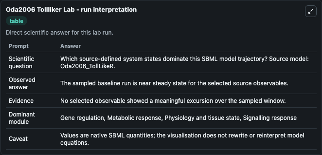
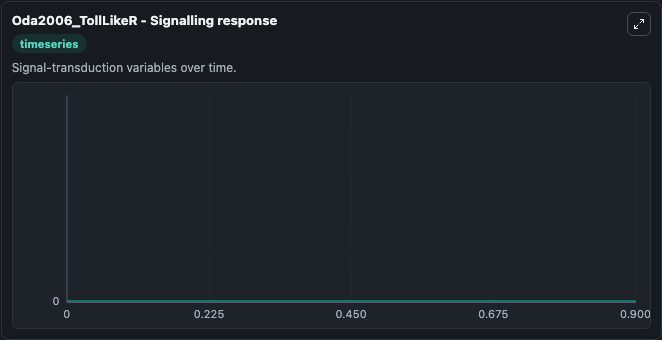

# Oda2006 Tollliker

This Biosimulant lab wraps `Oda2006 Tollliker` as a runnable systems biology model with a companion visualization module.
This model originates from BioModels Database: A Database of Annotated Published Models (http://www.ebi.ac.uk/biomodels/). It can be used to explore the configured dynamics and compare scenario outcomes across configurations.

## What You'll See

The lab asks: Which source-defined system states dominate this SBML model trajectory? Source model: Oda2006_TollLikeR. It runs for 1.0 time units with a communication step of 0.1. The run uses the model defaults declared by the curated SBML wrapper. The generated visualizations focus on target genes_br_ex. IL-1, IL-8, IL-6, TNF_alpha_ , IFN_gamma_ , GM-CSF, M-CSF,_br_iNOS, COX2, MHC class I / II, E-selectin, _beta_ -defensin2, target genes_br_ ex. cyclin D1, cell cycle, RNA_br_metabolism, Complex(RIP1/TRAF6/TICAM1*), and transcription, combining trajectory, endpoint-comparison, and summary-table views from one completed dark-mode run.

In this captured run, **target genes_br_ex. IL-1, IL-8, IL-6, TNF_alpha_ , IFN_gamma_ , GM-CSF, M-CSF,_br_iNOS, COX2, MHC class I / II, E-selectin, _beta_ -defensin2** moved from 0 to 0 across 1.0 simulation windows.


### Output Visualizations



*Summary table for Oda2006 Tollliker, reporting the scientific question, observed answer, dominant module, and caveat.*



*Trajectories of target genes_br_ex. IL-1, IL-8, IL-6, TNF_alpha_ , IFN_gamma_ , GM-CSF, M-CSF,_br_iNOS, COX2, MHC class I / II, E-selectin, _beta_ -defensin2, target genes_br_ ex. cyclin D1, cell cycle, RNA_br_metabolism, Complex(RIP1/TRAF6/TICAM1*), and transcription across the 1.0 simulation. In this run target genes_br_ex. IL-1, IL-8, IL-6, TNF_alpha_ , IFN_gamma_ , GM-CSF, M-CSF,_br_iNOS, COX2, MHC class I / II, E-selectin, _beta_ -defensin2, target genes_br_ ex. cyclin D1, cell cycle, RNA_br_metabolism stayed near their initial values — no observable moved appreciably.*


## Model Context

- Core model: `models/core`
- Visualization model: `models/visualisation`
- Standard: `other`
- Upstream source: `biomodels_ebi:MODEL2463683119`
- License: `CC0`

## Inputs

| Input | Maps To | Default | Notes |
|---|---|---|---|
| Initial Target Genes Br Ex Il 1 Il 8 Il 6 TNF Alpha Ifn Gamma Gm Csf M Csf Br I Nos Cox2 Mhc Class I Ii E Selectin Beta Defensin2 | `systemsbiology_sbml_oda2006_tollliker_model2463683119_model.initial_target_genes_br_ex_il_1_il_8_il_6_tnf_alpha_ifn_gamma_gm_csf_m_csf_br_i_nos_cox2_mhc_class_i_ii_e_selectin_beta_defensin2` | | Source state initial condition exposed as a model-specific control because no explicit intervention parameter is identifiable. Maps to SBML symbol `s1290`. |
| Initial Target Genes Br Ex Cyclin D1 | `systemsbiology_sbml_oda2006_tollliker_model2463683119_model.initial_target_genes_br_ex_cyclin_d1` | | Source state initial condition exposed as a model-specific control because no explicit intervention parameter is identifiable. Maps to SBML symbol `s1304`. |
| Initial Cell Cycle | `systemsbiology_sbml_oda2006_tollliker_model2463683119_model.initial_cell_cycle` | | Source state initial condition exposed as a model-specific control because no explicit intervention parameter is identifiable. Maps to SBML symbol `s1138`. |
| Initial RNA Br Metabolism | `systemsbiology_sbml_oda2006_tollliker_model2463683119_model.initial_rna_br_metabolism` | | Source state initial condition exposed as a model-specific control because no explicit intervention parameter is identifiable. Maps to SBML symbol `s805`. |
| Initial Complex Rip1 Traf6 Ticam1 | `systemsbiology_sbml_oda2006_tollliker_model2463683119_model.initial_complex_rip1_traf6_ticam1` | | Source state initial condition exposed as a model-specific control because no explicit intervention parameter is identifiable. Maps to SBML symbol `s288`. |
| Initial Transcription | `systemsbiology_sbml_oda2006_tollliker_model2463683119_model.initial_transcription` | | Source state initial condition exposed as a model-specific control because no explicit intervention parameter is identifiable. Maps to SBML symbol `s1184`. |

## Outputs

| Output | Maps To | Role |
|---|---|---|
| `state` | `systemsbiology_sbml_oda2006_tollliker_model2463683119_model.state` | Available to the visualization model and downstream workflows. |
| `summary` | `systemsbiology_sbml_oda2006_tollliker_model2463683119_model.summary` | Available to the visualization model and downstream workflows. |
| `species_labels` | `systemsbiology_sbml_oda2006_tollliker_model2463683119_model.species_labels` | Available to the visualization model and downstream workflows. |
| `target_genes_br_ex_il_1_il_8_il_6_tnf_alpha_ifn_gamma_gm_csf_m_csf_br_i_nos_cox2_mhc_class_i_ii_e_selectin_beta_defensin2` | `systemsbiology_sbml_oda2006_tollliker_model2463683119_model.target_genes_br_ex_il_1_il_8_il_6_tnf_alpha_ifn_gamma_gm_csf_m_csf_br_i_nos_cox2_mhc_class_i_ii_e_selectin_beta_defensin2` | Available to the visualization model and downstream workflows. |
| `target_genes_br_ex_cyclin_d1` | `systemsbiology_sbml_oda2006_tollliker_model2463683119_model.target_genes_br_ex_cyclin_d1` | Available to the visualization model and downstream workflows. |
| `cell_cycle` | `systemsbiology_sbml_oda2006_tollliker_model2463683119_model.cell_cycle` | Available to the visualization model and downstream workflows. |
| `rna_br_metabolism` | `systemsbiology_sbml_oda2006_tollliker_model2463683119_model.rna_br_metabolism` | Available to the visualization model and downstream workflows. |
| `complex_rip1_traf6_ticam1` | `systemsbiology_sbml_oda2006_tollliker_model2463683119_model.complex_rip1_traf6_ticam1` | Available to the visualization model and downstream workflows. |
| `transcription` | `systemsbiology_sbml_oda2006_tollliker_model2463683119_model.transcription` | Available to the visualization model and downstream workflows. |

## Runtime

- Duration: `1.0`
- Communication step: `0.1`

## Running Locally

```bash
biosimulant labs serve
```
