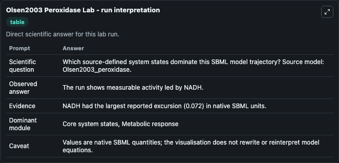
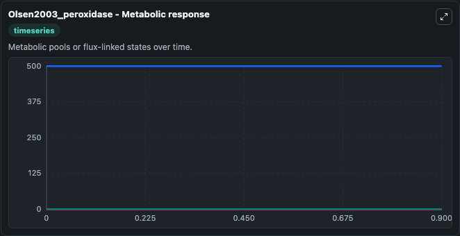
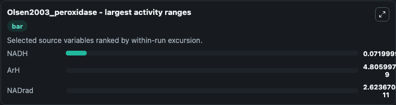
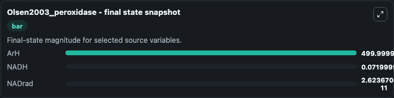
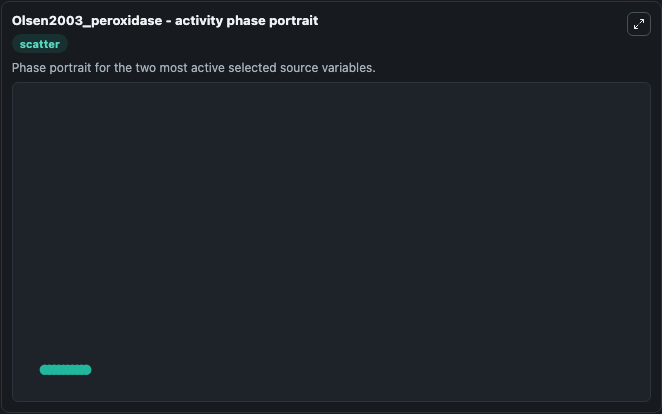

# Olsen2003 Peroxidase

This Biosimulant lab wraps `Olsen2003 Peroxidase` as a runnable systems biology model with a companion visualization module.
Notes of the BioModels curators: The current model reproduce the figure 7, panel B of the paper. It can be used to explore the configured dynamics and compare scenario outcomes across configurations.

## What You'll See

The lab asks: Which source-defined system states dominate this SBML model trajectory? Source model: Olsen2003_peroxidase. It runs for 1.0 time units with a communication step of 0.1. The run uses the model defaults declared by the curated SBML wrapper. The generated visualizations focus on NADrad, NADHres, NADH, NAD2, NAD, and ArH, combining trajectory, endpoint-comparison, and summary-table views from one completed dark-mode run.

In this captured run, **NADH** moved from 0 to 0.0720 across 1.0 simulation windows.


### Output Visualizations



*Summary table for Olsen2003 Peroxidase, reporting the scientific question, observed answer, dominant module, and caveat.*



*Trajectories of NADH, ArH, NADrad, NADHres, NAD2, and NAD across the 1.0 simulation. In this run **NADH** climbed from 0 to 0.0720 and **ArH** fell from 500.0 to 500.0 — the largest movements among the focused observables.*



*Largest-excursion ranking of the focused observables — the absolute movement magnitude during the run. Top 3: **NADH** = 0.0720, **ArH** = 4.81e-09, **NADrad** = 2.62e-11.*



*Endpoint snapshot of the focused observables — final values from the captured run. Top 3 by value: **ArH** = 500.0, **NADH** = 0.0720, **NADrad** = 2.62e-11.*



*Visualization card from the Olsen2003 Peroxidase dark-mode run.*


## Model Context

- Core model: `models/core`
- Visualization model: `models/visualisation`
- Standard: `other`
- Upstream source: `biomodels_ebi:BIOMD0000000046`
- License: `CC0`

## Inputs

| Input | Maps To | Default | Notes |
|---|---|---|---|
| Initial Na Drad | `systemsbiology_sbml_olsen2003_peroxidase_biomd0000000046_model.initial_na_drad` | | Source state initial condition exposed as a model-specific control because no explicit intervention parameter is identifiable. Maps to SBML symbol `NADrad`. |
| Initial Nad Hres | `systemsbiology_sbml_olsen2003_peroxidase_biomd0000000046_model.initial_nad_hres` | | Source state initial condition exposed as a model-specific control because no explicit intervention parameter is identifiable. Maps to SBML symbol `NADHres`. |
| Initial Nadh | `systemsbiology_sbml_olsen2003_peroxidase_biomd0000000046_model.initial_nadh` | | Source state initial condition exposed as a model-specific control because no explicit intervention parameter is identifiable. Maps to SBML symbol `NADH`. |
| Initial Nad2 | `systemsbiology_sbml_olsen2003_peroxidase_biomd0000000046_model.initial_nad2` | | Source state initial condition exposed as a model-specific control because no explicit intervention parameter is identifiable. Maps to SBML symbol `NAD2`. |
| Initial Model State Nad | `systemsbiology_sbml_olsen2003_peroxidase_biomd0000000046_model.initial_model_state_nad` | | Source state initial condition exposed as a model-specific control because no explicit intervention parameter is identifiable. Maps to SBML symbol `NAD`. |
| Initial Ar H | `systemsbiology_sbml_olsen2003_peroxidase_biomd0000000046_model.initial_ar_h` | | Source state initial condition exposed as a model-specific control because no explicit intervention parameter is identifiable. Maps to SBML symbol `ArH`. |

## Outputs

| Output | Maps To | Role |
|---|---|---|
| `state` | `systemsbiology_sbml_olsen2003_peroxidase_biomd0000000046_model.state` | Available to the visualization model and downstream workflows. |
| `summary` | `systemsbiology_sbml_olsen2003_peroxidase_biomd0000000046_model.summary` | Available to the visualization model and downstream workflows. |
| `species_labels` | `systemsbiology_sbml_olsen2003_peroxidase_biomd0000000046_model.species_labels` | Available to the visualization model and downstream workflows. |
| `na_drad` | `systemsbiology_sbml_olsen2003_peroxidase_biomd0000000046_model.na_drad` | Available to the visualization model and downstream workflows. |
| `nad_hres` | `systemsbiology_sbml_olsen2003_peroxidase_biomd0000000046_model.nad_hres` | Available to the visualization model and downstream workflows. |
| `nadh` | `systemsbiology_sbml_olsen2003_peroxidase_biomd0000000046_model.nadh` | Available to the visualization model and downstream workflows. |
| `nad2` | `systemsbiology_sbml_olsen2003_peroxidase_biomd0000000046_model.nad2` | Available to the visualization model and downstream workflows. |
| `nad` | `systemsbiology_sbml_olsen2003_peroxidase_biomd0000000046_model.nad` | Available to the visualization model and downstream workflows. |
| `ar_h` | `systemsbiology_sbml_olsen2003_peroxidase_biomd0000000046_model.ar_h` | Available to the visualization model and downstream workflows. |

## Runtime

- Duration: `1.0`
- Communication step: `0.1`

## Running Locally

```bash
biosimulant labs serve
```
