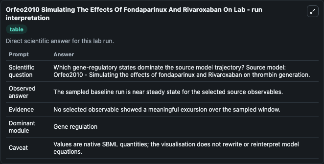
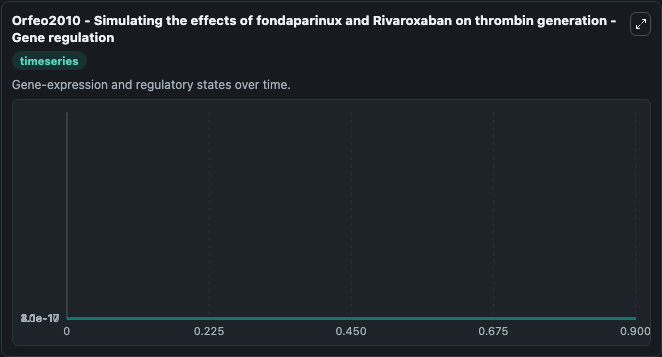
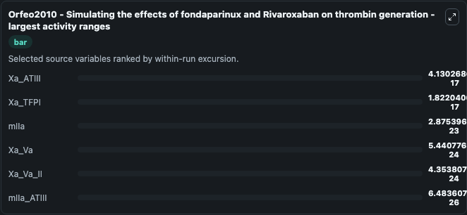
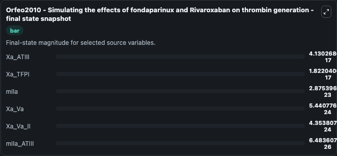
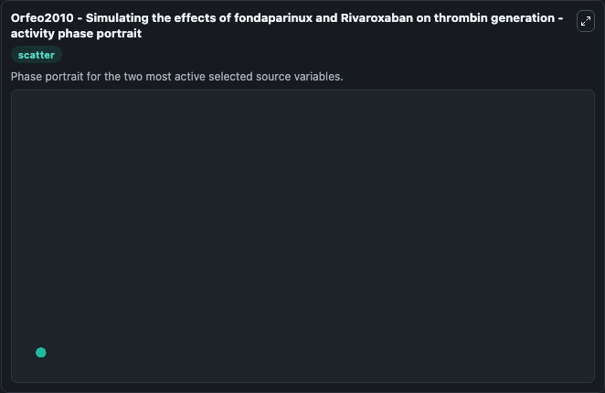

# Orfeo2010 Simulating The Effects Of Fondaparinux And Rivaroxaban On

This Biosimulant lab wraps `Orfeo2010 Simulating The Effects Of Fondaparinux And Rivaroxaban On` as a runnable systems biology model with a companion visualization module.
Reused mathematical model (Hockin et al., 2002) of blood coagulation simulating the effects of coagulation factor inhibitors, fondaparinux (synthetic heparin) and Rivaroxaban. It can be used to explore the configured dynamics and compare scenario outcomes across configurations.

## What You'll See

The lab asks: Which gene-regulatory states dominate the source model trajectory? Source model: Orfeo2010 - Simulating the effects of fondaparinux and Rivaroxaban on thrombin generation. It runs for 1.0 time units with a communication step of 0.1. The run uses the model defaults declared by the curated SBML wrapper. The generated visualizations focus on mIIa_ATIII, mIIa, Xa_Va_II, Xa_Va, Xa_TFPI, and Xa_ATIII, combining trajectory, endpoint-comparison, and summary-table views from one completed dark-mode run.

In this captured run, **Xa_ATIII** moved from 0 to 4.13e-17 across 1.0 simulation windows.


### Output Visualizations



*Summary table for Orfeo2010 Simulating The Effects Of Fondaparinux And Rivaroxaban On, reporting the scientific question, observed answer, dominant module, and caveat.*



*Trajectories of Xa_ATIII, Xa_TFPI, mIIa, Xa_Va, Xa_Va_II, and mIIa_ATIII across the 1.0 simulation. In this run **Xa_ATIII** climbed from 0 to 4.13e-17 — the largest movements among the focused observables.*



*Largest-excursion ranking of the focused observables — the absolute movement magnitude during the run. Top 3: **Xa_ATIII** = 4.13e-17, **Xa_TFPI** = 1.82e-17, **mIIa** = 2.88e-23, with 3 more observables below.*



*Endpoint snapshot of the focused observables — final values from the captured run. Top 3 by value: **Xa_ATIII** = 4.13e-17, **Xa_TFPI** = 1.82e-17, **mIIa** = 2.88e-23, with 3 more observables below.*



*Visualization card from the Orfeo2010 Simulating The Effects Of Fondaparinux And Rivaroxaban On dark-mode run.*


## Model Context

- Core model: `models/core`
- Visualization model: `models/visualisation`
- Standard: `other`
- Upstream source: `biomodels_ebi:MODEL1807240001`
- License: `CC0`

## Inputs

| Input | Maps To | Default | Notes |
|---|---|---|---|
| Initial M I Ia Atiii | `systemsbiology_sbml_orfeo2010_simulating_the_effects_of_fondaparinux_model1807240001_model.initial_m_i_ia_atiii` | | Source state initial condition exposed as a model-specific control because no explicit intervention parameter is identifiable. Maps to SBML symbol `mIIa_ATIII`. |
| Initial M I Ia | `systemsbiology_sbml_orfeo2010_simulating_the_effects_of_fondaparinux_model1807240001_model.initial_m_i_ia` | | Source state initial condition exposed as a model-specific control because no explicit intervention parameter is identifiable. Maps to SBML symbol `mIIa`. |
| Initial Xa Va Ii | `systemsbiology_sbml_orfeo2010_simulating_the_effects_of_fondaparinux_model1807240001_model.initial_xa_va_ii` | | Source state initial condition exposed as a model-specific control because no explicit intervention parameter is identifiable. Maps to SBML symbol `Xa_Va_II`. |
| Initial Xa Va | `systemsbiology_sbml_orfeo2010_simulating_the_effects_of_fondaparinux_model1807240001_model.initial_xa_va` | | Source state initial condition exposed as a model-specific control because no explicit intervention parameter is identifiable. Maps to SBML symbol `Xa_Va`. |
| Initial Xa Tfpi | `systemsbiology_sbml_orfeo2010_simulating_the_effects_of_fondaparinux_model1807240001_model.initial_xa_tfpi` | | Source state initial condition exposed as a model-specific control because no explicit intervention parameter is identifiable. Maps to SBML symbol `Xa_TFPI`. |
| Initial Xa Atiii | `systemsbiology_sbml_orfeo2010_simulating_the_effects_of_fondaparinux_model1807240001_model.initial_xa_atiii` | | Source state initial condition exposed as a model-specific control because no explicit intervention parameter is identifiable. Maps to SBML symbol `Xa_ATIII`. |

## Outputs

| Output | Maps To | Role |
|---|---|---|
| `state` | `systemsbiology_sbml_orfeo2010_simulating_the_effects_of_fondaparinux_model1807240001_model.state` | Available to the visualization model and downstream workflows. |
| `summary` | `systemsbiology_sbml_orfeo2010_simulating_the_effects_of_fondaparinux_model1807240001_model.summary` | Available to the visualization model and downstream workflows. |
| `species_labels` | `systemsbiology_sbml_orfeo2010_simulating_the_effects_of_fondaparinux_model1807240001_model.species_labels` | Available to the visualization model and downstream workflows. |
| `m_i_ia_atiii` | `systemsbiology_sbml_orfeo2010_simulating_the_effects_of_fondaparinux_model1807240001_model.m_i_ia_atiii` | Available to the visualization model and downstream workflows. |
| `m_i_ia` | `systemsbiology_sbml_orfeo2010_simulating_the_effects_of_fondaparinux_model1807240001_model.m_i_ia` | Available to the visualization model and downstream workflows. |
| `xa_va_ii` | `systemsbiology_sbml_orfeo2010_simulating_the_effects_of_fondaparinux_model1807240001_model.xa_va_ii` | Available to the visualization model and downstream workflows. |
| `xa_va` | `systemsbiology_sbml_orfeo2010_simulating_the_effects_of_fondaparinux_model1807240001_model.xa_va` | Available to the visualization model and downstream workflows. |
| `xa_tfpi` | `systemsbiology_sbml_orfeo2010_simulating_the_effects_of_fondaparinux_model1807240001_model.xa_tfpi` | Available to the visualization model and downstream workflows. |
| `xa_atiii` | `systemsbiology_sbml_orfeo2010_simulating_the_effects_of_fondaparinux_model1807240001_model.xa_atiii` | Available to the visualization model and downstream workflows. |

## Runtime

- Duration: `1.0`
- Communication step: `0.1`

## Running Locally

```bash
biosimulant labs serve
```
