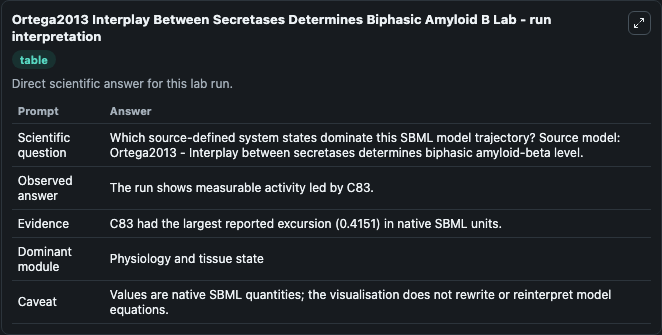
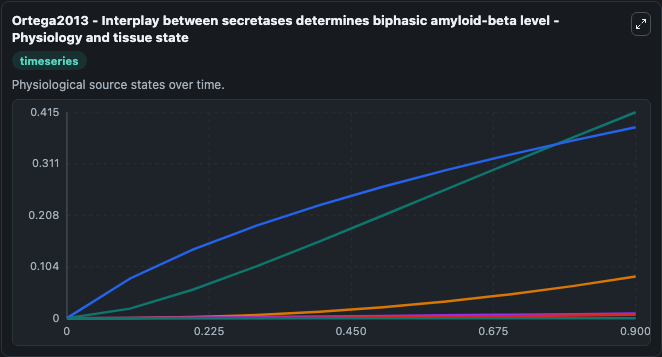
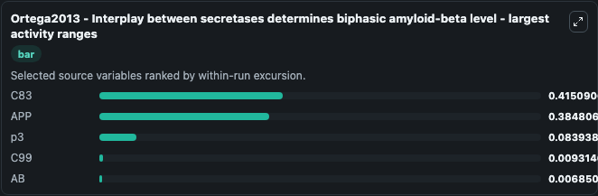
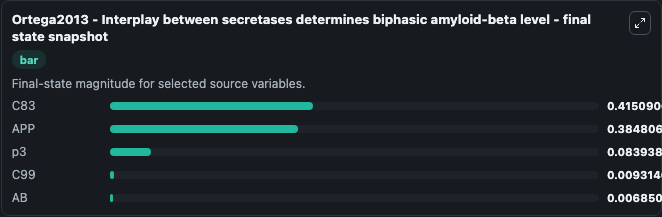
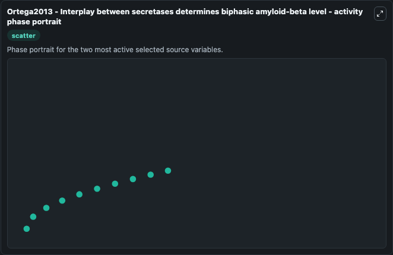

# Ortega2013 Interplay Between Secretases Determines Biphasic Amyloid B

This Biosimulant lab wraps `Ortega2013 Interplay Between Secretases Determines Biphasic Amyloid B` as a runnable systems biology model with a companion visualization module.
Ortega2013 - Interplay between secretasesdetermines biphasic amyloid-beta level This model is described in the article: Interplay between ?-, ?-, and ?-secretases determines biphasic amyloid-? It can be used to explore systems biology ortega2013 interplay between secretases determin dynamics and compare simulation behavior across conditions. It can be used to explore the configured dynamics and compare scenario outcomes across configurations.

## What You'll See

The lab asks: Which source-defined system states dominate this SBML model trajectory? Source model: Ortega2013 - Interplay between secretases determines biphasic amyloid-beta level. It runs for 1.0 time units with a communication step of 0.1. The run uses the model defaults declared by the curated SBML wrapper. The generated visualizations focus on p3, C99, C83, APP, AB, and X, combining trajectory, endpoint-comparison, and summary-table views from one completed dark-mode run.

In this captured run, **C83** moved from 0 to 0.4151 across 1.0 simulation windows.


### Output Visualizations



*Summary table for Ortega2013 Interplay Between Secretases Determines Biphasic Amyloid B, reporting the scientific question, observed answer, dominant module, and caveat.*



*Trajectories of C83, APP, p3, C99, AB, and X across the 1.0 simulation. In this run **C83** climbed from 0 to 0.4151 — the largest movements among the focused observables.*



*Largest-excursion ranking of the focused observables — the absolute movement magnitude during the run. Top 3: **C83** = 0.4151, **APP** = 0.3848, **p3** = 0.0839, with 2 more observables below.*



*Endpoint snapshot of the focused observables — final values from the captured run. Top 3 by value: **C83** = 0.4151, **APP** = 0.3848, **p3** = 0.0839, with 2 more observables below.*



*Visualization card from the Ortega2013 Interplay Between Secretases Determines Biphasic Amyloid B dark-mode run.*


## Model Context

- Core model: `models/core`
- Visualization model: `models/visualisation`
- Standard: `other`
- Upstream source: `biomodels_ebi:BIOMD0000000556`
- License: `CC0`

## Inputs

| Input | Maps To | Default | Notes |
|---|---|---|---|
| Initial Model State P3 | `systemsbiology_sbml_ortega2013_interplay_between_secretases_determin_biomd0000000556_model.initial_model_state_p3` | | Source state initial condition exposed as a model-specific control because no explicit intervention parameter is identifiable. Maps to SBML symbol `p3`. |
| Initial Model State C99 | `systemsbiology_sbml_ortega2013_interplay_between_secretases_determin_biomd0000000556_model.initial_model_state_c99` | | Source state initial condition exposed as a model-specific control because no explicit intervention parameter is identifiable. Maps to SBML symbol `C99`. |
| Initial Model State C83 | `systemsbiology_sbml_ortega2013_interplay_between_secretases_determin_biomd0000000556_model.initial_model_state_c83` | | Source state initial condition exposed as a model-specific control because no explicit intervention parameter is identifiable. Maps to SBML symbol `C83`. |
| Initial Model State App | `systemsbiology_sbml_ortega2013_interplay_between_secretases_determin_biomd0000000556_model.initial_model_state_app` | | Source state initial condition exposed as a model-specific control because no explicit intervention parameter is identifiable. Maps to SBML symbol `APP`. |
| Initial Model State Ab | `systemsbiology_sbml_ortega2013_interplay_between_secretases_determin_biomd0000000556_model.initial_model_state_ab` | | Source state initial condition exposed as a model-specific control because no explicit intervention parameter is identifiable. Maps to SBML symbol `AB`. |
| Initial Model State X | `systemsbiology_sbml_ortega2013_interplay_between_secretases_determin_biomd0000000556_model.initial_model_state_x` | | Source state initial condition exposed as a model-specific control because no explicit intervention parameter is identifiable. Maps to SBML symbol `X`. |

## Outputs

| Output | Maps To | Role |
|---|---|---|
| `state` | `systemsbiology_sbml_ortega2013_interplay_between_secretases_determin_biomd0000000556_model.state` | Available to the visualization model and downstream workflows. |
| `summary` | `systemsbiology_sbml_ortega2013_interplay_between_secretases_determin_biomd0000000556_model.summary` | Available to the visualization model and downstream workflows. |
| `species_labels` | `systemsbiology_sbml_ortega2013_interplay_between_secretases_determin_biomd0000000556_model.species_labels` | Available to the visualization model and downstream workflows. |
| `model_state_p3` | `systemsbiology_sbml_ortega2013_interplay_between_secretases_determin_biomd0000000556_model.model_state_p3` | Available to the visualization model and downstream workflows. |
| `c99` | `systemsbiology_sbml_ortega2013_interplay_between_secretases_determin_biomd0000000556_model.c99` | Available to the visualization model and downstream workflows. |
| `c83` | `systemsbiology_sbml_ortega2013_interplay_between_secretases_determin_biomd0000000556_model.c83` | Available to the visualization model and downstream workflows. |
| `app` | `systemsbiology_sbml_ortega2013_interplay_between_secretases_determin_biomd0000000556_model.app` | Available to the visualization model and downstream workflows. |
| `model_state_ab` | `systemsbiology_sbml_ortega2013_interplay_between_secretases_determin_biomd0000000556_model.model_state_ab` | Available to the visualization model and downstream workflows. |
| `model_state_x` | `systemsbiology_sbml_ortega2013_interplay_between_secretases_determin_biomd0000000556_model.model_state_x` | Available to the visualization model and downstream workflows. |

## Runtime

- Duration: `1.0`
- Communication step: `0.1`

## Running Locally

```bash
biosimulant labs serve
```
