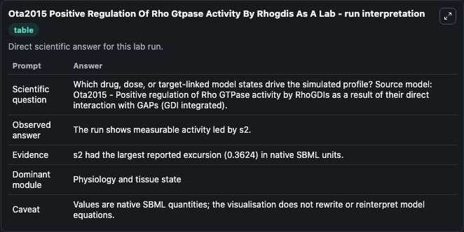
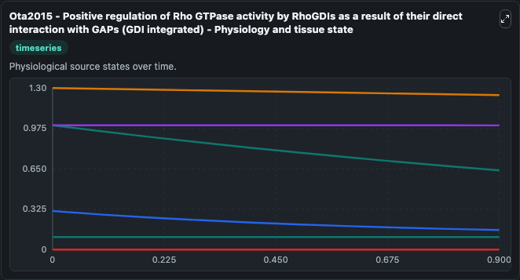
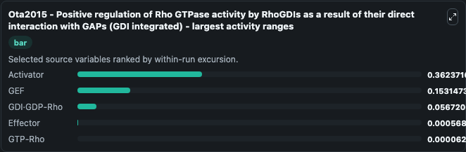
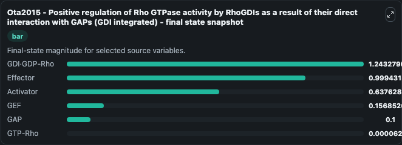
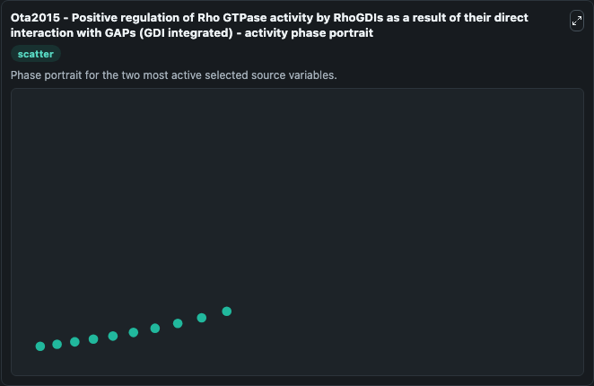

# Ota2015 Positive Regulation Of Rho Gtpase Activity By Rhogdis As A

This Biosimulant lab wraps `Ota2015 Positive Regulation Of Rho Gtpase Activity By Rhogdis As A` as a runnable systems biology model with a companion visualization module.
This is a ordinary differential equation mathematical model describing the Rho GTPase cycle in which Rho GDP-dissociation inhibitors (RhoGDIs) inhibit the regulatory activities of guanine nucleotide e. It can be used to explore the configured dynamics and compare scenario outcomes across configurations.

## What You'll See

The lab asks: Which drug, dose, or target-linked model states drive the simulated profile? Source model: Ota2015 - Positive regulation of Rho GTPase activity by RhoGDIs as a result of their direct interaction with GAPs (GDI integrated). It runs for 1.0 time units with a communication step of 0.1. The run uses the model defaults declared by the curated SBML wrapper. The generated visualizations focus on GDI·GDP-Rho, Effector, Activator, GEF, GAP, and GTP-Rho, combining trajectory, endpoint-comparison, and summary-table views from one completed dark-mode run.

In this captured run, **Activator** moved from 1.000 to 0.6376 across 1.0 simulation windows.


### Output Visualizations



*Summary table for Ota2015 Positive Regulation Of Rho Gtpase Activity By Rhogdis As A, reporting the scientific question, observed answer, dominant module, and caveat.*



*Trajectories of Activator, GEF, GDI·GDP-Rho, Effector, GTP-Rho, and GAP across the 1.0 simulation. In this run **GTP-Rho** climbed from 0 to 6.29e-05 and **Activator** fell from 1.000 to 0.6376 — the largest movements among the focused observables.*



*Largest-excursion ranking of the focused observables — the absolute movement magnitude during the run. Top 3: **Activator** = 0.3624, **GEF** = 0.1531, **GDI·GDP-Rho** = 0.0567, with 2 more observables below.*



*Endpoint snapshot of the focused observables — final values from the captured run. Top 3 by value: **GDI·GDP-Rho** = 1.243, **Effector** = 0.9994, **Activator** = 0.6376, with 3 more observables below.*



*Visualization card from the Ota2015 Positive Regulation Of Rho Gtpase Activity By Rhogdis As A dark-mode run.*


## Model Context

- Core model: `models/core`
- Visualization model: `models/visualisation`
- Standard: `other`
- Upstream source: `biomodels_ebi:BIOMD0000000899`
- License: `CC0`

## Inputs

| Input | Maps To | Default | Notes |
|---|---|---|---|
| Initial Gdigdp Rho | `systemsbiology_sbml_ota2015_positive_regulation_of_rho_gtpase_activi_biomd0000000899_model.initial_gdigdp_rho` | | Source state initial condition exposed as a model-specific control because no explicit intervention parameter is identifiable. Maps to SBML symbol `s10`. |
| Initial Effector | `systemsbiology_sbml_ota2015_positive_regulation_of_rho_gtpase_activi_biomd0000000899_model.initial_effector` | | Source state initial condition exposed as a model-specific control because no explicit intervention parameter is identifiable. Maps to SBML symbol `s9`. |
| Initial Activator | `systemsbiology_sbml_ota2015_positive_regulation_of_rho_gtpase_activi_biomd0000000899_model.initial_activator` | | Source state initial condition exposed as a model-specific control because no explicit intervention parameter is identifiable. Maps to SBML symbol `s1`. |
| Initial Model State Gef | `systemsbiology_sbml_ota2015_positive_regulation_of_rho_gtpase_activi_biomd0000000899_model.initial_model_state_gef` | | Source state initial condition exposed as a model-specific control because no explicit intervention parameter is identifiable. Maps to SBML symbol `s3`. |
| Initial Model State Gap | `systemsbiology_sbml_ota2015_positive_regulation_of_rho_gtpase_activi_biomd0000000899_model.initial_model_state_gap` | | Source state initial condition exposed as a model-specific control because no explicit intervention parameter is identifiable. Maps to SBML symbol `s8`. |
| Initial Gtp Rho | `systemsbiology_sbml_ota2015_positive_regulation_of_rho_gtpase_activi_biomd0000000899_model.initial_gtp_rho` | | Source state initial condition exposed as a model-specific control because no explicit intervention parameter is identifiable. Maps to SBML symbol `s6`. |

## Outputs

| Output | Maps To | Role |
|---|---|---|
| `state` | `systemsbiology_sbml_ota2015_positive_regulation_of_rho_gtpase_activi_biomd0000000899_model.state` | Available to the visualization model and downstream workflows. |
| `summary` | `systemsbiology_sbml_ota2015_positive_regulation_of_rho_gtpase_activi_biomd0000000899_model.summary` | Available to the visualization model and downstream workflows. |
| `species_labels` | `systemsbiology_sbml_ota2015_positive_regulation_of_rho_gtpase_activi_biomd0000000899_model.species_labels` | Available to the visualization model and downstream workflows. |
| `gdigdp_rho` | `systemsbiology_sbml_ota2015_positive_regulation_of_rho_gtpase_activi_biomd0000000899_model.gdigdp_rho` | Available to the visualization model and downstream workflows. |
| `effector` | `systemsbiology_sbml_ota2015_positive_regulation_of_rho_gtpase_activi_biomd0000000899_model.effector` | Available to the visualization model and downstream workflows. |
| `activator` | `systemsbiology_sbml_ota2015_positive_regulation_of_rho_gtpase_activi_biomd0000000899_model.activator` | Available to the visualization model and downstream workflows. |
| `gef` | `systemsbiology_sbml_ota2015_positive_regulation_of_rho_gtpase_activi_biomd0000000899_model.gef` | Available to the visualization model and downstream workflows. |
| `gap` | `systemsbiology_sbml_ota2015_positive_regulation_of_rho_gtpase_activi_biomd0000000899_model.gap` | Available to the visualization model and downstream workflows. |
| `gtp_rho` | `systemsbiology_sbml_ota2015_positive_regulation_of_rho_gtpase_activi_biomd0000000899_model.gtp_rho` | Available to the visualization model and downstream workflows. |

## Runtime

- Duration: `1.0`
- Communication step: `0.1`

## Running Locally

```bash
biosimulant labs serve
```
