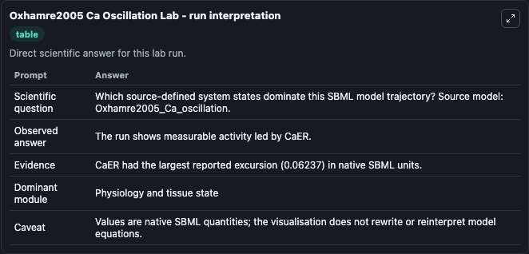
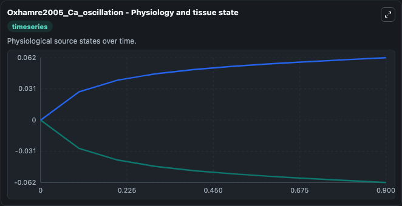
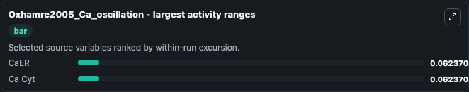
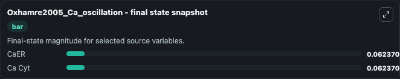
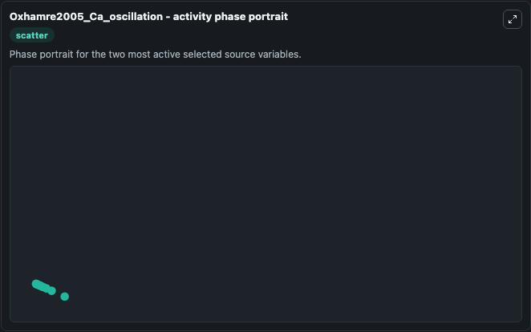

# Oxhamre2005 Ca Oscillation

This Biosimulant lab wraps `Oxhamre2005 Ca Oscillation` as a runnable systems biology model with a companion visualization module.
The model should reproduce the figure 1C of the article (successfully reproduced in MathSBML). It can be used to explore the configured dynamics and compare scenario outcomes across configurations.

## What You'll See

The lab asks: Which source-defined system states dominate this SBML model trajectory? Source model: Oxhamre2005_Ca_oscillation. It runs for 1.0 time units with a communication step of 0.1. The run uses the model defaults declared by the curated SBML wrapper. The generated visualizations focus on CaER, and Ca Cyt, combining trajectory, endpoint-comparison, and summary-table views from one completed dark-mode run.

In this captured run, **CaER** moved from 0 to -0.0624 across 1.0 simulation windows.


### Output Visualizations



*Summary table for Oxhamre2005 Ca Oscillation, reporting the scientific question, observed answer, dominant module, and caveat.*



*Trajectories of CaER, and Ca Cyt across the 1.0 simulation. In this run **Ca Cyt** climbed from 0 to 0.0624 and **CaER** fell from 0 to -0.0624 — the largest movements among the focused observables.*



*Largest-excursion ranking of the focused observables — the absolute movement magnitude during the run. Top 2: **CaER** = 0.0624, **Ca Cyt** = 0.0624.*



*Endpoint snapshot of the focused observables — final values from the captured run. Top 2 by value: **CaER** = 0.0624, **Ca Cyt** = 0.0624.*



*Visualization card from the Oxhamre2005 Ca Oscillation dark-mode run.*


## Model Context

- Core model: `models/core`
- Visualization model: `models/visualisation`
- Standard: `other`
- Upstream source: `biomodels_ebi:BIOMD0000000047`
- License: `CC0`

## Inputs

| Input | Maps To | Default | Notes |
|---|---|---|---|
| Initial Ca Er | `systemsbiology_sbml_oxhamre2005_ca_oscillation_biomd0000000047_model.initial_ca_er` | | Source state initial condition exposed as a model-specific control because no explicit intervention parameter is identifiable. Maps to SBML symbol `CaER`. |
| Initial Ca Cyt | `systemsbiology_sbml_oxhamre2005_ca_oscillation_biomd0000000047_model.initial_ca_cyt` | | Source state initial condition exposed as a model-specific control because no explicit intervention parameter is identifiable. Maps to SBML symbol `Ca_Cyt`. |

## Outputs

| Output | Maps To | Role |
|---|---|---|
| `state` | `systemsbiology_sbml_oxhamre2005_ca_oscillation_biomd0000000047_model.state` | Available to the visualization model and downstream workflows. |
| `summary` | `systemsbiology_sbml_oxhamre2005_ca_oscillation_biomd0000000047_model.summary` | Available to the visualization model and downstream workflows. |
| `species_labels` | `systemsbiology_sbml_oxhamre2005_ca_oscillation_biomd0000000047_model.species_labels` | Available to the visualization model and downstream workflows. |
| `ca_er` | `systemsbiology_sbml_oxhamre2005_ca_oscillation_biomd0000000047_model.ca_er` | Available to the visualization model and downstream workflows. |
| `ca_cyt` | `systemsbiology_sbml_oxhamre2005_ca_oscillation_biomd0000000047_model.ca_cyt` | Available to the visualization model and downstream workflows. |

## Runtime

- Duration: `1.0`
- Communication step: `0.1`

## Running Locally

```bash
biosimulant labs serve
```
