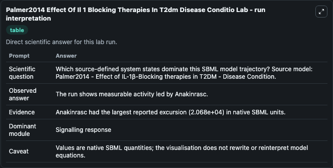
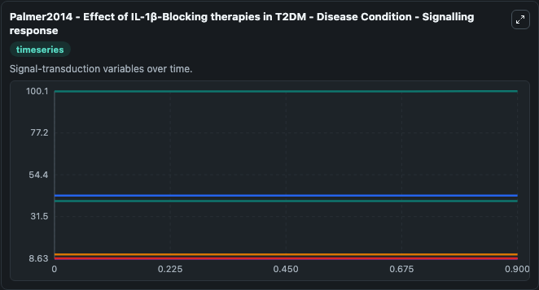
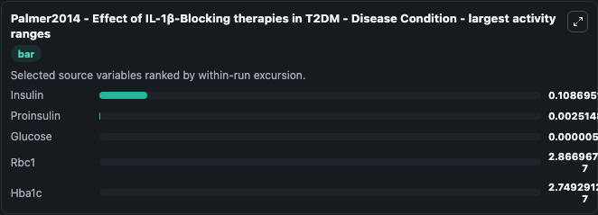
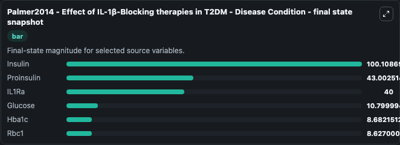
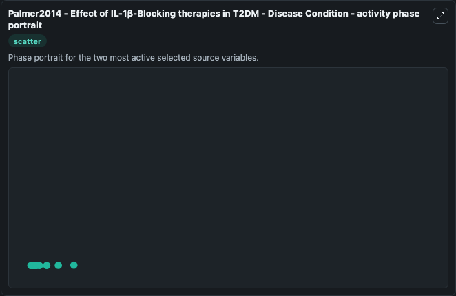

# Palmer2014 Effect Of Il 1 Blocking Therapies In T2dm Disease Conditio

This Biosimulant lab wraps `Palmer2014 Effect Of Il 1 Blocking Therapies In T2dm Disease Conditio` as a runnable systems biology model with a companion visualization module.
Palmer2014 - Effect of IL-1β-Blocking therapies in T2DM - Disease Condition This is the model with disease state initial conditions. It can be used to explore the configured dynamics and compare scenario outcomes across configurations.

## What You'll See

The lab asks: Which source-defined system states dominate this SBML model trajectory? Source model: Palmer2014 - Effect of IL-1β-Blocking therapies in T2DM - Disease Condition. It runs for 1.0 time units with a communication step of 0.1. The run uses the model defaults declared by the curated SBML wrapper. The generated visualizations focus on Insulin, Proinsulin, Glucose, IL1Ra, Hba1c, and Rbc1, combining trajectory, endpoint-comparison, and summary-table views from one completed dark-mode run.

In this captured run, **Insulin** moved from 100.0 to 100.1 across 1.0 simulation windows.


### Output Visualizations



*Summary table for Palmer2014 Effect Of Il 1 Blocking Therapies In T2dm Disease Conditio, reporting the scientific question, observed answer, dominant module, and caveat.*



*Trajectories of Insulin, Proinsulin, Glucose, Rbc1, Hba1c, and IL1Ra across the 1.0 simulation. In this run **Insulin** climbed from 100.0 to 100.1 and **Glucose** fell from 10.800 to 10.800 — the largest movements among the focused observables.*



*Largest-excursion ranking of the focused observables — the absolute movement magnitude during the run. Top 3: **Insulin** = 0.1087, **Proinsulin** = 0.00251, **Glucose** = 5.51e-06, with 2 more observables below.*



*Endpoint snapshot of the focused observables — final values from the captured run. Top 3 by value: **Insulin** = 100.1, **Proinsulin** = 43.003, **IL1Ra** = 40.000, with 3 more observables below.*



*Visualization card from the Palmer2014 Effect Of Il 1 Blocking Therapies In T2dm Disease Conditio dark-mode run.*


## Model Context

- Core model: `models/core`
- Visualization model: `models/visualisation`
- Standard: `other`
- Upstream source: `biomodels_ebi:BIOMD0000000620`
- License: `CC0`

## Inputs

| Input | Maps To | Default | Notes |
|---|---|---|---|
| Kglucose | `systemsbiology_sbml_palmer2014_effect_of_il_1_blocking_therapies_in_biomd0000000620_model.kglucose` | | Source parameter exposed because its SBML label indicates a boundary, stimulus, dose, ligand, protocol, substrate, or environmental control. Maps to SBML symbol `Kglucose`. |

## Outputs

| Output | Maps To | Role |
|---|---|---|
| `state` | `systemsbiology_sbml_palmer2014_effect_of_il_1_blocking_therapies_in_biomd0000000620_model.state` | Available to the visualization model and downstream workflows. |
| `summary` | `systemsbiology_sbml_palmer2014_effect_of_il_1_blocking_therapies_in_biomd0000000620_model.summary` | Available to the visualization model and downstream workflows. |
| `species_labels` | `systemsbiology_sbml_palmer2014_effect_of_il_1_blocking_therapies_in_biomd0000000620_model.species_labels` | Available to the visualization model and downstream workflows. |
| `insulin` | `systemsbiology_sbml_palmer2014_effect_of_il_1_blocking_therapies_in_biomd0000000620_model.insulin` | Available to the visualization model and downstream workflows. |
| `proinsulin` | `systemsbiology_sbml_palmer2014_effect_of_il_1_blocking_therapies_in_biomd0000000620_model.proinsulin` | Available to the visualization model and downstream workflows. |
| `glucose` | `systemsbiology_sbml_palmer2014_effect_of_il_1_blocking_therapies_in_biomd0000000620_model.glucose` | Available to the visualization model and downstream workflows. |
| `il1_ra` | `systemsbiology_sbml_palmer2014_effect_of_il_1_blocking_therapies_in_biomd0000000620_model.il1_ra` | Available to the visualization model and downstream workflows. |
| `hba1c` | `systemsbiology_sbml_palmer2014_effect_of_il_1_blocking_therapies_in_biomd0000000620_model.hba1c` | Available to the visualization model and downstream workflows. |
| `rbc1` | `systemsbiology_sbml_palmer2014_effect_of_il_1_blocking_therapies_in_biomd0000000620_model.rbc1` | Available to the visualization model and downstream workflows. |

## Runtime

- Duration: `1.0`
- Communication step: `0.1`

## Running Locally

```bash
biosimulant labs serve
```
