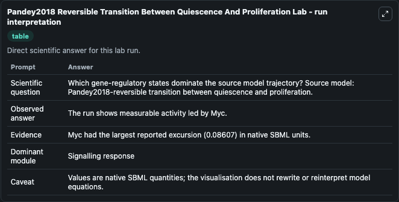
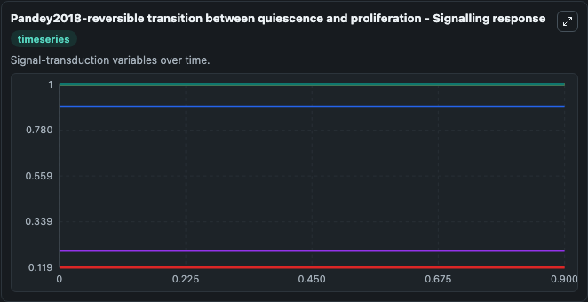
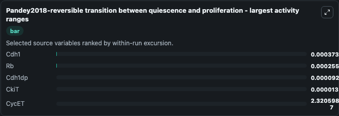
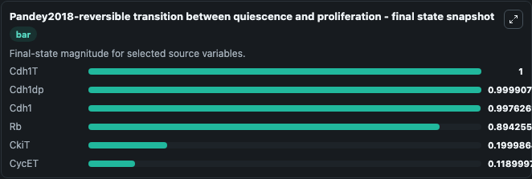
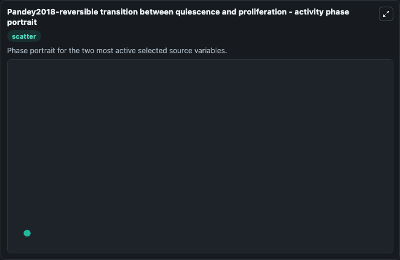

# Pandey2018 Reversible Transition Between Quiescence And Proliferation

This Biosimulant lab wraps `Pandey2018 Reversible Transition Between Quiescence And Proliferation` as a runnable systems biology model with a companion visualization module.
Cells switch between quiescence and proliferation states for maintaining tissue homeostasis and regeneration. It can be used to explore the configured dynamics and compare scenario outcomes across configurations.

## What You'll See

The lab asks: Which gene-regulatory states dominate the source model trajectory? Source model: Pandey2018-reversible transition between quiescence and proliferation. It runs for 1.0 time units with a communication step of 0.1. The run uses the model defaults declared by the curated SBML wrapper. The generated visualizations focus on Cdh1dp, Cdh1T, Cdh1, Rb, CkiT, and CycET, combining trajectory, endpoint-comparison, and summary-table views from one completed dark-mode run.

In this captured run, **Cdh1** moved from 0.9980 to 0.9976 across 1.0 simulation windows.


### Output Visualizations



*Summary table for Pandey2018 Reversible Transition Between Quiescence And Proliferation, reporting the scientific question, observed answer, dominant module, and caveat.*



*Trajectories of Cdh1, Rb, Cdh1dp, CkiT, CycET, and Cdh1T across the 1.0 simulation. In this run **Rb** climbed from 0.8940 to 0.8943 and **Cdh1** fell from 0.9980 to 0.9976 — the largest movements among the focused observables.*



*Largest-excursion ranking of the focused observables — the absolute movement magnitude during the run. Top 3: **Cdh1** = 0.000374, **Rb** = 0.000255, **Cdh1dp** = 9.28e-05, with 2 more observables below.*



*Endpoint snapshot of the focused observables — final values from the captured run. Top 3 by value: **Cdh1T** = 1.000, **Cdh1dp** = 0.9999, **Cdh1** = 0.9976, with 3 more observables below.*



*Visualization card from the Pandey2018 Reversible Transition Between Quiescence And Proliferation dark-mode run.*


## Model Context

- Core model: `models/core`
- Visualization model: `models/visualisation`
- Standard: `other`
- Upstream source: `biomodels_ebi:BIOMD0000000954`
- License: `CC0`

## Inputs

| Input | Maps To | Default | Notes |
|---|---|---|---|
| Initial Cdh1dp | `systemsbiology_sbml_pandey2018_reversible_transition_between_quiesce_biomd0000000954_model.initial_cdh1dp` | | Source state initial condition exposed as a model-specific control because no explicit intervention parameter is identifiable. Maps to SBML symbol `Cdh1dp`. |
| Initial Cdh1 T | `systemsbiology_sbml_pandey2018_reversible_transition_between_quiesce_biomd0000000954_model.initial_cdh1_t` | | Source state initial condition exposed as a model-specific control because no explicit intervention parameter is identifiable. Maps to SBML symbol `Cdh1T`. |
| Initial Cdh1 | `systemsbiology_sbml_pandey2018_reversible_transition_between_quiesce_biomd0000000954_model.initial_cdh1` | | Source state initial condition exposed as a model-specific control because no explicit intervention parameter is identifiable. Maps to SBML symbol `Cdh1`. |
| Initial Model State Rb | `systemsbiology_sbml_pandey2018_reversible_transition_between_quiesce_biomd0000000954_model.initial_model_state_rb` | | Source state initial condition exposed as a model-specific control because no explicit intervention parameter is identifiable. Maps to SBML symbol `Rb`. |
| Initial Cki T | `systemsbiology_sbml_pandey2018_reversible_transition_between_quiesce_biomd0000000954_model.initial_cki_t` | | Source state initial condition exposed as a model-specific control because no explicit intervention parameter is identifiable. Maps to SBML symbol `CkiT`. |
| Initial Cyc Et | `systemsbiology_sbml_pandey2018_reversible_transition_between_quiesce_biomd0000000954_model.initial_cyc_et` | | Source state initial condition exposed as a model-specific control because no explicit intervention parameter is identifiable. Maps to SBML symbol `CycET`. |

## Outputs

| Output | Maps To | Role |
|---|---|---|
| `state` | `systemsbiology_sbml_pandey2018_reversible_transition_between_quiesce_biomd0000000954_model.state` | Available to the visualization model and downstream workflows. |
| `summary` | `systemsbiology_sbml_pandey2018_reversible_transition_between_quiesce_biomd0000000954_model.summary` | Available to the visualization model and downstream workflows. |
| `species_labels` | `systemsbiology_sbml_pandey2018_reversible_transition_between_quiesce_biomd0000000954_model.species_labels` | Available to the visualization model and downstream workflows. |
| `cdh1dp` | `systemsbiology_sbml_pandey2018_reversible_transition_between_quiesce_biomd0000000954_model.cdh1dp` | Available to the visualization model and downstream workflows. |
| `cdh1_t` | `systemsbiology_sbml_pandey2018_reversible_transition_between_quiesce_biomd0000000954_model.cdh1_t` | Available to the visualization model and downstream workflows. |
| `cdh1` | `systemsbiology_sbml_pandey2018_reversible_transition_between_quiesce_biomd0000000954_model.cdh1` | Available to the visualization model and downstream workflows. |
| `model_state_rb` | `systemsbiology_sbml_pandey2018_reversible_transition_between_quiesce_biomd0000000954_model.model_state_rb` | Available to the visualization model and downstream workflows. |
| `cki_t` | `systemsbiology_sbml_pandey2018_reversible_transition_between_quiesce_biomd0000000954_model.cki_t` | Available to the visualization model and downstream workflows. |
| `cyc_et` | `systemsbiology_sbml_pandey2018_reversible_transition_between_quiesce_biomd0000000954_model.cyc_et` | Available to the visualization model and downstream workflows. |

## Runtime

- Duration: `1.0`
- Communication step: `0.1`

## Running Locally

```bash
biosimulant labs serve
```
