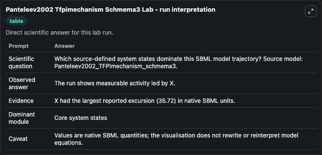
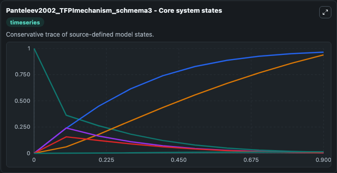
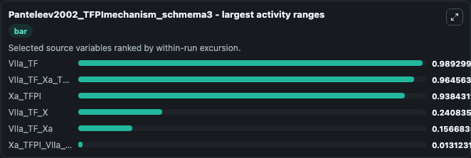
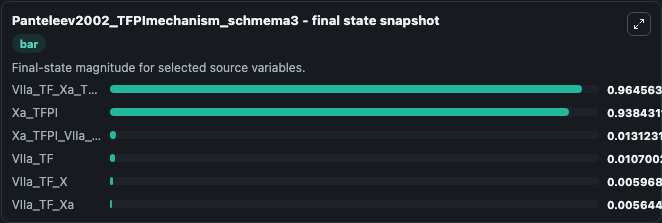
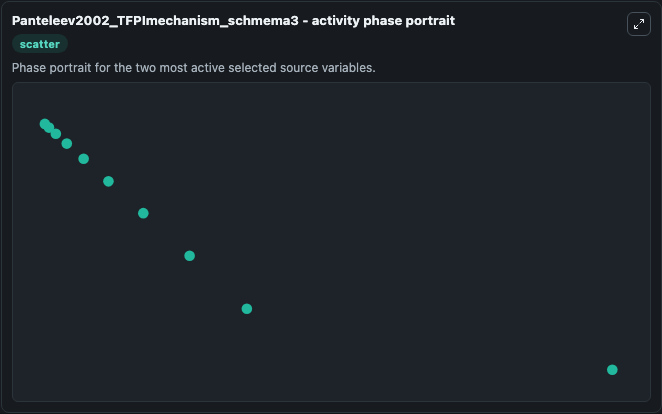

# Panteleev2002 Tfpimechanism Schmema3

This Biosimulant lab wraps `Panteleev2002 Tfpimechanism Schmema3` as a runnable systems biology model with a companion visualization module.
This model originates from BioModels Database: A Database of Annotated Published Models (http://www.ebi.ac.uk/biomodels/). It can be used to explore the configured dynamics and compare scenario outcomes across configurations.

## What You'll See

The lab asks: Which source-defined system states dominate this SBML model trajectory? Source model: Panteleev2002_TFPImechanism_schmema3. It runs for 1.0 time units with a communication step of 0.1. The run uses the model defaults declared by the curated SBML wrapper. The generated visualizations focus on VIIa_TF, Xa_TFPI_VIIa_TF, Xa_TFPI, VIIa_TF_Xa_TFPI, VIIa_TF_Xa, and VIIa_TF_X, combining trajectory, endpoint-comparison, and summary-table views from one completed dark-mode run.

In this captured run, **VIIa_TF** moved from 1.000 to 0.0107 across 1.0 simulation windows.


### Output Visualizations



*Summary table for Panteleev2002 Tfpimechanism Schmema3, reporting the scientific question, observed answer, dominant module, and caveat.*



*Trajectories of VIIa_TF, VIIa_TF_Xa_TFPI, Xa_TFPI, VIIa_TF_X, VIIa_TF_Xa, and Xa_TFPI_VIIa_TF across the 1.0 simulation. In this run **VIIa_TF_Xa_TFPI** climbed from 0 to 0.9646 and **VIIa_TF** fell from 1.000 to 0.0107 — the largest movements among the focused observables.*



*Largest-excursion ranking of the focused observables — the absolute movement magnitude during the run. Top 3: **VIIa_TF** = 0.9893, **VIIa_TF_Xa_TFPI** = 0.9646, **Xa_TFPI** = 0.9384, with 3 more observables below.*



*Endpoint snapshot of the focused observables — final values from the captured run. Top 3 by value: **VIIa_TF_Xa_TFPI** = 0.9646, **Xa_TFPI** = 0.9384, **Xa_TFPI_VIIa_TF** = 0.0131, with 3 more observables below.*



*Visualization card from the Panteleev2002 Tfpimechanism Schmema3 dark-mode run.*


## Model Context

- Core model: `models/core`
- Visualization model: `models/visualisation`
- Standard: `other`
- Upstream source: `biomodels_ebi:BIOMD0000000359`
- License: `CC0`

## Inputs

| Input | Maps To | Default | Notes |
|---|---|---|---|
| Initial Vi Ia Tf | `systemsbiology_sbml_panteleev2002_tfpimechanism_schmema3_biomd0000000359_model.initial_vi_ia_tf` | | Source state initial condition exposed as a model-specific control because no explicit intervention parameter is identifiable. Maps to SBML symbol `VIIa_TF`. |
| Initial Xa Tfpi Vi Ia Tf | `systemsbiology_sbml_panteleev2002_tfpimechanism_schmema3_biomd0000000359_model.initial_xa_tfpi_vi_ia_tf` | | Source state initial condition exposed as a model-specific control because no explicit intervention parameter is identifiable. Maps to SBML symbol `Xa_TFPI_VIIa_TF`. |
| Initial Xa Tfpi | `systemsbiology_sbml_panteleev2002_tfpimechanism_schmema3_biomd0000000359_model.initial_xa_tfpi` | | Source state initial condition exposed as a model-specific control because no explicit intervention parameter is identifiable. Maps to SBML symbol `Xa_TFPI`. |
| Initial Vi Ia Tf Xa Tfpi | `systemsbiology_sbml_panteleev2002_tfpimechanism_schmema3_biomd0000000359_model.initial_vi_ia_tf_xa_tfpi` | | Source state initial condition exposed as a model-specific control because no explicit intervention parameter is identifiable. Maps to SBML symbol `VIIa_TF_Xa_TFPI`. |
| Initial Vi Ia Tf Xa | `systemsbiology_sbml_panteleev2002_tfpimechanism_schmema3_biomd0000000359_model.initial_vi_ia_tf_xa` | | Source state initial condition exposed as a model-specific control because no explicit intervention parameter is identifiable. Maps to SBML symbol `VIIa_TF_Xa`. |
| Initial Vi Ia Tf X | `systemsbiology_sbml_panteleev2002_tfpimechanism_schmema3_biomd0000000359_model.initial_vi_ia_tf_x` | | Source state initial condition exposed as a model-specific control because no explicit intervention parameter is identifiable. Maps to SBML symbol `VIIa_TF_X`. |

## Outputs

| Output | Maps To | Role |
|---|---|---|
| `state` | `systemsbiology_sbml_panteleev2002_tfpimechanism_schmema3_biomd0000000359_model.state` | Available to the visualization model and downstream workflows. |
| `summary` | `systemsbiology_sbml_panteleev2002_tfpimechanism_schmema3_biomd0000000359_model.summary` | Available to the visualization model and downstream workflows. |
| `species_labels` | `systemsbiology_sbml_panteleev2002_tfpimechanism_schmema3_biomd0000000359_model.species_labels` | Available to the visualization model and downstream workflows. |
| `vi_ia_tf` | `systemsbiology_sbml_panteleev2002_tfpimechanism_schmema3_biomd0000000359_model.vi_ia_tf` | Available to the visualization model and downstream workflows. |
| `xa_tfpi_vi_ia_tf` | `systemsbiology_sbml_panteleev2002_tfpimechanism_schmema3_biomd0000000359_model.xa_tfpi_vi_ia_tf` | Available to the visualization model and downstream workflows. |
| `xa_tfpi` | `systemsbiology_sbml_panteleev2002_tfpimechanism_schmema3_biomd0000000359_model.xa_tfpi` | Available to the visualization model and downstream workflows. |
| `vi_ia_tf_xa_tfpi` | `systemsbiology_sbml_panteleev2002_tfpimechanism_schmema3_biomd0000000359_model.vi_ia_tf_xa_tfpi` | Available to the visualization model and downstream workflows. |
| `vi_ia_tf_xa` | `systemsbiology_sbml_panteleev2002_tfpimechanism_schmema3_biomd0000000359_model.vi_ia_tf_xa` | Available to the visualization model and downstream workflows. |
| `vi_ia_tf_x` | `systemsbiology_sbml_panteleev2002_tfpimechanism_schmema3_biomd0000000359_model.vi_ia_tf_x` | Available to the visualization model and downstream workflows. |

## Runtime

- Duration: `1.0`
- Communication step: `0.1`

## Running Locally

```bash
biosimulant labs serve
```
