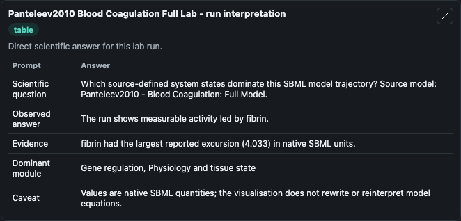
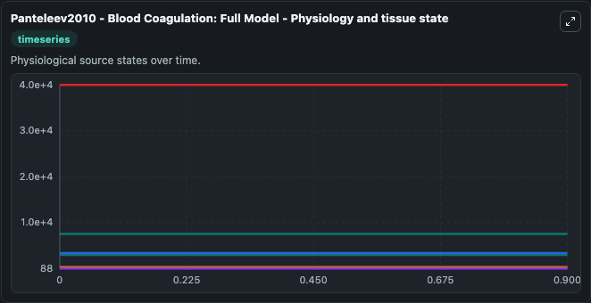
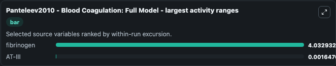
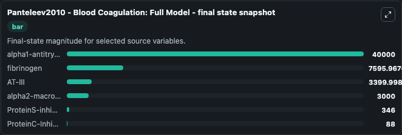
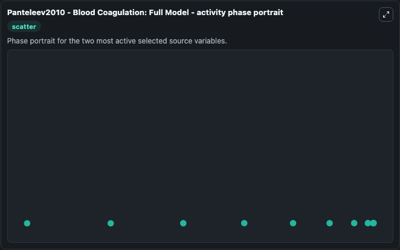

# Panteleev2010 Blood Coagulation Full

This Biosimulant lab wraps `Panteleev2010 Blood Coagulation Full` as a runnable systems biology model with a companion visualization module.
Full and reduced mathematical model of blood coagulation focusing on fibrin formation and the response to varied TF and V. It can be used to explore the configured dynamics and compare scenario outcomes across configurations.

## What You'll See

The lab asks: Which source-defined system states dominate this SBML model trajectory? Source model: Panteleev2010 - Blood Coagulation: Full Model. It runs for 1.0 time units with a communication step of 0.1. The run uses the model defaults declared by the curated SBML wrapper. The generated visualizations focus on ProteinS-inhibitor, ProteinC-Inhibitor, alpha1-antitrypsin, fibrinogen, AT-III, and alpha2-macroglobulin, combining trajectory, endpoint-comparison, and summary-table views from one completed dark-mode run.

In this captured run, **fibrinogen** moved from 7600.0 to 7596.0 across 1.0 simulation windows.


### Output Visualizations



*Summary table for Panteleev2010 Blood Coagulation Full, reporting the scientific question, observed answer, dominant module, and caveat.*



*Trajectories of fibrinogen, AT-III, ProteinS-inhibitor, ProteinC-Inhibitor, alpha1-antitrypsin, and alpha2-macroglobulin across the 1.0 simulation. In this run **fibrinogen** fell from 7600.0 to 7596.0 — the largest movements among the focused observables.*



*Largest-excursion ranking of the focused observables — the absolute movement magnitude during the run. Top 2: **fibrinogen** = 4.033, **AT-III** = 0.00165.*



*Endpoint snapshot of the focused observables — final values from the captured run. Top 3 by value: **alpha1-antitrypsin** = 4e+04, **fibrinogen** = 7596.0, **AT-III** = 3400.0, with 3 more observables below.*



*Visualization card from the Panteleev2010 Blood Coagulation Full dark-mode run.*


## Model Context

- Core model: `models/core`
- Visualization model: `models/visualisation`
- Standard: `other`
- Upstream source: `biomodels_ebi:BIOMD0000000740`
- License: `CC0`

## Inputs

| Input | Maps To | Default | Notes |
|---|---|---|---|
| Initial Protein S Inhibitor | `systemsbiology_sbml_panteleev2010_blood_coagulation_full_model_biomd0000000740_model.initial_protein_s_inhibitor` | | Source state initial condition exposed as a model-specific control because no explicit intervention parameter is identifiable. Maps to SBML symbol `ProteinS_inhibitor`. |
| Initial Protein C Inhibitor | `systemsbiology_sbml_panteleev2010_blood_coagulation_full_model_biomd0000000740_model.initial_protein_c_inhibitor` | | Source state initial condition exposed as a model-specific control because no explicit intervention parameter is identifiable. Maps to SBML symbol `ProteinC_Inhibitor`. |
| Initial Alpha1 Antitrypsin | `systemsbiology_sbml_panteleev2010_blood_coagulation_full_model_biomd0000000740_model.initial_alpha1_antitrypsin` | | Source state initial condition exposed as a model-specific control because no explicit intervention parameter is identifiable. Maps to SBML symbol `alpha1_antitrypsin`. |
| Initial Fibrinogen | `systemsbiology_sbml_panteleev2010_blood_coagulation_full_model_biomd0000000740_model.initial_fibrinogen` | | Source state initial condition exposed as a model-specific control because no explicit intervention parameter is identifiable. Maps to SBML symbol `fibrinogen`. |
| Initial At Iii | `systemsbiology_sbml_panteleev2010_blood_coagulation_full_model_biomd0000000740_model.initial_at_iii` | | Source state initial condition exposed as a model-specific control because no explicit intervention parameter is identifiable. Maps to SBML symbol `AT_III`. |
| Initial Alpha2 Macroglobulin | `systemsbiology_sbml_panteleev2010_blood_coagulation_full_model_biomd0000000740_model.initial_alpha2_macroglobulin` | | Source state initial condition exposed as a model-specific control because no explicit intervention parameter is identifiable. Maps to SBML symbol `alpha2_macroglobulin`. |

## Outputs

| Output | Maps To | Role |
|---|---|---|
| `state` | `systemsbiology_sbml_panteleev2010_blood_coagulation_full_model_biomd0000000740_model.state` | Available to the visualization model and downstream workflows. |
| `summary` | `systemsbiology_sbml_panteleev2010_blood_coagulation_full_model_biomd0000000740_model.summary` | Available to the visualization model and downstream workflows. |
| `species_labels` | `systemsbiology_sbml_panteleev2010_blood_coagulation_full_model_biomd0000000740_model.species_labels` | Available to the visualization model and downstream workflows. |
| `protein_s_inhibitor` | `systemsbiology_sbml_panteleev2010_blood_coagulation_full_model_biomd0000000740_model.protein_s_inhibitor` | Available to the visualization model and downstream workflows. |
| `protein_c_inhibitor` | `systemsbiology_sbml_panteleev2010_blood_coagulation_full_model_biomd0000000740_model.protein_c_inhibitor` | Available to the visualization model and downstream workflows. |
| `alpha1_antitrypsin` | `systemsbiology_sbml_panteleev2010_blood_coagulation_full_model_biomd0000000740_model.alpha1_antitrypsin` | Available to the visualization model and downstream workflows. |
| `fibrinogen` | `systemsbiology_sbml_panteleev2010_blood_coagulation_full_model_biomd0000000740_model.fibrinogen` | Available to the visualization model and downstream workflows. |
| `at_iii` | `systemsbiology_sbml_panteleev2010_blood_coagulation_full_model_biomd0000000740_model.at_iii` | Available to the visualization model and downstream workflows. |
| `alpha2_macroglobulin` | `systemsbiology_sbml_panteleev2010_blood_coagulation_full_model_biomd0000000740_model.alpha2_macroglobulin` | Available to the visualization model and downstream workflows. |

## Runtime

- Duration: `1.0`
- Communication step: `0.1`

## Running Locally

```bash
biosimulant labs serve
```
