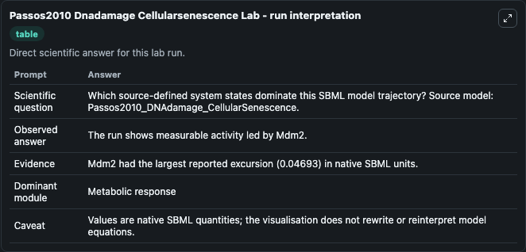
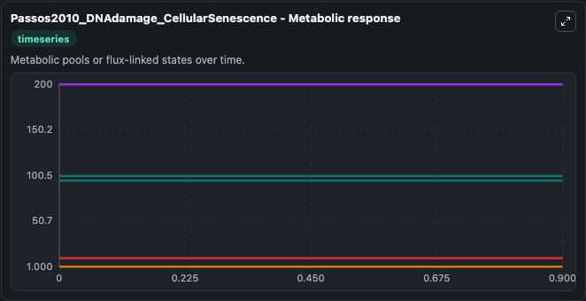
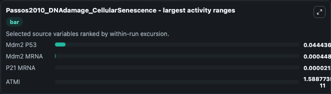
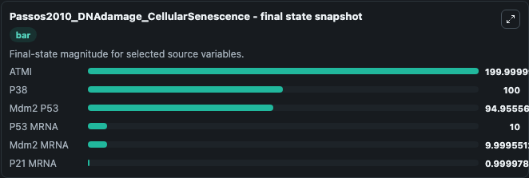
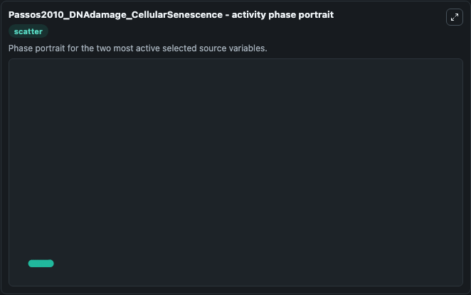

# Passos2010 Dnadamage Cellularsenescence

This Biosimulant lab wraps `Passos2010 Dnadamage Cellularsenescence` as a runnable systems biology model with a companion visualization module.
This is the model described in: Feedback between p21 and reactive oxygen production is necessary for cell senescence. It can be used to explore the configured dynamics and compare scenario outcomes across configurations.

## What You'll See

The lab asks: Which source-defined system states dominate this SBML model trajectory? Source model: Passos2010_DNAdamage_CellularSenescence. It runs for 1.0 time units with a communication step of 0.1. The run uses the model defaults declared by the curated SBML wrapper. The generated visualizations focus on P53 MRNA, Mdm2 MRNA, P21 MRNA, ATMI, P38, and Mdm2 P53, combining trajectory, endpoint-comparison, and summary-table views from one completed dark-mode run.

In this captured run, **Mdm2 P53** moved from 95.000 to 94.956 across 1.0 simulation windows.


### Output Visualizations



*Summary table for Passos2010 Dnadamage Cellularsenescence, reporting the scientific question, observed answer, dominant module, and caveat.*



*Trajectories of Mdm2 P53, Mdm2 MRNA, P21 MRNA, ATMI, P53 MRNA, and P38 across the 1.0 simulation. In this run **Mdm2 P53** fell from 95.000 to 94.956 — the largest movements among the focused observables.*



*Largest-excursion ranking of the focused observables — the absolute movement magnitude during the run. Top 3: **Mdm2 P53** = 0.0444, **Mdm2 MRNA** = 0.000449, **P21 MRNA** = 2.13e-05, with 1 more observable below.*



*Endpoint snapshot of the focused observables — final values from the captured run. Top 3 by value: **ATMI** = 200.0, **P38** = 100.0, **Mdm2 P53** = 94.956, with 3 more observables below.*



*Visualization card from the Passos2010 Dnadamage Cellularsenescence dark-mode run.*


## Model Context

- Core model: `models/core`
- Visualization model: `models/visualisation`
- Standard: `other`
- Upstream source: `biomodels_ebi:BIOMD0000000287`
- License: `CC0`

## Inputs

| Input | Maps To | Default | Notes |
|---|---|---|---|
| Initial P53 MRNA | `systemsbiology_sbml_passos2010_dnadamage_cellularsenescence_biomd0000000287_model.initial_p53_mrna` | | Source state initial condition exposed as a model-specific control because no explicit intervention parameter is identifiable. Maps to SBML symbol `p53_mRNA`. |
| Initial Mdm2 MRNA | `systemsbiology_sbml_passos2010_dnadamage_cellularsenescence_biomd0000000287_model.initial_mdm2_mrna` | | Source state initial condition exposed as a model-specific control because no explicit intervention parameter is identifiable. Maps to SBML symbol `Mdm2_mRNA`. |
| Initial P21 MRNA | `systemsbiology_sbml_passos2010_dnadamage_cellularsenescence_biomd0000000287_model.initial_p21_mrna` | | Source state initial condition exposed as a model-specific control because no explicit intervention parameter is identifiable. Maps to SBML symbol `p21_mRNA`. |
| Initial Atmi | `systemsbiology_sbml_passos2010_dnadamage_cellularsenescence_biomd0000000287_model.initial_atmi` | | Source state initial condition exposed as a model-specific control because no explicit intervention parameter is identifiable. Maps to SBML symbol `ATMI`. |
| Initial Model State P38 | `systemsbiology_sbml_passos2010_dnadamage_cellularsenescence_biomd0000000287_model.initial_model_state_p38` | | Source state initial condition exposed as a model-specific control because no explicit intervention parameter is identifiable. Maps to SBML symbol `p38`. |
| Initial Mdm2 P53 | `systemsbiology_sbml_passos2010_dnadamage_cellularsenescence_biomd0000000287_model.initial_mdm2_p53` | | Source state initial condition exposed as a model-specific control because no explicit intervention parameter is identifiable. Maps to SBML symbol `Mdm2_p53`. |

## Outputs

| Output | Maps To | Role |
|---|---|---|
| `state` | `systemsbiology_sbml_passos2010_dnadamage_cellularsenescence_biomd0000000287_model.state` | Available to the visualization model and downstream workflows. |
| `summary` | `systemsbiology_sbml_passos2010_dnadamage_cellularsenescence_biomd0000000287_model.summary` | Available to the visualization model and downstream workflows. |
| `species_labels` | `systemsbiology_sbml_passos2010_dnadamage_cellularsenescence_biomd0000000287_model.species_labels` | Available to the visualization model and downstream workflows. |
| `p53_mrna` | `systemsbiology_sbml_passos2010_dnadamage_cellularsenescence_biomd0000000287_model.p53_mrna` | Available to the visualization model and downstream workflows. |
| `mdm2_mrna` | `systemsbiology_sbml_passos2010_dnadamage_cellularsenescence_biomd0000000287_model.mdm2_mrna` | Available to the visualization model and downstream workflows. |
| `p21_mrna` | `systemsbiology_sbml_passos2010_dnadamage_cellularsenescence_biomd0000000287_model.p21_mrna` | Available to the visualization model and downstream workflows. |
| `atmi` | `systemsbiology_sbml_passos2010_dnadamage_cellularsenescence_biomd0000000287_model.atmi` | Available to the visualization model and downstream workflows. |
| `p38` | `systemsbiology_sbml_passos2010_dnadamage_cellularsenescence_biomd0000000287_model.p38` | Available to the visualization model and downstream workflows. |
| `mdm2_p53` | `systemsbiology_sbml_passos2010_dnadamage_cellularsenescence_biomd0000000287_model.mdm2_p53` | Available to the visualization model and downstream workflows. |

## Runtime

- Duration: `1.0`
- Communication step: `0.1`

## Running Locally

```bash
biosimulant labs serve
```
