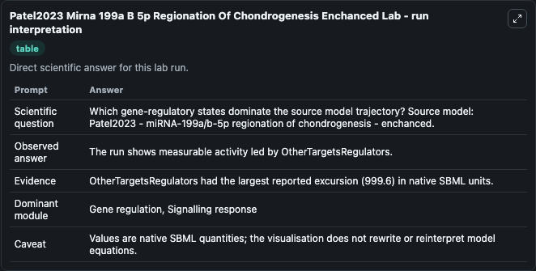
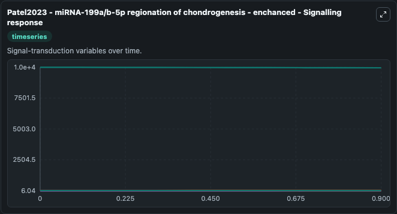
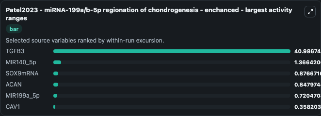
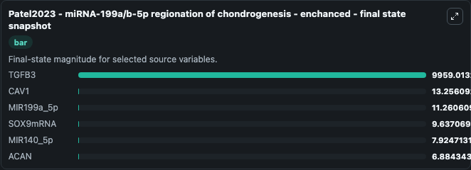
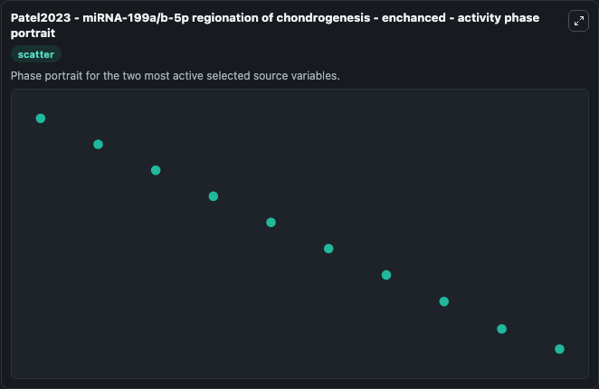

# Patel2023 Mirna 199a B 5p Regionation Of Chondrogenesis Enchanced

This Biosimulant lab wraps `Patel2023 Mirna 199a B 5p Regionation Of Chondrogenesis Enchanced` as a runnable systems biology model with a companion visualization module.
From a previous microarray study we developed a small chondrogenesis model. It can be used to explore the configured dynamics and compare scenario outcomes across configurations.

## What You'll See

The lab asks: Which gene-regulatory states dominate the source model trajectory? Source model: Patel2023 - miRNA-199a/b-5p regionation of chondrogenesis - enchanced. It runs for 1.0 time units with a communication step of 0.1. The run uses the model defaults declared by the curated SBML wrapper. The generated visualizations focus on CAV1, ACAN, TGFB3, MIR199a_5p, SOX9mRNA, and MIR140_5p, combining trajectory, endpoint-comparison, and summary-table views from one completed dark-mode run.

In this captured run, **TGFB3** moved from 1e+04 to 9959.0 across 1.0 simulation windows.


### Output Visualizations



*Summary table for Patel2023 Mirna 199a B 5p Regionation Of Chondrogenesis Enchanced, reporting the scientific question, observed answer, dominant module, and caveat.*



*Trajectories of TGFB3, MIR140_5p, SOX9mRNA, ACAN, MIR199a_5p, and CAV1 across the 1.0 simulation. In this run **MIR140_5p** climbed from 6.558 to 7.925 and **TGFB3** fell from 1e+04 to 9959.0 — the largest movements among the focused observables.*



*Largest-excursion ranking of the focused observables — the absolute movement magnitude during the run. Top 3: **TGFB3** = 40.987, **MIR140_5p** = 1.366, **SOX9mRNA** = 0.8767, with 3 more observables below.*



*Trajectories of TGFB3, MIR140_5p, SOX9mRNA, ACAN, MIR199a_5p, and CAV1 across the 1.0 simulation. In this run **MIR140_5p** climbed from 6.558 to 7.925 and **TGFB3** fell from 1e+04 to 9959.0 — the largest movements among the focused observables.*



*Visualization card from the Patel2023 Mirna 199a B 5p Regionation Of Chondrogenesis Enchanced dark-mode run.*


## Model Context

- Core model: `models/core`
- Visualization model: `models/visualisation`
- Standard: `other`
- Upstream source: `biomodels_ebi:MODEL2305010001`
- License: `CC0`

## Inputs

| Input | Maps To | Default | Notes |
|---|---|---|---|
| Initial Cav1 | `systemsbiology_sbml_patel2023_mirna_199a_b_5p_regionation_of_chondro_model2305010001_model.initial_cav1` | | Source state initial condition exposed as a model-specific control because no explicit intervention parameter is identifiable. Maps to SBML symbol `Cav1`. |
| Initial Acan | `systemsbiology_sbml_patel2023_mirna_199a_b_5p_regionation_of_chondro_model2305010001_model.initial_acan` | | Source state initial condition exposed as a model-specific control because no explicit intervention parameter is identifiable. Maps to SBML symbol `Acan`. |
| Initial Tgfb3 | `systemsbiology_sbml_patel2023_mirna_199a_b_5p_regionation_of_chondro_model2305010001_model.initial_tgfb3` | | Source state initial condition exposed as a model-specific control because no explicit intervention parameter is identifiable. Maps to SBML symbol `TGFB3`. |
| Initial Mir199a 5P | `systemsbiology_sbml_patel2023_mirna_199a_b_5p_regionation_of_chondro_model2305010001_model.initial_mir199a_5p` | | Source state initial condition exposed as a model-specific control because no explicit intervention parameter is identifiable. Maps to SBML symbol `MIR199a_5p`. |
| Initial Sox9mrna | `systemsbiology_sbml_patel2023_mirna_199a_b_5p_regionation_of_chondro_model2305010001_model.initial_sox9mrna` | | Source state initial condition exposed as a model-specific control because no explicit intervention parameter is identifiable. Maps to SBML symbol `Sox9mRNA`. |
| Initial Mir140 5P | `systemsbiology_sbml_patel2023_mirna_199a_b_5p_regionation_of_chondro_model2305010001_model.initial_mir140_5p` | | Source state initial condition exposed as a model-specific control because no explicit intervention parameter is identifiable. Maps to SBML symbol `MIR140_5p`. |

## Outputs

| Output | Maps To | Role |
|---|---|---|
| `state` | `systemsbiology_sbml_patel2023_mirna_199a_b_5p_regionation_of_chondro_model2305010001_model.state` | Available to the visualization model and downstream workflows. |
| `summary` | `systemsbiology_sbml_patel2023_mirna_199a_b_5p_regionation_of_chondro_model2305010001_model.summary` | Available to the visualization model and downstream workflows. |
| `species_labels` | `systemsbiology_sbml_patel2023_mirna_199a_b_5p_regionation_of_chondro_model2305010001_model.species_labels` | Available to the visualization model and downstream workflows. |
| `cav1` | `systemsbiology_sbml_patel2023_mirna_199a_b_5p_regionation_of_chondro_model2305010001_model.cav1` | Available to the visualization model and downstream workflows. |
| `acan` | `systemsbiology_sbml_patel2023_mirna_199a_b_5p_regionation_of_chondro_model2305010001_model.acan` | Available to the visualization model and downstream workflows. |
| `tgfb3` | `systemsbiology_sbml_patel2023_mirna_199a_b_5p_regionation_of_chondro_model2305010001_model.tgfb3` | Available to the visualization model and downstream workflows. |
| `mir199a_5p` | `systemsbiology_sbml_patel2023_mirna_199a_b_5p_regionation_of_chondro_model2305010001_model.mir199a_5p` | Available to the visualization model and downstream workflows. |
| `sox9mrna` | `systemsbiology_sbml_patel2023_mirna_199a_b_5p_regionation_of_chondro_model2305010001_model.sox9mrna` | Available to the visualization model and downstream workflows. |
| `mir140_5p` | `systemsbiology_sbml_patel2023_mirna_199a_b_5p_regionation_of_chondro_model2305010001_model.mir140_5p` | Available to the visualization model and downstream workflows. |

## Runtime

- Duration: `1.0`
- Communication step: `0.1`

## Running Locally

```bash
biosimulant labs serve
```
