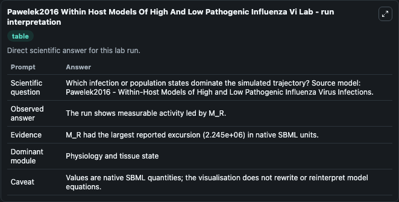
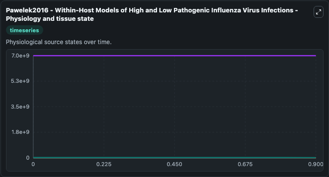
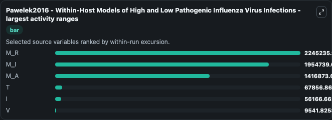
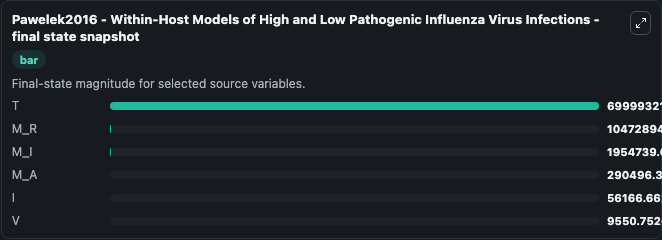
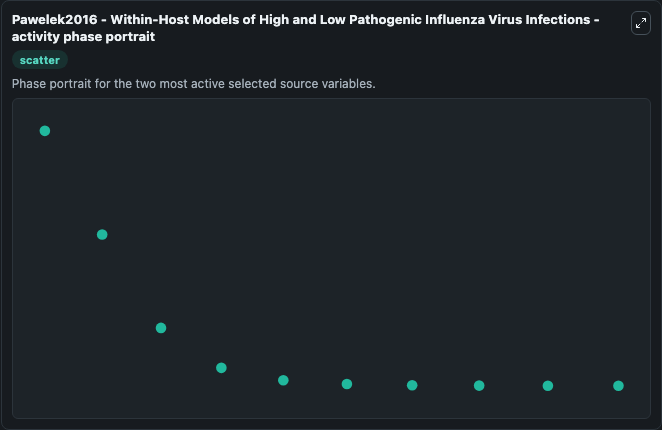

# Pawelek2016 Within Host Models Of High And Low Pathogenic Influenza Vi

This Biosimulant lab wraps `Pawelek2016 Within Host Models Of High And Low Pathogenic Influenza Vi` as a runnable systems biology model with a companion visualization module.
a possible mechanism of MP in determining HP versus LP outcomes, and how different interventions might affect infection dynamics. It can be used to explore the configured dynamics and compare scenario outcomes across configurations.

## What You'll See

The lab asks: Which infection or population states dominate the simulated trajectory? Source model: Pawelek2016 - Within-Host Models of High and Low Pathogenic Influenza Virus Infections. It runs for 1.0 time units with a communication step of 0.1. The run uses the model defaults declared by the curated SBML wrapper. The generated visualizations focus on M_R, M_I, M_A, T, V, and I, combining trajectory, endpoint-comparison, and summary-table views from one completed dark-mode run.

In this captured run, **M_R** moved from 1.27e+07 to 1.05e+07 across 1.0 simulation windows.


### Output Visualizations



*Summary table for Pawelek2016 Within Host Models Of High And Low Pathogenic Influenza Vi, reporting the scientific question, observed answer, dominant module, and caveat.*



*Trajectories of M_R, M_I, M_A, T, I, and V across the 1.0 simulation. In this run **M_I** climbed from 0 to 1.95e+06 and **M_R** fell from 1.27e+07 to 1.05e+07 — the largest movements among the focused observables.*



*Largest-excursion ranking of the focused observables — the absolute movement magnitude during the run. Top 3: **M_R** = 2.25e+06, **M_I** = 1.95e+06, **M_A** = 1.42e+06, with 3 more observables below.*



*Endpoint snapshot of the focused observables — final values from the captured run. Top 3 by value: **T** = 7e+09, **M_R** = 1.05e+07, **M_I** = 1.95e+06, with 3 more observables below.*



*Visualization card from the Pawelek2016 Within Host Models Of High And Low Pathogenic Influenza Vi dark-mode run.*


## Model Context

- Core model: `models/core`
- Visualization model: `models/visualisation`
- Standard: `other`
- Upstream source: `biomodels_ebi:MODEL1812040006`
- License: `CC0`

## Inputs

| Input | Maps To | Default | Notes |
|---|---|---|---|
| Initial Model State M R | `systemsbiology_sbml_pawelek2016_within_host_models_of_high_and_low_p_model1812040006_model.initial_model_state_m_r` | | Source state initial condition exposed as a model-specific control because no explicit intervention parameter is identifiable. Maps to SBML symbol `M_R`. |
| Initial Model State M I | `systemsbiology_sbml_pawelek2016_within_host_models_of_high_and_low_p_model1812040006_model.initial_model_state_m_i` | | Source state initial condition exposed as a model-specific control because no explicit intervention parameter is identifiable. Maps to SBML symbol `M_I`. |
| Initial Model State M A | `systemsbiology_sbml_pawelek2016_within_host_models_of_high_and_low_p_model1812040006_model.initial_model_state_m_a` | | Source state initial condition exposed as a model-specific control because no explicit intervention parameter is identifiable. Maps to SBML symbol `M_A`. |
| Initial Model State T | `systemsbiology_sbml_pawelek2016_within_host_models_of_high_and_low_p_model1812040006_model.initial_model_state_t` | | Source state initial condition exposed as a model-specific control because no explicit intervention parameter is identifiable. Maps to SBML symbol `T`. |
| Initial Model State V | `systemsbiology_sbml_pawelek2016_within_host_models_of_high_and_low_p_model1812040006_model.initial_model_state_v` | | Source state initial condition exposed as a model-specific control because no explicit intervention parameter is identifiable. Maps to SBML symbol `V`. |
| Initial Model State I | `systemsbiology_sbml_pawelek2016_within_host_models_of_high_and_low_p_model1812040006_model.initial_model_state_i` | | Source state initial condition exposed as a model-specific control because no explicit intervention parameter is identifiable. Maps to SBML symbol `I`. |

## Outputs

| Output | Maps To | Role |
|---|---|---|
| `state` | `systemsbiology_sbml_pawelek2016_within_host_models_of_high_and_low_p_model1812040006_model.state` | Available to the visualization model and downstream workflows. |
| `summary` | `systemsbiology_sbml_pawelek2016_within_host_models_of_high_and_low_p_model1812040006_model.summary` | Available to the visualization model and downstream workflows. |
| `species_labels` | `systemsbiology_sbml_pawelek2016_within_host_models_of_high_and_low_p_model1812040006_model.species_labels` | Available to the visualization model and downstream workflows. |
| `m_r` | `systemsbiology_sbml_pawelek2016_within_host_models_of_high_and_low_p_model1812040006_model.m_r` | Available to the visualization model and downstream workflows. |
| `m_i` | `systemsbiology_sbml_pawelek2016_within_host_models_of_high_and_low_p_model1812040006_model.m_i` | Available to the visualization model and downstream workflows. |
| `m_a` | `systemsbiology_sbml_pawelek2016_within_host_models_of_high_and_low_p_model1812040006_model.m_a` | Available to the visualization model and downstream workflows. |
| `model_state_t` | `systemsbiology_sbml_pawelek2016_within_host_models_of_high_and_low_p_model1812040006_model.model_state_t` | Available to the visualization model and downstream workflows. |
| `model_state_v` | `systemsbiology_sbml_pawelek2016_within_host_models_of_high_and_low_p_model1812040006_model.model_state_v` | Available to the visualization model and downstream workflows. |
| `model_state_i` | `systemsbiology_sbml_pawelek2016_within_host_models_of_high_and_low_p_model1812040006_model.model_state_i` | Available to the visualization model and downstream workflows. |

## Runtime

- Duration: `1.0`
- Communication step: `0.1`

## Running Locally

```bash
biosimulant labs serve
```
